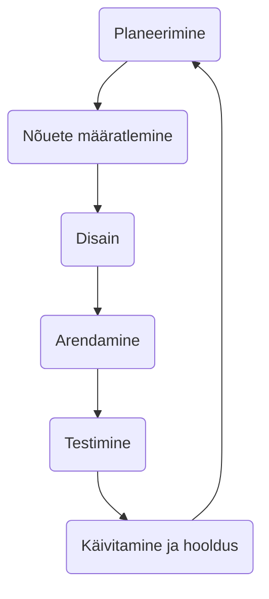

# Tarkvaraarenduse elutsükkel (Software Development Life Cycle - SDLC)

Tarkvaraarenduse elutsükkel (SDLC) on protsess, mida tarkvaratööstus kasutab kvaliteetse tarkvara kavandamiseks, arendamiseks ja testimiseks. SDLC eesmärk on toota kvaliteetset tarkvara, mis vastab või ületab klientide ootusi, jõuab lõpule ettenähtud aja ja kuluprognooside jooksul.

- SDLC on tarkvaraarenduse elutsükli akronüüm.
- Seda nimetatakse ka tarkvaraarendusprotsessiks.
- SDLC on raamistik, mis määratleb tarkvaraarenduse protsessi igas etapis tehtavad ülesanded.
- [ISO/IEC 12207](https://www.iso.org/standard/43447.html) on tarkvara elutsükli protsesside rahvusvaheline standard. Selle eesmärk on olla standard, mis määratleb kõik tarkvara arendamiseks ja hooldamiseks vajalikud ülesanded.

## Mis on SDLC?

SDLC on protsess, mida järgitakse tarkvaraprojekti jaoks tarkvaraorganisatsioonis. See koosneb üksikasjalikust plaanist, milles kirjeldatakse, kuidas konkreetset tarkvara arendada, hooldada, asendada ja muuta või täiustada. Elutsükkel määratleb metoodika tarkvara kvaliteedi ja üldise arendusprotsessi parandamiseks.

Järgmine joonis on tüüpilise SDLC erinevate etappide graafiline kujutis.

Tüüpiline tarkvaraarenduse elutsükkel koosneb järgmistest etappidest –

**1\. Planeerimine ja nõuete analüüs**

Nõuete analüüs on SDLC kõige olulisem ja põhiline etapp. Seda viivad läbi meeskonna liikmed kliendi, müügiosakonna, turu-uuringute ja valdkonna ekspertide koostöös. Seda teavet kasutatakse seejärel projekti põhilise lähenemisviisi kavandamiseks ja toote teostatavusuuringu läbiviimiseks majandus-, töö- ja tehnilistes valdkondades.

Planeerimisetapis toimub ka kvaliteedi tagamise nõuete planeerimine ja projektiga seotud riskide väljaselgitamine. Tehnilise teostatavusuuringu tulemuseks on määratleda erinevad tehnilised lähenemisviisid, mida saab järgida projekti edukaks elluviimiseks minimaalsete riskidega.

**2\. Nõuete määratlemine**

Kui nõuete analüüs on tehtud, on järgmine samm tootenõuete selgelt määratlemine ja dokumenteerimine ning kliendi või turuanalüütikute poolt heakskiitmine. Seda tehakse tarkvaranõuete spetsifikatsiooni (Software Requirement Specification - SRS) kaudu, mis sisaldab kõiki projekti elutsükli jooksul kavandatavaid ja arendatavaid tootenõudeid.

**3\.Tootearhitektuuri kujundamine (disain)**

Tarkvaranõuete spetsifikatsioon on aluseks tootearhitektidele, et tulla välja arendatava toote jaoks parima arhitektuuriga. Tarkvaranõuete spetsifikatsioonis määratletud nõuete alusel pakutakse tavaliselt välja rohkem kui üks tootearhitektuuri disainilahendus ja dokumenteeritakse need projekteerimisdokumendi spetsifikatsioonis (DDS).

Projekteerimisdokumendi spetsifikatsiooni vaatavad üle kõik olulised sidusrühmad ja erinevate parameetrite, nagu riskihinnang, toote vastupidavus, disaini modulaarsus, eelarve ja ajapiirangud, põhjal valitakse toote jaoks välja parim disainilahendus.

Disaini lähenemisviis määratleb selgelt kõik toote arhitektuurimoodulid koos selle side- ja andmevoo esitusega välise ja kolmanda osapoole moodulitega (kui neid on). Kavandatava arhitektuuri kõigi moodulite sisekujundus peaks olema selgelt määratletud Projekteerimisdokumendi spetsifikatsiooni pisimate üksikasjadega.

**4\. Toote ehitamine või arendamine**

Selles SDLC etapis algab tegelik arendus ja toote ehitamine. Programmeerimiskood genereeritakse selles etapis vastavalt projekteerimisdokumendi spetsifikatsioonile. Kui disain on läbi viidud üksikasjalikult ja organiseeritult, saab koodi genereerida ilma suurema vaevata.

Arendajad peavad järgima oma organisatsiooni määratletud kodeerimisjuhiseid ja koodi genereerimiseks kasutatakse programmeerimistööriistu, nagu kompilaatorid, tõlgid, silujad jne. Kodeerimiseks kasutatakse erinevaid kõrgetasemelisi programmeerimiskeeli nagu C, C++, Pascal, Java, Javascript ja PHP. Programmeerimiskeel valitakse vastavalt arendatava tarkvara tüübile.

**5\. Toote testimine**

See etapp on tavaliselt kõigi etappide alamhulk, nagu tänapäevaste SDLC mudelite puhul, testimistegevused hõlmavad enamasti kõiki SDLC etappe. See etapp viitab aga toote ainult testimise etapile, kus toote defektidest teatatakse, neid jälgitakse, parandatakse ja testitakse uuesti, kuni toode saavutab SRS-is määratletud kvaliteedistandardid.

**6\. Turuleviimine ja hooldus**

Kui toode on testitud ja kasutuselevõtuks valmis, lastakse see ametlikult vastavale turuel. Mõnikord toimub toote juurutamine selle organisatsiooni äristrateegia kohaselt etapiviisiliselt. Toode võidakse esmalt välja anda piiratud segmendis ja testida reaalses ärikeskkonnas (UAT – kasutaja aktsepteerimise testimine).

Seejärel võidakse toode tagasiside põhjal välja anda sellisel kujul või koos soovitatud täiustustega sihtturusegmendis. Pärast toote turule toomist tehakse selle hooldus olemasolevale kliendibaasile.

## SDLC mudelid

On defineeritud ja kavandatud erinevaid tarkvaraarenduse elutsükli mudeleid, mida tarkvara arendamise protsessis järgitakse. Neid mudeleid nimetatakse ka tarkvaraarenduse protsessimudeliteks. Iga protsessimudel järgib oma tüübile ainulaadset sammude seeriat, et tagada tarkvaraarendusprotsessi edu.

Järgmised on kõige olulisemad ja populaarsemad SDLC mudelid, mida selles valdkonnas järgitakse

- Kose mudel
- Iteratiivne mudel
- Spiraalne mudel
- V-mudel
- Suure Paugu mudel

Teised seotud metoodikad on Agile Model, RAD Model, Rapid Application Development ja Prototyping Models.

Lisalugemist arendusmudelite kohta: 
- https://web.htk.tlu.ee/digitaru/tarkvara/chapter/tarkvaraarenduse-etapid/

Allikad:
- https://www.tutorialspoint.com/sdlc/sdlc_overview.htm
