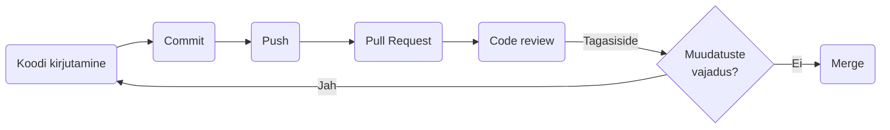

# Koodi ülevaatus (*Code Review*)

Koodi ülevaatus on protsess, mille käigus üks või mitu arendajat vaatavad üle teise arendaja kirjutatud koodi. Koodiülevaatuse eesmärk on tuvastada võimalikud probleemid, parandada koodi kvaliteeti ja tagada koodi vastavus projekti nõuetele.

Koodi ülevaatus hõlmab tavaliselt koodi ridade kaupa läbilugemist, selliste probleemide otsimist nagu:

- vead;
- turvanõrkused;
- jõudlusprobleemid;
- kodeerimisstandardite rikkumised;
- disainivead.

Ülevaataja võib ka soovitada parandusi või anda tagasisidet selle kohta, kuidas muuta kood tõhusamaks, hõlpsamini hooldatavaks ja loetavamaks.

Koodi ülevaatus on tarkvara arendusprotsessi oluline osa, kuna see aitab tuvastada vigu ja parandada koodi kvaliteeti enne selle ühendamist põhikoodibaasi. Samuti annab see arendajatele võimaluse üksteiselt õppida ja teadmisi jagada, mis võib aidata parandada meeskonna oskusi ja teadmisi.

Koodi ülevaatust saab teha käsitsi, kus üks arendaja loeb koodi läbi ja annab tagasisidet, või seda saab automatiseerida, kasutades tööriistu, mis analüüsivad koodi probleemide osas ja soovitavad parandusi. Olenemata lähenemisest on koodide ülevaatus oluline samm tarkvararakenduste kvaliteedi ja töökindluse tagamisel.

Sellel kursusel vaadatakse samamoodi üle ka dokumente: Markdown-failid, otsused ja release notes'id läbivad enne peaharusse ühendamist ülevaatuse nagu kood.

## Millises etapis koodi ülevaatust tehakse?

Koodi ülevaatus tehakse tarkvaraarendusprotsessis pärast koodi kirjutamist, kuid enne selle ühendamist põhikoodibaasi.

Enamikus tarkvaraarenduse töövoogudes on koodi ülevaatus osa tõmbetaotluse (*Pull Request*) protsessist. Kui arendaja on lõpetanud uue funktsiooni kirjutamise või vea parandamise, loob ta tõmbetaotluse, mis sisaldab tehtud muudatusi. Teised meeskonna arendajad vaatavad seejärel koodimuudatused üle ja annavad tagasisidet kas käsitsi või automatiseeritud tööriistu kasutades.

Pärast koodi ülevaatamist ja probleemide lahendamist saab muudatused liita põhikoodibaasi. Koodi ülevaatus on sageli iteratiivne protsess, mis tähendab, et enne muudatuste lõplikku kinnitamist võib toimuda mitu tagasiside ja muudatuste vooru.

## Ülevaatuse tegemine GitHubis

Pull request'i ülevaatus käib GitHubis järgmiselt.

1. Ava pull request. Ülevaatajaks määramise teade tuleb GitHubi teavitustesse ja e-postile; kõik PR-id leiad repo vahekaardilt **Pull requests**.
2. Ava vahekaart **Files changed**. Seal on näha, millised failid ja read muutusid.
3. Konkreetse rea kommenteerimiseks liigu rea peale ja vajuta `+`. Kirjuta kommentaar ja vali **Start a review**, et koguda kommentaarid ühte ülevaatusse.
4. Kui oled kõik läbi vaadanud, vajuta **Review changes** ja vali otsus:
   - **Comment** – tagasiside ilma otsuseta, näiteks küsimus;
   - **Approve** – muudatus sobib ühendamiseks;
   - **Request changes** – enne ühendamist on vaja parandusi; kirjelda, mida ja miks.
5. Vajuta **Submit review**.

Autor vastab kommentaaridele, teeb vajaduse korral parandused samas harus ja push'ib need. Pull request uueneb ise. Kui ülevaataja küsis muudatusi, palub autor pärast parandusi uut ülevaatust nupuga **Re-request review**.

### Hea ülevaatuse tunnused

- Ülevaataja on saanud aru, mida ja miks muudeti. Kui mitte, küsib ta.
- Tagasiside on konkreetne ja põhjendatud. „Ei meeldi” ei aita; „see samm jääb algajale selgitamata, sest ...” aitab.
- Ülevaataja märgib ka seda, mis on hästi tehtud.
- Ülevaataja hindab sisu, mitte ainult vormistust.
- Ülevaatus tehakse mõistliku aja jooksul, et autor ei jääks ootama.

### Kodutööde ülevaatuse käik sellel kursusel

Individuaalse kodutöö puhul liigub töö kolmes sammus:

1. autor avab pull request'i ja määrab ülevaatajaks kaasõppija;
2. kaasõppija teeb ülevaatuse ja lisab pärast heakskiitu ülevaatajaks õppejõu;
3. õppejõud teeb lõpliku ülevaatuse ja ühendab pull request'i peaharusse.

Kaasõppijate paarid on failis [`student_pairs.md`](../../student_pairs.md). Meeskonnaprojektis vaatavad liikmed üksteise pull request'e üle [pull request'i kontrollnimekirja](../../seminarid/mallid/pull-request.md) järgi.
