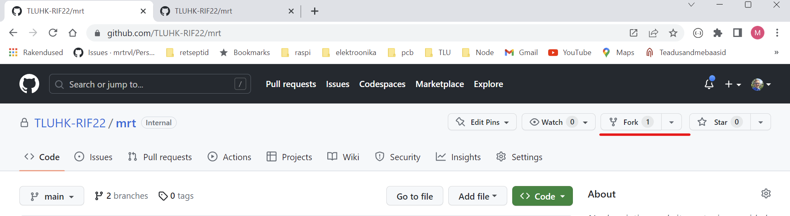

# Forkimine

GitHubi repositooriumi forkimine tähendab repositooriumi koopia loomist sinu enda GitHubi kontole. See koopia on sinu isiklik repositoorium, kus saad teha muudatusi ja katsetusi ilma, et see mõjutaks originaalrepositooriumit. Forkitud repositoorium säilitab seose algse repositooriumiga, mis võimaldab sul jälgida algse repositooriumi muudatusi ja vajadusel neid ka enda forkitud repositooriumiga sünkroniseerida.

Forkimine on eriti kasulik avatud lähtekoodiga projektide puhul. See võimaldab sul teha muudatusi ja seejärel esitada need algsele projektile pull requesti kaudu. Pull requestide kaudu saavad projekti omanikud ja teised kaasautorid hinnata ja arutada sinu muudatusi, enne kui need lisatakse algsele repositooriumile.

Forkimise protsess on järgmine:

- Mine GitHubis soovitud repositooriumi lehele.
- Kliki paremas ülanurgas "Fork" nupul.
  
- Vali `Create a new fork`
- Vali GitHubi konto, kuhu soovid fork'i teha.
  
- Pärast forkimist saad kloonida repositooriumi oma arvutisse, luua uusi harusid, teha muudatusi, commit'e ja push'e. Kui soovid oma muudatusi esitada algsele repositooriumile, tuleb sul luua pull request.

Kui oled teinud `forki`, selle oma arvutisse klooninud, teinud selles mingeid muudatusi (koos `commit`i ja `push`iga) ja soovid need muudatused esitada algsele repositooriumile, siis tuleb sul luua `pull request`. Selleks:
- Ava oma GitHubi kontol forkitud repositoorium.
- Vali `Contribute` menüüst `Open pull request`
  
- Avanenud vaatest kontrolli üle repositooriumid (millisest millisesse `Pull request` luuakse)
- Täida `Pull request` kirjeldus ja vajadusel määra ülevaataja (`reviewer`)
  
- Kui kõik on korras, siis vajuta `Create pull request` nuppu.
- Määratud ülevaatajale tuleb teade uue `Pull Request`i kohta
  
- Vajuta `Review changes` nuppu, lisa oma kommentaarid ja vastavalt vajadusele `Approve` või `Request changes`
  
- Kui kõik on korras, siis vajuta `Merge pull request` nuppu
  
- Seejärel vajuta `Confirm merge` nuppu
  

Üldiselt võiks kogu protsessi kirjeldada järgmine diagramm:
