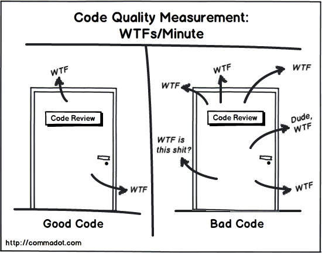

# Koodi kvaliteet

Koodi kvaliteet viitab koodibaasi üldisele kvaliteedile ja hooldatavusele. See hõlmab koodi erinevaid aspekte, sealhulgas selle loetavust, järjepidevust, lihtsust, hooldatavust ja usaldusväärsust. Kvaliteetset koodibaasi on aja jooksul lihtsam mõista, muuta ja hooldada, mis võib säästa arendusmeeskondade aega ja ressursse.

  
[Pildi allikas](http://zpalexander.com/content/images/2017/09/wtf.png)

Siin on mõned tegurid, mis võivad koodi heale kvaliteedile kaasa aidata.

- **Loetavus** (*Readability*): kood peaks olema kergesti loetav ja arusaadav. See peaks olema hästi struktureeritud ja organiseeritud, järjekindlate nimetamisreeglite, vahede ja taandega.
- **Järjepidevus** (*Consistency*): kood peaks olema stiililt ja lähenemisviisilt ühtne. See hõlbustab teistel arendajatel koodi mõistmist ja muutmist.
- **Lihtsus** (*Simplicity*): kood peaks olema lihtne ja arusaadav. See vähendab vigade tõenäosust ning muudab koodi aja jooksul muutmise ja hooldamise lihtsamaks.
- **Hooldatavus** (*Maintainability*): kood peaks olema aja jooksul hooldatav. See tähendab, et nõuete muutumisel peaks seda olema lihtne muuta, parandada ja värskendada.
- **Töökindlus** (*Reliability*): kood peaks olema töökindel ja prognoositav. See peaks töötama ootuspäraselt ja käsitlema vigu selliselt, et need ei põhjusta programmi töös tõrkeid.


## Kuidas tagada koodi kvaliteeti?

Järgnevalt mõned punktid, kuidas tagada koodi kvaliteeti:

- **Järjepidev koodi vormindamine** (*Consistent Code Formatting*): koodivormingu järjepidevus muudab arendajatel koodibaasi mõistmise ja hooldamise lihtsamaks. Kasutage koodibaasi ühtse stiili jõustamiseks koodilinterit või vormindustööriista, nagu Prettier või [ESLint](../eslint/README.md).

**Kommentaarid ja dokumentatsioon** (*Code Comments and Documentation*): koodibaasi dokumenteerimine kommentaaride, dokumentatsiooni ja tekstisiseste märkustega on hea tava tagamaks, et arendajad saavad koodist aru ja seda muuta. Kommenteeri lühidalt ja seda miks midagi sellisel kujul teed, mitte mita teed. Püüa muutujaid ja funktsioone nimetad selliselt, et kommentaare ei olekski vaja. Pikad nimed on okei.

**Ühiktestimine** (*Unit Testing*): koodi automaattestide kirjutamine aitab tagada, et see toimib ootuspäraselt ja et koodibaasi muudatused ei too kaasa uusi vigu ega probleeme. Javascripti ühiktestide kirjutamiseks ja käitamiseks saab kasutada näiteks selliseid tööriistu nagu [Jest](https://jestjs.io/) või [Mocha](https://mochajs.org/).

[**Koodiülevaatused**](../codeReview/README.md) (*Code Reviews*): Koodide ülevaatused teiste arendajate poolt võib olla väärtuslik tööriist, mis tagab koodi kõrge kvaliteedi. Koodiülevaatused võimaldavad teistel arendajatel koodimuudatusi üle vaadata, täiustusi soovitada ning vigu või probleeme tabada.

**Vigade käsitlemine** (*Error Handling*): vigade korrektne käsitlemine koodis võib aidata tagada selle töökindluse ja prognoositavuse. Veenduge, et vigu käsitletakse kogu koodibaasis järjepidevalt ning et veateated on arendajatele informatiivsed ja abistavad.

**Kaasaegsete JavaScripti funktsioonide kasutamine** (*Use of Modern JavaScript Features*): kaasaegsete JavaScripti funktsioonide (nt noolefunktsioonid, destruktureerimine ja malliliteraalid) kasutamine võib aidata parandada koodi kvaliteeti. Need funktsioonid võivad muuta koodi kokkuvõtlikumaks ja hõlpsamini loetavaks.

**Koodi refaktoreerimine** (*Code Refactoring*): Refaktoreerimine on olemasoleva koodi täiustamise protsess, muutmata selle käitumist. Refaktoreerimine võib aidata parandada koodi kvaliteeti, muutes selle loetavamaks, hooldatavamaks ja skaleeritavamaks.

Neid tavasid järgides saate tagada, et teie JavaScripti kood on kvaliteetne ja aja jooksul hõlpsasti hooldatav.

## Näited:

### Koodi loetavus

Näiteks:
```javascript
function add(x,y){return x+y;}
console.log(add(2,3));
```

See kood sooritab lihtsa liitmise ja prindib tulemuse konsooli. Kuigi kood töötab õigesti, ei ole see eriti hästi loetav. Siin on sama koodi täiustatud versioon, mis on paremini loetav:

```javascript
function add(num1, num2) {
  return num1 + num2;
}

const result = add(2, 3);
console.log(result);
```

Selles versioonis oleme parandanud koodi loetavust, andes funktsiooni parameetritele kirjeldavamad nimed (num1 ja num2) ning lisanud tühikuid, et muuta kood paremini loetavaks. Samuti salvestasime liitmistoimingu tulemuse enne konsooli printimist muutujasse, mis muudab koodi arusaadavamaks.

### Lihtsus

Näiteks:
```javascript
function checkLogin(username, password) {
  if (username === 'admin' && password === 'password') {
    return true;
  } else {
    return false;
  }
}
```

See kood defineerib funktsiooni `checkLogin`, mis võtab kaks argumenti (username ja password) ja tagastab `true`, kui väärtused on vastavalt 'admin' ja 'password' ning muul juhul `false`. Kuigi kood töötab õigesti, annab seda natukene lihtsamaks teha. Siin on sama koodi lihtsam versioon, mis annab sama tulemuse:

```javascript
function checkLogin(username, password) {
  return (username === 'admin' && password === 'password');
}
```

Selles versioonis oleme koodi lihtsustanud, eemaldades mittevajaliku `if`-lause ja `else` ploki. Samuti oleme eemaldanud `true` ja `false` tagastuslaused ning asendanud need ühe tõeväärtusavaldisega, mis tagastab olenevalt tingimuste täitmisest `true` või `false`.

### Hooldatavus

Näiteks:
```javascript
function calculateTax(price, taxRate) {
  let taxAmount = price * taxRate;
  let total = price + taxAmount;
  return total;
}
```

See kood määratleb funktsiooni `calculateTax`, mis võtab kaks argumenti (`price` ja `taxRate`) ning tagastab kogumaksumuse koos maksudega. Kuigi see kood töötab korralikult, ei ole see väga hooldatav. Siin on sama koodi täiustatud versioon, mis on paremini hooldatav:

```javascript
function calculateTotalPrice(price, taxRate) {
  const taxAmount = calculateTaxAmount(price, taxRate);
  const totalPrice = price + taxAmount;
  return totalPrice;
}

function calculateTaxAmount(price, taxRate) {
  return price * taxRate;
}
```

Selles versioonis oleme parandanud koodi hooldatavust, jagades selle kaheks funktsiooniks: `calculateTotalPrice` ja `calculateTaxAmount`. Funktsioon `calculateTotalPrice` kutsub nüüd maksusumma saamiseks funktsiooni `calculateTaxAmount` ja arvutab seejärel koguhinna. Koodi selliselt osadeks tükeldades oleme muutnud selle mõistmise ja muutmise lihtsamaks.

See kood on nüüd paremini hooldatav, kuna kõik maksuarvestuse muudatused saab teha funktsioonis `calculateTaxAmount`, ilma et see mõjutaks ülejäänud koodi. See muudab koodi edaspidise värskendamise ja muutmise lihtsamaks, mis lõppkokkuvõttes toob kaasa parema koodikvaliteedi.

### Töökindlus

Näiteks:
```javascript
function divide(a, b) {
  return a / b;
}
```

See kood määratleb funktsiooni `divide`, mis võtab kaks argumenti (`a` ja `b`) ja tagastab `a` jagamise tulemuse `b`-ga. Kuigi see töötab enamasti õigesti, ei ole see väga usaldusväärne, kuna see ei käsitle juhtumit, kus `b` on null, mis tooks kaasa nulliga jagamise vea. Siin on sama koodi täiustatud versioon, mis on usaldusväärsem:

```javascript
function divide(a, b) {
  if (b === 0) {
    throw new Error('Division by zero error');
  }
  return a / b;
}
```

Selles versioonis oleme parandanud koodi usaldusväärsust, lisades enne jagamist kontrolli, et `b` ei oleks null. Kui `b` on null, viskab funktsioon välja uue veaobjekti koos teatega, mis näitab nulliga jagamise viga.

Selle kontrolli lisamisega muutsime koodi usaldusväärsemaks, kuna see käsitleb nüüd juhtumeid, kus `b` on null, vältides nulliga jagamist. See viib lõpuks parema koodikvaliteedini, kuna kood töötab suurema tõenäosusega õigesti ja annab oodatud tulemusi.

Allikad ja lisalugemist:
- https://blog.cleancoder.com/
- https://github.com/jnguyen095/clean-code/blob/master/Clean.Code.A.Handbook.of.Agile.Software.Craftsmanship.pdf
- https://github.com/ryanmcdermott/clean-code-javascript