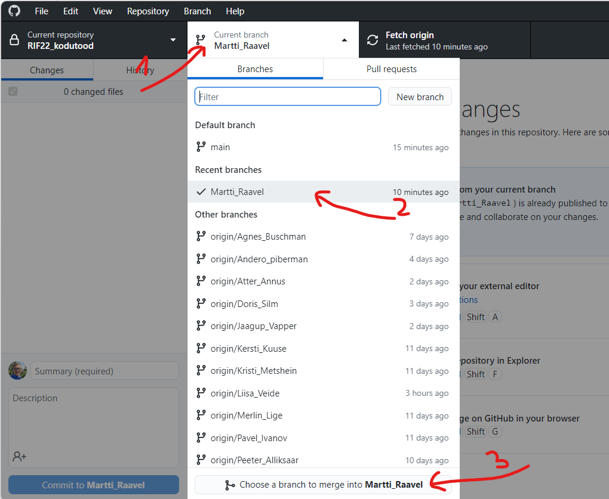
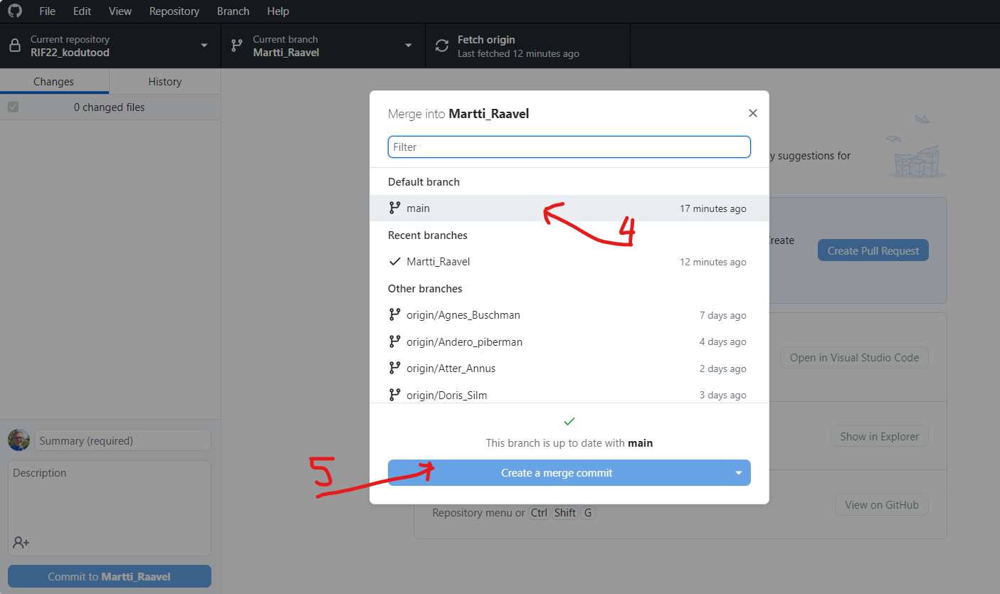

# main haru 'merge' oma harusse

Enne kodutöö esitamist, peab oma kodutööde harusse tegema `merge`, et vahepeal lisatud automaattestid saaksid ka Sinu kodutööde harusse lisatud.

Selleks tuleb `Github Desktop` rakenduses valida `Current branch` nupu alt (veendu, et linnuke oleks Sinu nimega haru ees) all servas olev nupp `Choose a branch to merge into Sinu_Nimega_Haru`.

Seejärel vali `main` haru ja vajuta nuppu `Create a merge commit`.

Seejärel võid juba oma harus tehtud muudatused Github-i `push`-ida.
