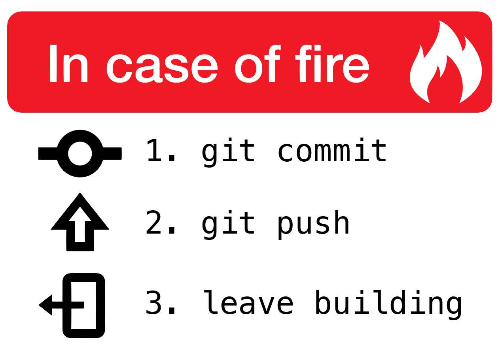
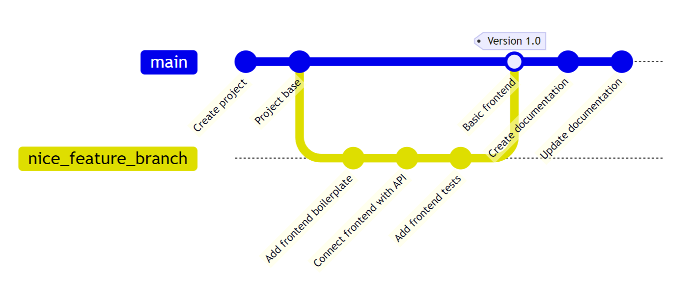
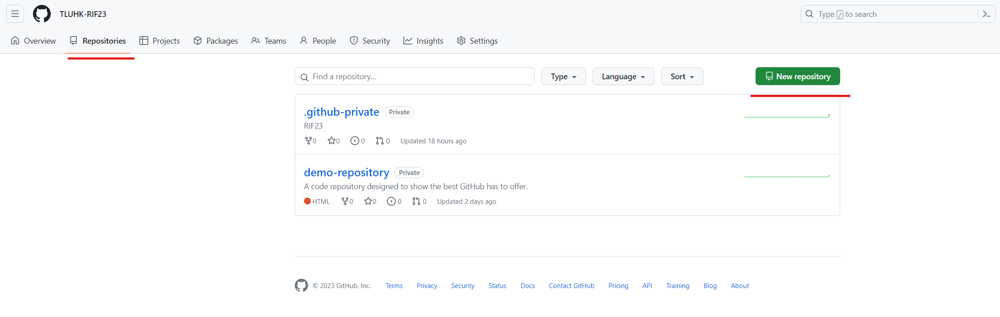
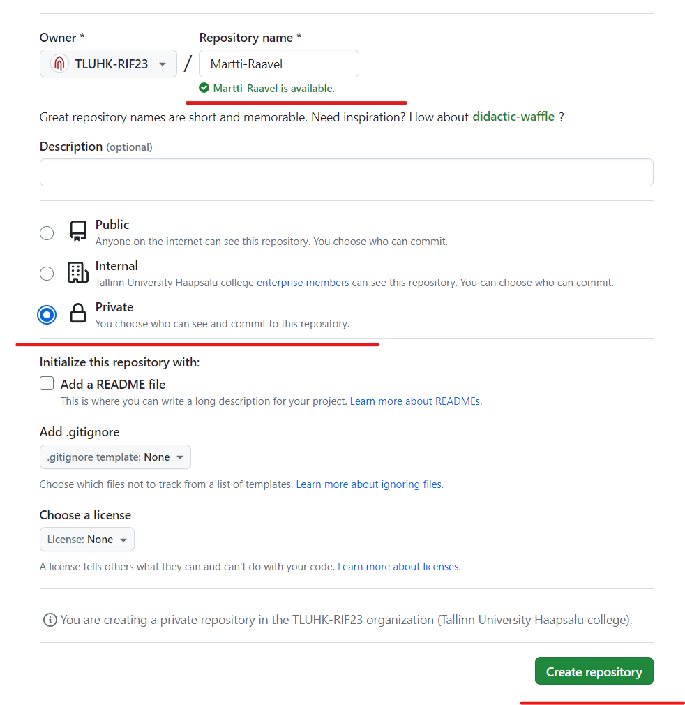
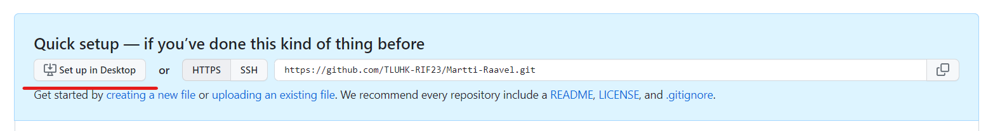
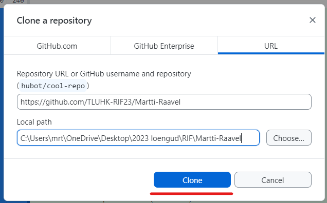
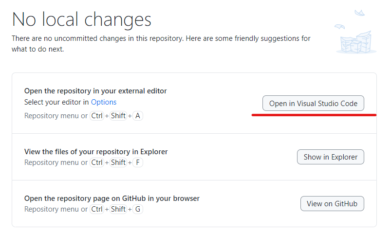

# Git ja GitHub Haapsalu kolledžis

Martti Raavel
martti.raavel@tlu.ee

---

## Plaan

- Git ja Github
- Harjutused

---

## Õppekava visuaal

:warning: Tegemist on prototüübiga!

- [tluhk.github.io/curriculum](https://tluhk.github.io/curriculum/)

---

## Git

Git on hajutatud versioonihaldussüsteem, mis on loodud tarkvara arendamise käigus lähtekoodi muutuste jälgimiseks. Selle töötas välja 2005. aastal Linuxi operatsioonisüsteemi looja Linus Torvalds ja sellest ajast on saanud üks enimkasutatavaid versioonihaldussüsteeme maailmas.

---

## Miks me Git-i koolis kasutame/õpetame?

- Koodihaldus on tarkvaraarenduse lahutamatu osa
- Koodihaldus on oskus, mida tööandjad ootavad
- Koodihaldus on oskus, mida saab kasutada ka mujal
- Et tunda ennast selle tööriistaga mugavalt, alustame varakult ja läbivalt

---

## Kuidas me Git-i koolis kasutame?

- Õppematerjalide repositooriumid (mitte kõik õppeained)
- Koduste tööde repositooriumid (mitte kõik õppeained)
- Mingil määral infovahetus (Issues, Discussions, Projects)

---

## Kuidas Git-i kasutada?

- Git-iga seotud sõnavara
- GitHub
- GitHub Desktop

---



[Pildi allikas](https://hikaruzone.wordpress.com/2015/10/06/in-case-of-fire-1-git-commit-2-git-push-3-leave-building/)

---

## Git-iga seotud sõnavara

- Hoidla (repository)
- Haru (branch)
- Commit
- Tõukamine (push)
- Ühendamine (merge)
- Tõmbetaotlus (pull request)
- Kloonimine (clone)
- Konflikt
- ...

---

## Hoidla (repository)

_Hoidla_ ehk repositoorium on keskne koht koodi ja sellega seotud failide salvestamiseks. Gitis võib hoidla olla kas kohalik või asuda kusagil serveris.

---

## Kloonimine (clone)

_Kloonimine_ on hoidlast kohalikku masinasse koopia tegemine. See loob hoidlast kohaliku koopia, mida saab kasutada muudatuste tegemiseks ja keskhoidlasse sidumiseks.

---

## Kehtestus (commit)

_Commit_ on koodibaasi tehtud muudatuste salvestatud komplekt. Kui arendaja teeb koodis muudatusi, saab ta need muudatused hoidlasse salvestamiseks committida. Igal commitil on kordumatu identifikaator ja sõnum, mis kirjeldab tehtud muudatusi.

---

## Tõukamine (push)

_Push_ on Giti käsk, mida kasutatakse kohalikus hoidlas tehtud muudatuste üleslaadimiseks kaughoidlasse. Kui teete kohalikus hoidlas muudatusi, saate tõukekäskluse abil need muudatused kaughoidlasse üles laadida, näiteks GitHubis või GitLabis hostitud hoidlasse.

---

## Haru (branch)

_Haru_ on koodibaasi eraldi versioon. Arendajad saavad luua uue haru, et töötada uue funktsiooni või veaparandusega, ilma et see mõjutaks põhikoodibaasi. Filiaalis tehtud muudatused saab liita tagasi põhikoodibaasi, kui need on valmis.

---

## Tõmbetaotlus (pull request)

_Tõmbetaotlus_ on taotlus teisele arendajale harus tehtud muudatuste ülevaatamiseks ja liitmiseks. Tõmbepäringud sisaldavad tavaliselt tehtud muudatuste loendit, kommentaare ja koodi muudatuste erinevusi.

---

## Ühendamine (merge)

_Merge_ on koodibaasi ühest harust teise tehtud muudatuste kombineerimise protsess. Tavaliselt tehakse seda funktsiooniharus tehtud muudatuste liitmiseks tagasi põhikoodibaasi.

---

## Konflikt

Konflikt on olukord, kus koodibaasi kaks haru sisaldavad sama faili sama rida, kuid erinevaid muudatusi. Git ei oska ise otsustada, milline muudatus on õige, nii et arendajad peavad konflikti käsitsi lahendama.

---



---

## GitHub

GitHub on veebipõhine platvorm, mida kasutatakse versioonikontrolliks ja koostööks tarkvara arendamiseks. Github pakub Giti versioonikontrollisüsteemi kasutavate tarkvaraarendusprojektide hostimisteenust.

GitHub pakub tarkvaraarenduse toetamiseks palju funktsioone, sealhulgas:

- Hoidla hostimine
- Koostöötööriistad
- Juurdepääsu juhtimine
- Integratsioonid

Sotsiaalsed funktsioonid: GitHub pakub sotsiaalseid funktsioone, nagu profiilid, tegevuskanalid ja jälgimisnupud, et aidata arendajatel üksteisega ühendust luua ja koostööd teha.

---

## Github

- Kasutajakonto
- Github Desktop
- Visual Studio Code
- Markdown
- HK organisatsioonid
- Harjutused

---

## Github Desktop

GitHub Desktop on graafilise kasutajaliidesega rakendus, mis võimaldab arendajatel hõlpsasti hallata oma Git-repositooriume ja interakteeruda GitHubiga. Tarkvara on välja töötatud GitHub-i poolt ning see on saadaval nii Windowsi, macOS-i, kui ka Linux-i jaoks.

GitHub Desktop pakub arendajatele võimalust teha Gitiga seotud toiminguid, nagu kloonimine, commit'imine, push'imine ja pull'imine, ilma et peaks kasutama käsurea utiliite.

https://desktop.github.com/

---

## Visual Studio Code

Visual Studio Code ehk VS Code on vabavaraline koodiredaktor, mille on välja töötanud Microsoft. See on saadaval Windowsi, macOS-i ja Linuxi operatsioonisüsteemidele.

VS Code on kujundatud olema kerge ja efektiivne, kuid samas pakkuma võimsaid funktsioone nagu süntaksiesiletõstmine, nutikas koodi lõpetamine, lõigete (snippets) toetamine, versioonikontrolli integreerimine (näiteks Git), debugging ja palju muud.

https://code.visualstudio.com/

---

## Markdown

Markdown on märgendikeel, mis võimaldab kasutajatel kirjutada lihtteksti ja vormindada seda lihtsa süntaksiga, et luua dokumente, mida on lihtne lugeda ja kirjutada.

https://github.com/adam-p/markdown-here/wiki/Markdown-Cheatsheet

```markdown
# A first-level heading

## A second-level heading

### A third-level heading

Just a text ...

- George Washington
- John Adams
- Thomas Jefferson
```

---

# A first-level heading

## A second-level heading

### A third-level heading

Just a text ...

- George Washington
- John Adams
- Thomas Jefferson

---

## GitHubis tekkivate sündmuste kogumine

- Kogume sündmusi, mis toimuvad meie organisatsiooni repositooriumides
  - commit, push, pull request, reaktsioonid, kommentaarid, discussionid jne
- Õpianalüütika, uurimistöö
- **Ei jaga isikustatud andmeid kolmandate osapooltega**

---

## Organisatsioonid Github-is

Organisatsioonid on GitHubi kontod, mis võimaldavad mitme kasutaja koostööd projektide kallal. Organisatsioonid võivad sisaldada erinevaid repositooriume ja meeskondi.

HK organisatsioonide struktuur:

- https://github.com/tluhk/
- https://github.com/TLUHK-RIF25/
- https://github.com/TLUHK-RIF25-Eesnimi-Perekonnanimi

---

## Githubi kasutamise harjutamine 1

- Loo omale repositoorium
- Klooni see oma arvutisse
- Lisa sinna README.md
- Täida loodud fail mingi sisuga
- Tee _commit_
- Push

---

## Repositooriumi loomine 1

- Mine organisatsiooni (või oma isikliku konto) Gtihhubi lehele
- Vali **Repositories** nupp
- Vali roheline nupp _New repository_

---



---

## Repositooriumi loomine 2

- Sisesta repositooriumi nimi kujul _Eesnimi-Perekonnanimi_
- Muuda nähtavus privaatseks (_Private_)
- Vajuta nuppu _Create repository_

---



---

## Repositooriumi kloonimine

- Vajuta nuppu _Set up in Desktop_



- Vajuta nuppu _Clone_



---

## Repositoriumi kloonimine

- Vajuta nuppu _Open in Visual Studio Code_



---

## Faili loomine

- Lisa uus fail nimega _README.md_
- Lisa faili sisse oma nimi
- Salvesta fail

> Pööra tähelepanu, et _README_ on suurte tähtedega!

---

## Tee Commit


- Commit-i sisu peaks kirjeldama tegevust, mida Commit täidab

---

## Tee Push


---

## Veendu, et muudatus kajastub Github-is


---

## Githubi kasutamise harjutamine 2

- Tee uus haru
- Lisa mingi uus fail
- Tee commit
- Tee push
- Tee Pull request
- Tee merge

---

## Kodused tööd Githubis

- Omanimelises organisatsioonis
- Kaustad õppeaine nimega (reeglina tekivad automaatselt)
- Küsimused/probleemid jms Github Issue-s

---

## Kodune töö

- Oma isikliku organisatsiooni privaatse (või soovi korral avaliku) avalehe loomine
- Kes Sa oled ja miks Sa tulid just Haapsalu kolledžisse?
- Oma pilt
- Lühike kirjeldus oma huvidest/hobidest
