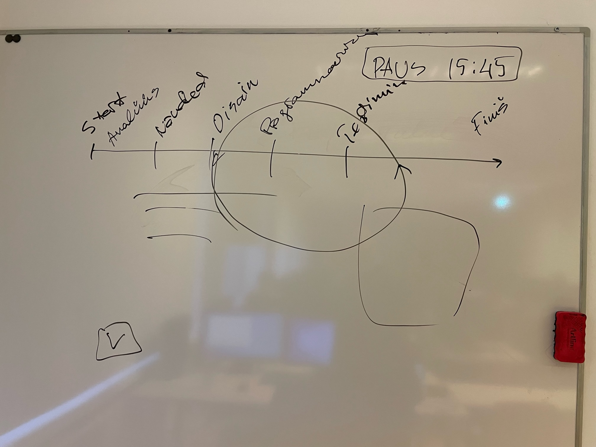
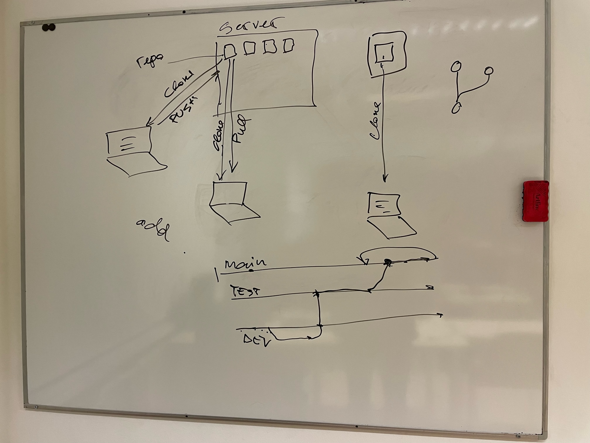

# Esimene loeng

Esimese loengu eesmärk on arutleda selle üle, mis on üldse tarkvara ja kuidas see tekib. Seejärel räägime natukene tööriistadest ja teeme kohe tutvust ühe väga olulise teemaga, mis puudutab koodihaldust. Selle kursuse ja kooli jooksul üldiselt hakkame kasutama koodihalduskeskkonnana GitHub-i ja püüame sellega võimalikult ruttu tuttavaks saada.

[Esimese loengu slaidid](files/slaidid_01.pdf)

[Esimese loengu salvestus](https://zoom.us/rec/share/SViPF6fkZBgCELDgLUsljbO173iqfRdaD1p1FKgGumDkcq6Mj09OCNXZBiHmXAHD.uB6YaLTZKXTFtznx?startTime=1676720682000) - Parool: 8DJz.+@9

## Esimese loengu teemad:

- [Sissejuhatus](../../concepts/sissejuhatus/about.md)
- [Tarkvara](../../concepts/tarkvara/about.md)
- [Tarkvaraarendus](../../concepts/tarkvaraarendus/about.md)
- [Tarkvaraarenduse elutsükkel](../../concepts/SDLC/about.md)
- [Git](../../concepts/git/about.md)
- [Github](../../concepts/github/readme.md)
- [.gitignore](../../concepts/gitignore/about.md)
- [Markdown](../../concepts/markdown/about.md)
- [Github issue](../../concepts/githubIssue/readme.md)

## Mida veel materjalidesse lisada

- [XML](https://github.com/tluhk/Programmeerimine_I/blob/master/concepts/xml/about.md)

## Kodune töö

Tähtajad vastavalt Programmeerimine I aine [tähtaegadele](https://github.com/tluhk/Programmeerimine_I/blob/master/lessons/loeng_02/about.md#kodune-t%C3%B6%C3%B6).

- Endanimelises kaustas README.md lühikese ülevaade oma kodutööde kohta
  - Kuidas ülesande lahendamisele lähenesid
  - Kas oli probleeme
  - Kuidas probleemid lahendasid
- Programmeerimine I ülesanded
- Oma Programmeerimine I kausta
  - Kodune_1
  - Kodune_2