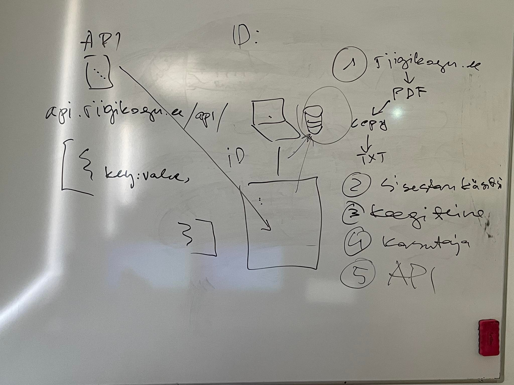

# Teine loeng

Kõigepealt meenutame eelmist loengut ja vaatame üle, kuidas on läinud kodutööde tegemine ja täpsustame üle mõningad aspektid kodutööde esitamisega seoses.

Seejärel vaatame üle teemad, mis olid eelmisse loengusse planeeritud, kuid mida ei jõudnud läbi vaadata või vaatasime väga pinnapealselt.

Järgmisena viime läbi harjutuse, mis sisaldab loodava rakenduse jaoks analüüsi, nõuete määratlemist ja disaini. Harjutuse tulemus on sisendiks Programmeerimine I aines loodava rakenduse jaoks.

Lisaks räägime tarkvaraarenduse meetoditest ja koodi kvaliteedist.

[Esimene loeng](../loeng_01/README.md)

[Teise loengu slaidid](files/slaidid_02.pdf)

[Teise loengu salvestus]()

[Kolmas loeng](../loeng_03/README.md)

## Teise loengu teemad

- [Meenutame eelmist loengut](../loeng_01/README.md)
- Konsultatsioon
- [Kodused tööd](../../docs/kodusedtood/kodune_01_tagasiside.md)
- [.gitignore](../../concepts/gitignore/README.md)
- [Persoona](../../concepts/persoona/README.md)
- [Stsenaarium](../../concepts/stsenaarium/README.md)
- [Kasutajalood](../../concepts/kasutajalugu/README.md)
- [Kasutaja teekond](../../concepts/kasutajateekond/README.md)
- [Harjutus nõuete väljaselgitamiseks](files/harjutus.md)
- [Tarkvaraarenduse meetodid](../../concepts/arendusmeetodid/README.md)
- [Koodi kvaliteet](../../concepts/koodikvaliteet/README.md)

## Mida veel materjalidesse lisada

## Loengus tehtav töö

Esitada repositooriumisse hiljemalt

[Harjutus](files/harjutus.md)

## Kodune töö

[Teise koduse töö kirjelduse leiad siit](../../docs/kodusedtood/kodune_02.md)
