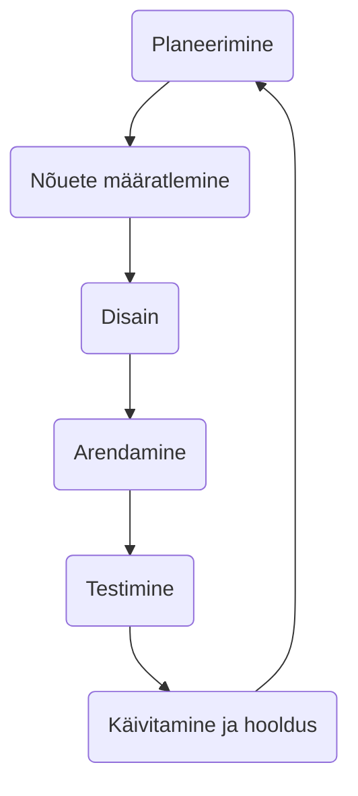

# Harjutus nõuete kogumiseks

## Riigikogu liikmete lehekülg

- Riigikogu liikmete lehekülg
- Andmed
  - Nimi
  - Sünniaeg
  - Valimisringkond
  - Viimane sõnavõtt
  - Märkused, skoor vms
- List
  - Kõik nimed
  - Otsing

---

- Kust saab andmed?
- Kuidas andmeid säilitada?
- Disain?
- Veel midagi?

## Eelmisest loengust mäletame

## Et ei juhtuks nii

  
[Pildi allikas](https://pmac-agpc.ca/sites/default/files/Tree.jpg)

## Planeerimine

- Kellele?
- Milleks?
- Mida?
- Kas midagi on juba olemas?
- Kas mingiks muuks asjaks mõeldud olemasolev asi sobiks?

## Nõuded

- Mida on kindlasti vaja?
- Mis oleks tore, kui oleks olemas?
- Soov ei võrdu vajadus!
- Nõuete prioritiseerimine

## Disain

- Mis andmeid on vaja?
- Kust neid saab?
- Kas midagi on vaja endale salvestada?
- Kui on vaja salvestada, siis kuhu ja kuidas?
- [UX/UI prototüüp](../../../concepts/prototyypimine/README.md)

## Tulemuse esitamine
