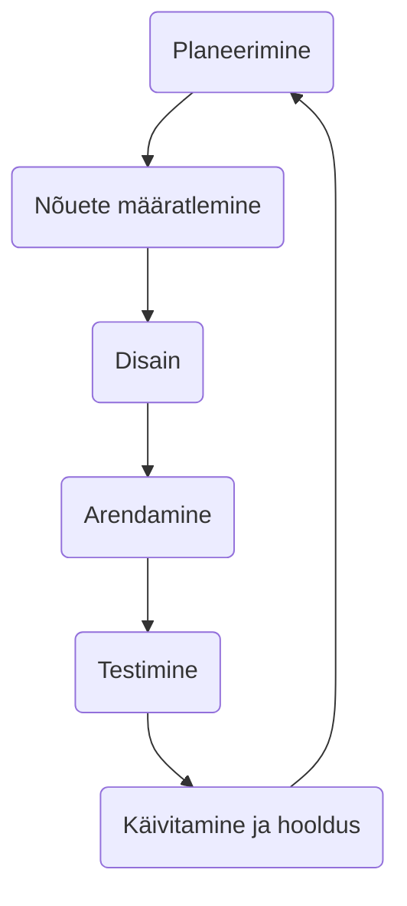

# Harjutus nõuete kogumiseks

## Maja joonistamine

## Riigikogu liikmete lehekülg

- Riigikogu liikmete lehekülg
- Andmed
  - Nimi
  - Sünniaeg
  - Valimisringkond
  - Viimane sõnavõtt
  - Märkused, skoor vms
- List
  - Kõik nimed
  - Otsing

- Kust saab andmed?
- Kuidas andmeid säilitada?
- Disain?
- Veel midagi?

## Eelmisest loengust mäletame:

## Et ei juhtuks nii ...

