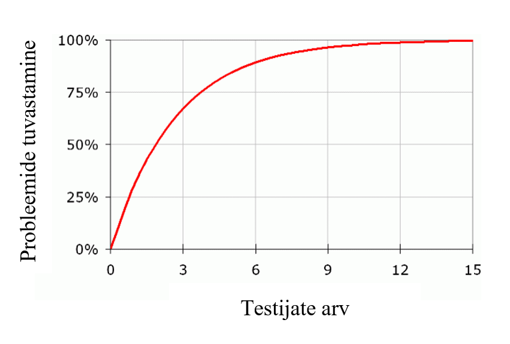

# Sissejuhatus tarkvaraarendusse

Martti Raavel
<martti.raavel@tlu.ee>

---

## Neljas loeng

- [Meenutame eelmist loengut](../loeng_03/README.md)
- [Forkimine](../../../concepts/fork/README.md)
- [Mittefunktsionaalsed nõuded](../../../concepts/mittefunktsionaalsedNouded/README.md)
- [Prototüüpimine](../../../concepts/prototyypimine/README.md)
- [Testimine](../../../concepts/testimine/README.md)

---

## Fork

`Fork`imine tähendab olemasoleva repositooriumi kopeerimist enda Githubi kontole.

`Fork`itud repositoorium säilitab ühenduse originaalrepositooriumiga, mis võimaldab algse repositooriumi omanikul vaadata ja kopeerida muudatusi, mis on tehtud forkitud repositooriumis.

`Fork`imine annab võimaluse teha muudatusi repositooriumis, millele sul ei ole kirjutamisõigusi (läbi `Pull Request`i).

---

## Fork vs Clone

Mis vahe on repositooriumi `fork`imisel ja `clone`imisel?

---

## Mittefunktsionaalsed nõuded

Funktsionaalsed vs mittefunktsionaalsed nõuded?

---

## Mittefunktsionaalsed nõuded - mis?

Kriteeriumid, mis määravad süsteemi kvaliteedi, toimivuse ja töökindluse, kuid ei ole seotud süsteemi konkreetsete funktsionaalsete omadustega

---

## Mittefunktsionaalsed nõuded projektile

- Jõudlus
- Skaleeritavus
- Turvalisus
- Usaldusväärsus
- Hooldatavus
- Kasutatavus
- Ühilduvus

---

## Mittefunktsonaalsed nõuded koodile

- Koodi loetavus
- Koodi struktuur ja modulaarsus
- Dokumentatsioon
- Testitavus
- Versioonihaldus
- Koodi optimeerimine
- Turvalisus
- Koodi ühilduvus
- Koodi läbipaistvus ja lähtekoodi avatus
- Arendusstandardite ja kodeerimisstiilide järgimine

---

## Prototüüpimine

Prototüüpimine on tehnika, mida kasutatakse tarkvaraarenduses tarkvaratoote või -süsteemi varajaste töötavate versioonide loomiseks.

Prototüüpimine hõlmab lõpptootest lihtsustatud, kuid funktsionaalse versiooni loomist, mida saab kasutada tagasiside kogumiseks, ideede testimiseks ja nõuete täpsustamiseks enne lõpliku versiooni loomist.

---

## Protorüüpimise eesmärk

Prototüüpimise peamine eesmärk on pakkuda lõpptootest käegakatsutavat interaktiivset esitust, mida saab kasutada võimalike probleemide ja parendusvaldkondade tuvastamiseks.

Prototüübi loomisega saavad arendajad kiiresti katsetada ja itereerida erinevaid disainikontseptsioone ja töövooge ning saada paremat arusaama sellest, kuidas lõpptoode töötab ja kuidas seda lõppkasutajad kasutavad.

---

## Prototüüpimise eelised

- Parem suhtlus ja koostöö meeskonnaliikmete ja sidusrühmade vahel
- Võimalike probleemide ja parendusvaldkondade varajane tuvastamine
- Arusaamatuste ja valesti suhtlemise oht arendajate ja sidusrühmade vahel
- Disainikontseptsioonide ja töövoogude kiirem iteratsioon ja testimine
- Parem kasutajate seotus ja rahulolu varajase tagasiside ja sisendi kaudu
- ...

---

## Prototüüpimine - kuidas?

Prototüüpimine võib esineda mitmel kujul, alates lihtsatest visanditest ja paberprototüüpidest kuni täiustatud digitaalsete prototüüpideni, mis on loodud spetsiaalsete tarkvaratööriistadega.

Kasutatava prototüübi tüüp sõltub projekti vajadustest, eelarvest ja ajakavast.

---

## Paberprototüüpimine

Sageli alahinnatud prototüüpimise tehnika, mis võimaldab kiiresti ja odavalt luua interaktiivseid prototüüpe.

See hõlmab paberi, pastakate ja muude põhimaterjalide kasutamist kasutajaliidese või töövoo füüsilise mudeli loomiseks.

---

## Paberprototüüpimise eelised

- Madalad kulud
- Kiire iteratsioon
- Parandatud suhtlus
- Suurem kasutajate kaasatus

---

## Digitaalsed prototüüpimise tööriistad

- Figma
- Sketch
- Adobe XD
- InVision
- Axure RP
- ...

---

## Testimine - milleks?

- **Probleemide tuvastamine** disaini, toote või teenuse juures. 
- **Võimaluste leidmine** disaini parandamiseks. 
- **Kasutajate jälgimine** harjumuste ja eelistuste tuvastamiseks.

---

## Testimise elemendid

- **Testi läbiviija** - juhendab testis osalejat ülesannete sooritamisel, vaatleb ja talletab reaktsioone, vajadusel esitab lisaküsimusi.
- **Ülesanded** ehk reaalsed tegevused, mida kasutajad sooritaks tavaolukorras. Edastatakse suuliselt või kirjalikult.
- **Osaleja / testija** - esindab testitava toote tavakasutajat, sooritab läbiviija poolt antud ülesandeid ja tegevusi, annab tagasisidet.

---

## Osalejate / testijate arv

- Piisab **kuni 5 testijast**, et tuvastada pea kõik kasutatavuse probleemid;
- Juba esimene testija tuvastab umbes ühe kolmandiku probleemidest;
- Testimise võib lõpetada niipea, kui uus testija enam **midagi uut** välja ei too.

---

## Testijate arv

---

## Testimise tüübid

- **Kasutatavustestid** - kasutajaliidese ja kasutuskogemuse testimine.
- **A/B testimine** - kahe või enama versiooni võrdlemine, et teha kindlaks, milline neist toimib paremini.
- **Funktsionaalsed testid** - süsteemi funktsionaalsuse testimine.
- **Jõudlustestid** - süsteemi jõudluse testimine.
- **Turvalisustestid** - süsteemi turvalisuse testimine.
- **Ühilduvustestid** - süsteemi ühilduvuse testimine erinevate platvormide ja seadmetega.
- ...

---

## Kodune töö

