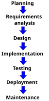
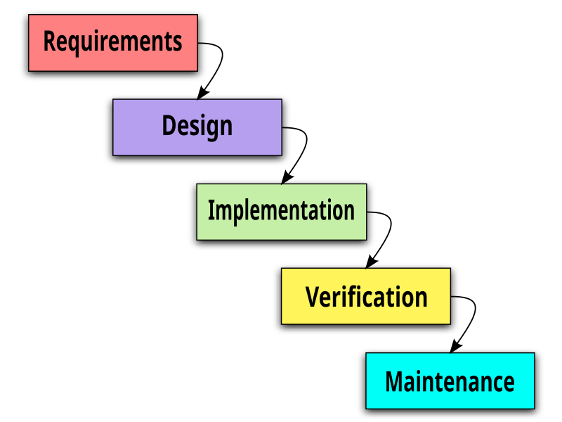
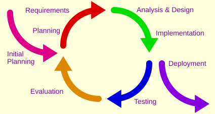

# Seminar 1: sissejuhatus ja arenduskeskkonna seadistamine

## Seminari eesmärk

Esimeses seminaris saad ülevaate kursusest, tarkvarast ja tarkvaraarenduse elutsüklist. Seminari praktilises osas seadistad töövahendid, mida kasutame kogu kursuse jooksul.

Kursuse läbiv mõte on, et **tarkvaraarendus on meeskonnatöö**. Tarkvara loovad koos kasutajad, tellija, analüütikud, disainerid, arendajad ja testijad. See kehtib ka siis, kui suure osa koodist kirjutab AI: vastutus tulemuse eest, otsused ja kokkulepped jäävad inimestele ja meeskonnale.

Seminari lõpuks:

- oskad oma sõnadega selgitada, mis on programm, tarkvara ja tarkvaraarendus;
- tead, et programmeerimine on ainult üks osa tarkvaraarendusest;
- tead, et tarkvaraarendus on meeskonnatöö ka AI-vahendite kasutamisel;
- tunned tarkvaraarenduse elutsükli peamisi etappe;
- oskad nimetada võimalusi ja riske, mida AI tarkvaraarendusse toob;
- tead, milleks kasutatakse VS Code'i, terminali, Giti, GitHubi, Node.js-i ja Dockerit;
- oskad avada VS Code'is projekti kausta ja terminali;
- oskad luua või kloonida GitHubi repositooriumi;
- oskad muuta Markdown-faili ning saata muudatuse GitHubi.

## Ajakava

Seminar koosneb kahest 90-minutilisest osast.

### I osa: mis on tarkvaraarendus?

| Aeg | Teema | Kestus |
|---|---|---:|
| 0:00–0:10 | Kursus ja tänase seminari eesmärk | 10 min |
| 0:10–0:30 | Programm ja tarkvara ning tarkvara roll | 20 min |
| 0:30–0:50 | Tarkvaraarendus ja selle elutsükkel | 20 min |
| 0:50–1:05 | AI tarkvaraarenduses | 15 min |
| 1:05–1:20 | Arendaja töövahendite tervikpilt | 15 min |
| 1:20–1:30 | Paigalduste alustamine ja puhver | 10 min |

### II osa: arenduskeskkonna seadistamine ja esimene GitHubi muudatus

| Aeg | Teema | Kestus |
|---|---|---:|
| 0:00–0:15 | VS Code, IDE ja projekti kaust | 15 min |
| 0:15–0:30 | Terminal ja Git Bash | 15 min |
| 0:30–0:45 | Git ja GitHub | 15 min |
| 0:45–1:15 | Praktiline GitHubi töövoog | 30 min |
| 1:15–1:25 | Markdown | 10 min |
| 1:25–1:30 | Kontrollpunkt ja järgmised sammud | 5 min |

> Ajad on orientiirid. Paigaldused, sisselogimine ja erinevate operatsioonisüsteemide probleemid võivad võtta planeeritust rohkem aega.

---

# I osa: mis on tarkvaraarendus?

Esimeses osas liigume üldisemalt konkreetsemale: kõigepealt selgitame, mis on programm ja tarkvara, seejärel milline on tarkvara roll, mis on tarkvaraarendus ja milline on selle elutsükkel, kuidas AI arendust muudab ning milliseid töövahendeid arendaja kasutab.

## 1. Kursus ja tänane seminar

### Mida kursusel teeme?

Kursuse jooksul läbime tarkvaraarenduse teekonna ühe projekti kaudu:

```text
Probleem
  ↓
Kasutajate ja vajaduste uurimine
  ↓
Nõuete kirjeldamine
  ↓
Töö planeerimine
  ↓
Lahenduse disainimine
  ↓
Arendamine
  ↓
Testimine ja tagasiside
  ↓
Avaldamine ja hooldus
```

Kursuse läbiv praktiline töö toimub GitHubis. Kasutame GitHubi nii failide hoidmiseks, muudatuste jälgimiseks, ülesannete planeerimiseks kui ka koostööks.

### Aruteluküsimus

Millise tarkvara kasutamine mõjutas sinu tänast päeva juba enne seminari algust?

## 2. Programm ja tarkvara

### Mis on tarkvara?

Alustame kõige üldisemast küsimusest.

> Mis on tarkvara? Kas programm ja tarkvara on sama asi?

**Õppejõule:** lase õppijatel pakkuda näiteid ja erinevusi enne definitsioonide andmist.

Lühidalt: tarkvara on kõik see, mis paneb riistvara kasuliku ülesande jaoks tööle. Tarkvara ei koosne ainult koodist.

### Mis on programm?

Programm on arvutile antud käskude või juhiste kogum, mille abil täidetakse mingit ülesannet.

Programm võib näiteks:

- arvutada kahe arvu summa;
- kuvada veebilehe;
- töödelda pilti;
- juhtida valgusfoori;
- saata sõnumi;
- otsida andmebaasist vajalikku teavet.

### Programm vs tarkvara

Tarkvara on programmist laiem mõiste. Tarkvara võib koosneda:

- ühest või mitmest programmist;
- lähtekoodist;
- andmetest;
- seadistustest;
- dokumentatsioonist;
- välistest teekidest ja teenustest.

Tarkvara vajab töötamiseks riistvara. Rakendus võib töötada telefonis, sülearvutis, serveris, autos, mängukonsoolis või mõnes väikeses elektroonikaseadmes.

### Tarkvara põhitüübid

- **Süsteemitarkvara** aitab seadmel töötada. Näiteks Windows, macOS, Linux, Android ja seadmedraiverid.
- **Rakendustarkvara** aitab kasutajal mingit ülesannet täita. Näiteks veebibrauser, tekstitöötlusprogramm või pangarakendus.
- **Veebirakendus** töötab tavaliselt brauseri kaudu, kuid selle osad võivad paikneda mitmes serveris ja kasutada teisi teenuseid.
- **Sardtarkvara** on ehitatud mõne füüsilise seadme sisse. Näiteks auto juhtploki või nutika termostaadi tarkvara.

Piirid ei ole alati täiesti selged. Üks tarkvaratoode võib koosneda mitut tüüpi komponentidest.

## 3. Tarkvara roll ühiskonnas

Tarkvara kasutatakse muu hulgas:

- suhtluses ja meedias;
- hariduses;
- panganduses ja kaubanduses;
- transpordis ja logistikas;
- tervishoius;
- avalikes teenustes;
- tööstuses ja põllumajanduses;
- teaduses ja meelelahutuses.

Tarkvaral on tagajärjed. Halvasti kavandatud või testitud tarkvara võib põhjustada andmekadu, rahalist kahju, privaatsuse rikkumist või ohtu inimese tervisele. Seetõttu ei piisa ainult sellest, et programm „minu arvutis töötab”.

Hea tarkvara peab vastama kasutaja vajadusele ning olema oma kasutuskohas piisavalt töökindel, turvaline, arusaadav ja hooldatav.

### Paarisarutelu

Valige üks tarkvara, mida mõlemad kasutate.

1. Millist probleemi see lahendab?
2. Kes on selle kasutajad?
3. Mis juhtuks, kui see töötaks valesti?
4. Millest see lisaks nähtavale kasutajaliidesele koosneda võib?

## 4. Tarkvaraarendus ja selle elutsükkel

### Avaküsimus

Nüüd, kui teame, mis on tarkvara, küsime, kuidas see sünnib.

> Mis on teie arvates tarkvaraarendus?

Arutame seda kõigepealt koos. Paku välja tegevusi, mis sinu arvates tarkvaraarenduse juurde kuuluvad. Selles etapis ei ole vaja jõuda ühe täpse definitsioonini.

**Õppejõule:** kirjuta pakutud tegevused tahvlile või ühisesse dokumenti. Ära hakka vastuseid kohe õigeks või valeks hindama. Kui arutelu ei käivitu, kasuta jätkuküsimusi:

- Millest tarkvara loomine algab?
- Kes peale programmeerija tarkvara loomises osalevad?
- Mis peab juhtuma enne koodi kirjutamist?
- Mis juhtub pärast seda, kui kood on valmis?
- Kas töötav, kuid kasutaja probleemi mitte lahendav programm on õnnestunud tarkvara?

Tõenäoliselt pakutakse ühe vastusena **programmeerimist ehk koodi kirjutamist**. See vastus on õige, kuid kirjeldab ainult ühte osa tervikust.

### Mis on tarkvaraarendus?

Tarkvaraarendus on protsess, mille käigus uuritakse probleemi, kavandatakse lahendus, luuakse tarkvara, kontrollitakse selle kvaliteeti ning hooldatakse seda pärast kasutuselevõttu.

> Tarkvaraarendus ei võrdu programmeerimisega. Programmeerimine ehk koodi kirjutamine on üks osa tarkvaraarendusest.

Tarkvaraarendus hõlmab probleemi ja kasutajate vajaduste mõistmist, nõuete kirjeldamist, lahenduse kavandamist, töö planeerimist, programmeerimist, testimist, avaldamist ja hooldamist. Kursuse jooksul vaatame seda tervikliku protsessina.

### Kes tarkvara arendavad?

Tarkvara ei loo tavaliselt üks inimene. Arendusse võivad panustada:

- kasutajad ja tellija;
- tooteomanik ja projektijuht;
- analüütik;
- kasutajakogemuse ja kasutajaliidese disainer;
- arendaja;
- testija;
- süsteemi-, andme- ja turvaspetsialistid.

Ühes projektis võib inimene täita mitut rolli. Teises projektis võib iga rolliga tegeleda terve meeskond.

### Tarkvaraarendus on meeskonnatöö

Tarkvara ei loo tavaliselt üks inimene. Ka kursuse projekt on meeskonnatöö: jagame ülesandeid, vaatame üksteise tööd üle ja lepime kokku, kuidas asju teeme.

See kehtib ka AI-vahendite kasutamisel. AI võib kirjutada koodi, pakkuda lahendusi ja koostada dokumentatsiooni, kuid ei otsusta, millist probleemi lahendame, ei lepi kokku meeskonna töökorraldust ega vastuta tulemuse eest. Need jäävad inimestele.

**Õppejõule:** see on kursuse läbiv mõte. Tule selle juurde tagasi AI-peatükis ning GitHubi töövoo juures.

### Tarkvaraarenduse elutsükkel

Tarkvaraarenduse elutsükkel ehk **SDLC** (*Software Development Life Cycle*) kirjeldab tegevusi, mida on vaja tarkvara loomiseks ja käigus hoidmiseks.

Lihtsustatud elutsükkel:

1. **Probleemi mõistmine** – kelle probleem ja miks tasub seda lahendada?
2. **Uurimine ja nõuded** – mida kasutajad vajavad ning mida süsteem peab tegema?
3. **Planeerimine** – kes, mida, millal ja milliste vahenditega teeb?
4. **Disainimine** – kuidas lahendus töötab ja kuidas kasutaja seda kasutab?
5. **Arendamine** – lahendus ehitatakse ja kirjutatakse kood.
6. **Testimine** – kontrollitakse funktsionaalsust, kasutatavust, turvalisust ja töökindlust.
7. **Avaldamine** – tarkvara tehakse kasutajatele kättesaadavaks.
8. **Kasutamine ja hooldus** – parandatakse vigu, jälgitakse tööd ning lisatakse vajaduse korral uusi võimalusi.



*Tarkvaraarenduse elutsükkel planeerimisest hoolduseni. Joonis: [Wikimedia Commons](https://commons.wikimedia.org/wiki/File:Systems_development_life_cycle.svg), [CC0 1.0](https://creativecommons.org/publicdomain/zero/1.0/).*

Päris arendus ei liigu alati sirgjooneliselt. Testimine võib näidata, et disaini tuleb muuta. Kasutajate tagasiside võib muuta nõudeid. Hoolduse käigus algab järgmine arendusring.

### Kosemudel ja iteratiivne arendus

- **Kosemudelis** liigutakse etappide kaupa ning järgmine suurem etapp algab pärast eelmise lõpetamist.



*Kosemudelis liigub töö nõuetest disaini, teostuse, kontrollimise ja hoolduseni. Joonis: Paul Smith / [Wikimedia Commons](https://commons.wikimedia.org/wiki/File:Waterfall_model_(1).svg), [CC BY 3.0](https://creativecommons.org/licenses/by/3.0/).*

- **Iteratiivses arenduses** luuakse lahendus väiksemate osade ja korduvate arendusringidena.



*Iteratiivses arenduses korratakse planeerimise, nõuete, disaini, teostuse, testimise ja hindamise tegevusi. Joonis: Aflafla1 / [Wikimedia Commons](https://commons.wikimedia.org/wiki/File:Iterative_development_model.svg), [CC0 1.0](https://creativecommons.org/publicdomain/zero/1.0/).*

### Iteratiivne ja järkjärguline arendus

Neid kahte mõistet kasutatakse sageli koos, kuid need kirjeldavad veidi erinevaid tegevusi:

- **Iteratiivne arendus** tähendab, et tuleme sama lahenduse juurde korduvalt tagasi, kontrollime tulemust ja parandame seda tagasiside põhjal.
- **Järkjärguline ehk inkrementaalne arendus** tähendab, et lisame töötavale lahendusele sammhaaval uusi võimalusi.

Näiteks võib üliõpilaste ülesannete haldamise rakendus areneda nii:

1. kasutaja näeb ülesannete nimekirja;
2. järgmisena saab ta ülesandeid lisada;
3. seejärel saab määrata tähtaja;
4. hiljem lisanduvad meeldetuletused ja rühmatöö võimalused.

Iga etapi järel on olemas eelmisest täiuslikum, kuid kasutatav tarkvaraversioon. Samal ajal võidakse juba olemasolevaid võimalusi kasutajate tagasiside põhjal korduvalt parandada.

### MVP: väikseim elujõuline toode

**MVP** (*Minimum Viable Product*) on väikseim kasutatav tooteversioon, millega saab kontrollida olulist oletust ja koguda päris kasutajatelt tagasisidet.

Ülesannete haldamise rakenduse MVP võib võimaldada ainult ülesande lisamist, nimekirja vaatamist ja ülesande tehtuks märkimist. Kujundus võib olla lihtne ning meeldetuletused, rühmad ja muud lisavõimalused võivad alguses puududa. Põhiline töövoog peab siiski algusest lõpuni toimima.

MVP ei tähenda teadlikult halva või katkise toote avaldamist. See tähendab, et kõigepealt ehitatakse valmis kõige väiksem tervik, mis:

- lahendab kasutaja jaoks mingi päris probleemi;
- töötab piisavalt hästi, et seda saaks kasutada;
- aitab kontrollida, kas valitud lahendus on üldse vajalik;
- annab järgmise arendusringi jaoks tagasisidet.

```text
MVP → kasutamine → tagasiside → parandused ja uued võimalused → järgmine versioon
```

MVP ja järkjärguline arendus sobivad hästi agiilse mõtteviisiga, kuid need ei ole täpselt sama asi. Agiilne arendus kirjeldab laiemalt seda, kuidas meeskond töötab, teeb koostööd ja reageerib muutustele.

Nii kosemudelis kui ka iteratiivses arenduses on vaja probleemi mõista, tööd kavandada, tulemust kontrollida ja tehtut dokumenteerida.

## 5. AI tarkvaraarenduses

AI ei ole tarkvaraarenduse elutsüklis ainult koodi kirjutamise tööriist. See võib toetada peaaegu kõiki etappe.

| Arenduse osa | Kuidas AI võib aidata? | Mida inimene peab kontrollima? |
|---|---|---|
| Uurimine | info koondamine, küsimuste ideed | allikad, kallutatus, tegelikud kasutajavajadused |
| Nõuded | sõnastamine, rühmitamine, vastuolude leidmine | kas nõue vastab päris probleemile |
| Disain | lahendusideed, kasutusvood, prototüübid | kasutatavus, ligipääsetavus, sobivus |
| Programmeerimine | koodi loomine, selgitamine ja parandamine | kas kood töötab, on turvaline ja arusaadav |
| Testimine | testjuhtumid ja võimalike piirjuhtude leidmine | kas testid on piisavad ja tulemused õiged |
| Dokumentatsioon | mustandid, kokkuvõtted ja näited | faktiline täpsus ja vastavus tegelikule süsteemile |
| Hooldus | logide, vigade ja vana koodi analüüs | muudatuse mõju kogu süsteemile |

AI võib muuta töö kiiremaks, kuid ei võta inimeselt vastutust. Tarkvaraarendus jääb ka AI-vahendeid kasutades meeskonnatööks: mida ehitada, kuidas tööd jagada ja kas tulemus kõlbab, otsustavad inimesed koos.

### AI kasutamise põhimõtted

- Ära eelda, et veenvalt sõnastatud vastus on õige.
- Kontrolli loodud koodi, viiteid ja väiteid.
- Ära sisesta avalikku AI-teenusesse paroole, API võtmeid, isikuandmeid ega konfidentsiaalset lähtekoodi.
- Uuri enne kasutamist, millised on kursuse, tööandja või projekti reeglid.
- Arvesta autoriõiguse, litsentside, privaatsuse, turvalisuse ja kallutatuse küsimustega.
- Ole valmis selgitama enda esitatud töö sisu ja tehtud otsuseid.

### Aruteluküsimus

Kui AI loob töötava koodi, siis kes vastutab selle eest, et kood oleks turvaline ja vastaks kasutaja vajadusele?

## 6. Arendaja töövahendite tervikpilt

Tarkvara arendamisel kasutatakse mitut erineva ülesandega töövahendit.

| Töövahend | Milleks seda kasutatakse? |
|---|---|
| VS Code | projekti failide ja koodi muutmine ning tööriistade ühendamine |
| Terminal | tekstikäskude abil programmide käivitamine ja arvuti juhtimine |
| Git | failide muudatuste ajaloo ja versioonide haldamine |
| GitHub | Giti repositooriumide veebis hoidmine ja meeskonnatöö |
| GitHub CLI (`gh`) | GitHubi repositooriumide ja Issue'de kasutamine terminalist |
| Markdown | lihtsa vormindusega dokumentatsiooni kirjutamine |
| Node.js | JavaScripti käivitamine väljaspool veebibrauserit |
| npm | Node.js-i pakettide ja projektikäskude haldamine |
| Docker | rakenduse ja selle keskkonna pakendamine konteinerisse |

Need töövahendid ei asenda üksteist. Nad moodustavad omavahel seotud arenduskeskkonna.

```text
VS Code
├── projekti failid
├── Giti tööriistad
├── laiendused
└── terminal
    ├── Git
    ├── GitHub CLI
    ├── Node.js ja npm
    └── Docker
```

## 7. Alustame paigaldustega

Kui vajalikud programmid pole veel arvutis, alusta nende allalaadimist enne esimese osa lõppu. Paigaldamist jätkame teises osas.

Vajalikud töövahendid:

1. [Git](https://git-scm.com/downloads)
2. [Visual Studio Code](https://code.visualstudio.com/)
3. [Node.js](https://nodejs.org/)
4. GitHubi kasutajakonto

[GitHub CLI](https://cli.github.com/) on kasulik valikuline lisatööriist. GitHub Desktop on lubatud graafiline alternatiiv, kuid kursusel kasutame põhilise Giti kasutajaliidesena VS Code'i.

Dockerist räägime esimeses seminaris, kuid selle paigaldamine ei ole tänase seminari lõpetamise eeltingimus.

### Git tuleb eraldi paigaldada

VS Code sisaldab Giti graafilist kasutajaliidest, kuid kasutab arvutisse paigaldatud Giti. Ka GitHub Desktop ei asenda Giti paigaldust VS Code'i jaoks.

Kontrolli terminalis:

```bash
git --version
```

Kui käsu vastuses on versiooninumber, on Git olemas. Kui näed teadet `command not found`, `not recognized` või VS Code ei leia Giti, tuleb Git paigaldada.

#### Windows

1. Ava [Git for Windowsi ametlik paigaldusleht](https://git-scm.com/install/windows).
2. Laadi alla oma arvutile sobiv paigaldaja. Enamikul arvutitel sobib x64 versioon, ARM-seadmel vali ARM64.
3. Käivita paigaldaja. Algaja võib üldjuhul jätta vaikevalikud.
4. Paigaldaja lisab Git Bashi ja Git Credential Manageri.
5. Sulge ja ava VS Code pärast paigaldamist uuesti.

Windows Package Manageriga saab Giti paigaldada ka käsuga:

```powershell
winget install --id Git.Git -e --source winget
```

#### macOS

macOS võib pakkuda Giti või Xcode Command Line Toolsi paigaldamist, kui käivitad esimest korda `git --version`. Kui paigaldusdialoogi ei ilmu, proovi:

```bash
xcode-select --install
```

Teised võimalused on [macOS-i Giti paigaldusjuhendis](https://git-scm.com/install/mac).

#### Linux

Kasuta oma Linuxi distributsiooni paketihaldurit. Näiteks Ubuntu või Debiani puhul:

```bash
sudo apt update
sudo apt install git
```

Teiste distributsioonide käsud leiab [Linuxi Giti paigaldusjuhendist](https://git-scm.com/install/linux).

### Levinud probleemid

#### Terminal või VS Code ei leia Giti pärast paigaldamist

- sulge kõik terminaliaknad ja VS Code ning ava need uuesti;
- kontrolli uues terminalis käsku `git --version`;
- Windowsis kontrolli, et paigaldasid Git for Windowsi;
- ava VS Code'i käsupaletist **Git: Show Git Output** ja vaata esimest veateadet.

#### Esimene commit küsib kasutaja nime ja e-posti

Git lisab autori nime ja e-posti iga commit'i metaandmetesse. Seadista need üks kord:

```bash
git config --global user.name "Sinu nimi"
git config --global user.email "sinu@email.ee"
```

Kasuta GitHubi kontoga seotud aadressi või GitHubi pakutavat privaatset `noreply` aadressi. Tavaline e-post võib muutuda avalikus repositooriumis commit'i osana nähtavaks.

#### GitHub küsib korduvalt sisselogimist

Git for Windows sisaldab Git Credential Manageri. Teistes süsteemides kontrolli, et kasutad sobivat credential helper'it. VS Code'i sisselogimisaken või `gh auth login` võib avada autentimise brauseris.

#### Paigaldamiseks puuduvad õigused

Ära proovi turvapiiranguid mööda minna. Küsi abi õppejõult või arvuti IT-toelt.

> Logi jagamisel kontrolli enne, et selles poleks kasutajanime, privaatseid failiteid, repositooriumi aadresse ega autentimisandmeid.

---

# II osa: arenduskeskkonna seadistamine

## 8. VS Code, koodiredaktor ja IDE

**IDE** on lühend ingliskeelsest nimetusest *Integrated Development Environment* ehk integreeritud arenduskeskkond.

IDE koondab tavaliselt ühte programmi:

- koodiredaktori;
- projekti failide halduse;
- koodi käivitamise;
- silumise ehk vigade otsimise;
- testimise;
- terminali;
- versioonihalduse tööriistad.

VS Code on ametlikult koodiredaktor, mida saab laienduste abil kasutada tervikliku arenduskeskkonnana.

### VS Code'i põhiosad

- **Explorer** – projekti kaustad ja failid;
- **Search** – otsing projekti failidest;
- **Source Control** – Giti muudatused;
- **Run and Debug** – rakenduse käivitamine ja silumine;
- **Extensions** – lisavõimaluste paigaldamine;
- **Terminal** – käsurea kasutamine VS Code'i sees.

### Alternatiivid

Olemas on palju teisi koodiredaktoreid ja arenduskeskkondi, näiteks Cursor, Devin Desktop ja Sublime Text. Mõni keskendub klassikalisele koodikirjutamisele, mõni AI-toega töövoole. Atom on ajalooliselt oluline koodiredaktor, kuid selle ametlik arendus lõpetati 2022. aastal.

Kui oled mõnda neist kasutanud, kirjelda lühidalt:

- mida kasutasid;
- milleks kasutasid;
- mis oli selle juures mugav või ebamugav.

### Praktiline kontroll

1. Ava VS Code.
2. Vali **File → Open Folder**.
3. Loo või vali oma arvutis kursuse jaoks eraldi kaust.
4. Leia vasakult Explorer ja Source Control.
5. Ava menüüst **Terminal → New Terminal**.

## 9. Terminal ja käsukest (*shell*)

**Terminal** on kasutajaliides, kuhu saab kirjutada tekstikäske ja näha nende väljundit.

**Käsukest** (*shell*) on programm, mis neid käske tõlgendab. Levinud käsukestad on näiteks Bash, Zsh ja PowerShell.

Terminal ei ole Giti sünonüüm. Git, Node.js, npm ja Docker on eraldi programmid, mida saab terminalist käivitada.

### Windows: Git Bash

Kursuse käsureanäited kasutavad Bashile sobivat kuju. Windowsis vali VS Code'i terminalis Git Bash:

1. Ava VS Code'is terminal.
2. Vajuta terminalipaneelil profiili valiku noolele.
3. Vali **Select Default Profile**.
4. Vali **Git Bash**.
5. Ava uus terminal.

Kui Git Bash valikus puudub, kontrolli, kas Git on paigaldatud, ning taaskäivita VS Code.

macOS-is sobib vaikimisi kasutatav Zsh. Linuxis sobib tavaliselt Bash või Zsh.

### Esimesed ohutud käsud

```bash
pwd
ls
git --version
gh --version
node --version
npm --version
```

- `pwd` näitab aktiivse kausta asukohta;
- `ls` näitab aktiivse kausta sisu;
- `--version` näitab, kas programm on paigaldatud ja milline versioon käivitub.

`gh --version` kontrollib valikulise GitHub CLI olemasolu. Selle puudumine ei takista põhiharjutuse tegemist.

> Ära kopeeri tundmatut käsku terminali enne, kui mõistad, mida see teeb.

### Kontrollpunkt

Töövahendid on valmis, kui terminal näitab Giti, Node.js-i ja npm-i versiooninumbreid.

## 10. Git ja GitHub

### Git

Git on versioonihaldussüsteem. See aitab:

- näha, milliseid faile muudeti;
- salvestada seotud muudatused üheks versiooniks ehk commit'iks;
- vaadata muudatuste ajalugu;
- töötada eraldi harudes;
- ühendada mitme inimese töö.

### GitHub

GitHub on veebiplatvorm, kus saab Giti repositooriume hoida ja teistega koostööd teha.

GitHub lisab muu hulgas:

- kasutajakontod ja organisatsioonid;
- ligipääsuõigused;
- pull request'id ja ülevaatused;
- Issues ülesannete ja probleemide haldamiseks;
- Projects töö planeerimiseks;
- automatiseerimise võimalused.

### Kohalik ja kaug-repositoorium

- **Kohalik repositoorium** asub sinu arvutis.
- **Kaug-repositoorium** (*remote repository*) asub näiteks GitHubis.

```text
Sinu arvuti                              GitHub
┌──────────────────┐    push          ┌──────────────────┐
│ kohalik repo     │ ───────────────► │ kaug-repo        │
│ muuda ja commit'i│ ◄─────────────── │ teiste muudatused│
└──────────────────┘    pull          └──────────────────┘
```

### Põhimõisted

- **Repository** – projekti failid koos muudatuste ajalooga.
- **Clone** – kaug-repositooriumi koopia loomine arvutisse.
- **Fork** – teise GitHubi repositooriumi koopia loomine enda konto või organisatsiooni alla.
- **Commit** – tähenduslik salvestatud muudatuste komplekt.
- **Push** – kohalike commit'ide saatmine kaug-repositooriumi.
- **Pull** – kaugmuudatuste toomine kohalikku repositooriumi.

### Clone ja fork

`Clone` ja `fork` loovad koopia eri kohta ning eri eesmärgil:

- **Clone** kopeerib kaug-repositooriumi GitHubist sinu arvutisse. Nii saad failidega kohalikult töötada.
- **Fork** loob teise omaniku repositooriumist uue repositooriumi sinu GitHubi konto või organisatsiooni alla. Forkil on oma aadress ja muudatuste ajalugu.

Tavaliselt luuakse esmalt GitHubis fork ja seejärel kloonitakse enda fork arvutisse:

```text
algne GitHubi repo → sinu GitHubi fork → clone → sinu arvuti
```

Forki kasutatakse sageli siis, kui kasutajal pole õigust algsesse repositooriumisse otse kirjutada. Muudatus tehakse enda forkis ja pakutakse algsele repositooriumile pull request'iga. Esimeses seminaris piisab selle töövoo mõistmisest, praktiliselt kasutame seda hiljem.

### HTTPS ja SSH

GitHub pakub repositooriumi kloonimiseks ning Gitiga suhtlemiseks kahte levinud ühendusviisi:

```text
HTTPS  https://github.com/omanik/repo.git
SSH    git@github.com:omanik/repo.git
```

**SSH** on lühend nimetusest *Secure Shell Protocol*. SSH loob krüpteeritud ühenduse ja kasutab GitHubis autentimiseks tavaliselt võtmepaari:

- **privaatne võti** jääb kasutaja arvutisse ning seda ei jagata;
- **avalik võti** lisatakse GitHubi kontole.

SSH kasutamiseks tuleb võtmepaar luua, privaatset võtit kaitsta, avalik võti GitHubi lisada ja vajaduse korral SSH agent seadistada. See lisaks esimese seminari paigaldustele mitu uut sammu.

**Esimeses seminaris kasutame HTTPS-i. SSH-võtmeid me sel korral ei loo ega seadista.** SSH tuleb hiljem eraldi valikulise teemana, kui põhiline Giti töövoog juba toimib.

[GitHubi ametlik SSH selgitus](https://docs.github.com/en/authentication/connecting-to-github-with-ssh/about-ssh)

### GitHub Desktop

GitHub Desktop on eraldi graafiline rakendus Giti ja GitHubi kasutamiseks. See võib olla kasulik alternatiiv, kui VS Code'i Source Control ei tööta või õppija eelistab eraldi rakendust.

Kursuse peamine töövoog tehakse VS Code'is, et projektifailid, muudatuste võrdlus, Git ja terminal oleksid ühes kohas.

### GitHub CLI

**GitHub CLI** on GitHubi ametlik käsureatööriist. Selle käsk on `gh`. Git ja GitHub CLI lahendavad erinevaid ülesandeid:

- `git` haldab kohalikku versiooniajalugu ning saadab ja toob commit'e;
- `gh` suhtleb GitHubi teenusega, näiteks kuvab repositooriumi või Issue'sid.

GitHub CLI kasutamine on esimeses seminaris valikuline. See ei asenda VS Code'i Source Controli põhivoogu.

Kontrolli paigaldust ja sisselogimist:

```bash
gh --version
gh auth status
```

Kui GitHub CLI on paigaldatud, kuid kasutaja pole sisse logitud:

```bash
gh auth login
```

Käivita järgmised lugemiskäsud kloonitud repositooriumi kaustas:

```bash
gh repo view
gh issue list
gh issue view 2
```

Viimases käsus tuleb `2` asendada soovitud Issue numbriga. Need käsud kuvavad infot ega muuda repositooriumi või Issue'sid.

Kasulikud variandid:

```bash
gh repo view --web
gh issue view 2 --web
gh issue list --state all
gh issue list --assignee @me
gh issue list --limit 50
gh issue list --repo ORGANISATSIOON/SJTA
gh issue list --help
```

- `--web` avab vastava GitHubi vaate brauseris;
- `--state all` kaasab avatud ja suletud Issue'd;
- `--assignee @me` näitab sisselogitud kasutajale määratud Issue'sid;
- `--limit` määrab tulemuste ülempiiri;
- `--repo` võimaldab kasutada käsku väljaspool repositooriumi kausta;
- `--help` kuvab käsu abi ja valikud.

> Enne andmeid muutva `gh` käsu kasutamist kontrolli sihtrepositooriumi ja loe käsu abi. Ära jaga autentimisvõtmeid ega muid sisselogimisandmeid.

## 11. Praktiline töö: esimene repositoorium ja muudatus

Praktilise töö eesmärk on läbida esimene terviklik töövoog:

```text
GitHubis repo → kloonimine → faili muutmine → commit → push → kontroll GitHubis
```

### 12.1 Loo repositoorium

1. Logi GitHubi sisse.
2. Vali **New repository**.
3. Pane repositooriumi nimeks `sissejuhatus-tarkvaraarendusse`.
4. Vali nähtavus vastavalt õppejõu juhisele.
5. Lisa repositooriumile `README.md`.
6. Loo repositoorium.

Kui õppejõud on loonud sulle kursuse repositooriumi, kasuta uue isikliku repositooriumi asemel seda.

### 12.2 Klooni repositoorium VS Code'i

1. Kopeeri GitHubist repositooriumi HTTPS-aadress.
2. Ava VS Code.
3. Ava käsupalett:
   - Windows ja Linux: `Ctrl+Shift+P`;
   - macOS: `Cmd+Shift+P`.
4. Käivita **Git: Clone**.
5. Kleebi repositooriumi aadress.
6. Vali arvutis kursuse projektide kaust.
7. Ava kloonitud repositoorium VS Code'is.

### 12.3 Muuda README-faili

Ava `README.md` ja lisa järgmine struktuur enda sisuga:

```markdown
# Sissejuhatus tarkvaraarendusse

## Minust

Minu nimi on ...

## Miks ma seda kursust õpin?

Kirjuta siia paar lauset.

## Üks tarkvara, mida kasutan iga päev

- Tarkvara nimi:
- Millist probleemi see lahendab?
- Mis juhtuks, kui see ei töötaks?
```

Salvesta fail.

### 12.4 Vaata muudatus üle

1. Ava VS Code'is **Source Control**.
2. Vali muudetud `README.md`.
3. Vaata rohelist ja punast muudatuste võrdlust.
4. Kontrolli, et failis poleks kogemata parooli, isikukoodi ega muud tundlikku teavet.

### 12.5 Tee commit

**Commit** on tähenduslik komplekt salvestatud muudatusi koos seda kirjeldava sõnumiga.

1. Lisa `README.md` staged changes nimekirja.
2. Kirjuta commit'i sõnum:

   ```text
   Lisa enda tutvustus
   ```

3. Vajuta **Commit**.

### 12.6 Tee push

**Push** saadab kohalikud commit'id GitHubis asuvasse kaug-repositooriumi.

1. Vali VS Code'is **Sync Changes** või **Push**.
2. Vajaduse korral logi GitHubi sisse ja kinnita ligipääs.
3. Ava repositoorium brauseris.
4. Kontrolli, et README uus sisu ja commit on GitHubis nähtavad.

### Praktilise töö kontrollpunkt

Töö on valmis, kui:

- repositoorium avaneb VS Code'is kaustana;
- `README.md` sisaldab sinu kirjutatud Markdowni;
- VS Code'i Source Control ei näita saatmata muudatusi;
- GitHubis on näha uus commit ja README uuendatud sisu.

## 12. Markdown

Markdown on lihtne märgistuskeel struktureeritud teksti kirjutamiseks. Markdown-faili tunneb tavaliselt ära laiendi `.md` järgi.

Markdown on tarkvaraarenduses kasulik, sest:

- selle lähteksti on lihtne lugeda;
- seda saab kirjutada tavalise tekstiredaktoriga;
- Git näitab tekstimuudatusi selgelt;
- GitHub kuvab Markdowni vormindatud dokumendina;
- seda kasutatakse README-failides, juhendites, Issues kirjeldustes ja pull request'ides.

### Põhisüntaks

```markdown
# Pealkiri

## Alapealkiri

Tavaline tekst ja **paks tekst**.

- loendi esimene punkt
- loendi teine punkt

1. esimene samm
2. teine samm

[Lingi tekst](https://example.com)

`lühike kood või failinimi`
```

Markdown kirjeldab dokumendi struktuuri. See ei ole mõeldud täpse kujunduse tegemiseks nagu küljendusprogramm.

## 13. Node.js, npm, Docker ja arenduskeskkond

### Node.js

Veebibrauser oskab JavaScripti käivitada. Node.js võimaldab JavaScripti käivitada ka väljaspool brauserit, näiteks terminalis ja serveris.

Node.js-iga paigaldatakse tavaliselt ka **npm** (*Node Package Manager*). npm aitab:

- lisada projekti teiste loodud pakette;
- hallata projekti sõltuvusi;
- käivitada projektis kirjeldatud käske;
- hoida projekti seadistust failis `package.json`.

Esimeses seminaris kontrollime ainult, et Node.js ja npm oleksid olemas. Hiljem hakkame neid projekti käivitamiseks kasutama.

### Docker

Rakendus võib ühe arendaja arvutis töötada, kuid teises arvutis ebaõnnestuda, sest programmide versioonid või seadistused on erinevad.

Docker aitab pakendada rakenduse koos vajaliku käituskeskkonna ja seadistustega **konteinerisse**. See muudab arendus- ja käituskeskkonna korratavaks.

Docker ei asenda Giti, GitHubi, VS Code'i ega Node.js-i. See lahendab teistsugust probleemi.

### Mis on arenduskeskkond?

Arenduskeskkond on töövahendite, programmide, seadistuste ja teenuste kogum, mida kasutatakse tarkvara arendamiseks ning kontrollimiseks.

Selle kursuse algne arenduskeskkond koosneb vähemalt järgmistest osadest:

- VS Code;
- VS Code'i integreeritud terminal;
- Git;
- GitHubi konto ja repositooriumid;
- Node.js ja npm;
- projektide jaoks korrastatud kaust arvutis.

## 14. Seminari lõpu kontroll

Enne seminari lõppu kontrolli:

- [ ] Mul on ligipääs oma GitHubi kontole.
- [ ] VS Code avaneb ja oskan selles projekti kausta avada.
- [ ] VS Code'i terminal avaneb.
- [ ] Windowsis on terminaliprofiiliks valitud Git Bash.
- [ ] `git --version` näitab Giti versiooni.
- [ ] Kui paigaldasin GitHub CLI, siis `gh auth status` näitab õiget kontot.
- [ ] `node --version` näitab Node.js-i versiooni.
- [ ] `npm --version` näitab npm-i versiooni.
- [ ] Olen GitHubi repositooriumi oma arvutisse klooninud.
- [ ] Olen muutnud `README.md` faili.
- [ ] Olen teinud commit'i ja push'i.
- [ ] Muudatus on GitHubis nähtav.

Kui mõni punkt jäi pooleli, kirjuta üles:

1. millises sammus probleem tekkis;
2. mida ekraanil nägid;
3. millist veateadet näidati;
4. mida jõudsid juba proovida.

See kirjeldus aitab probleemi järgmises tunnis või iseseisvalt lahendada.

## 15. Kodutöö

Kodutöös dokumenteerib õppija oma arenduskeskkonna olemasolevas `SJTA` repositooriumis, vaatab muudatuse üle ning teeb commit'i ja push'i.

[Kodutöö 1: minu arenduskeskkond](homework.md)

Kodutöö ei korda enne seminari antud õpikeskkonna kirjelduse lugemise ülesannet. Samuti ei nõua see veel haru, forki ega pull request'i kasutamist.
