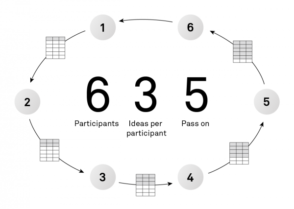
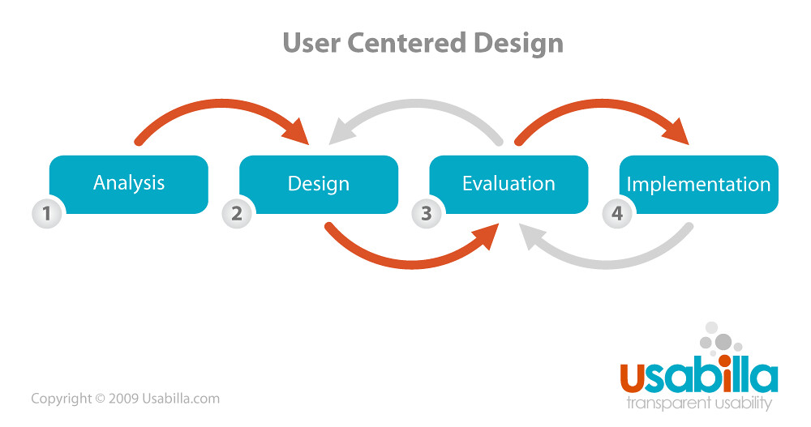
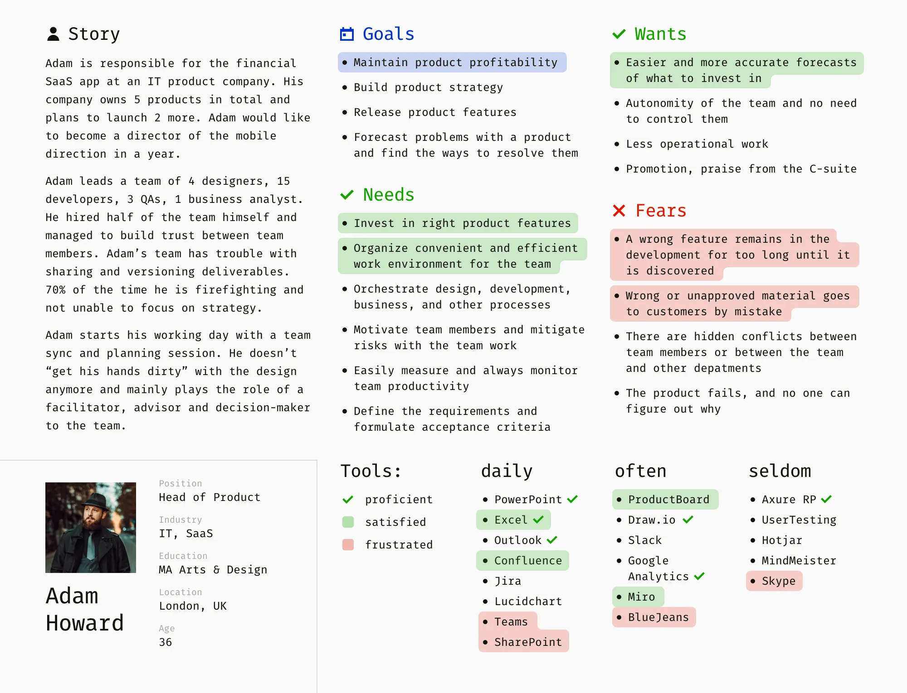
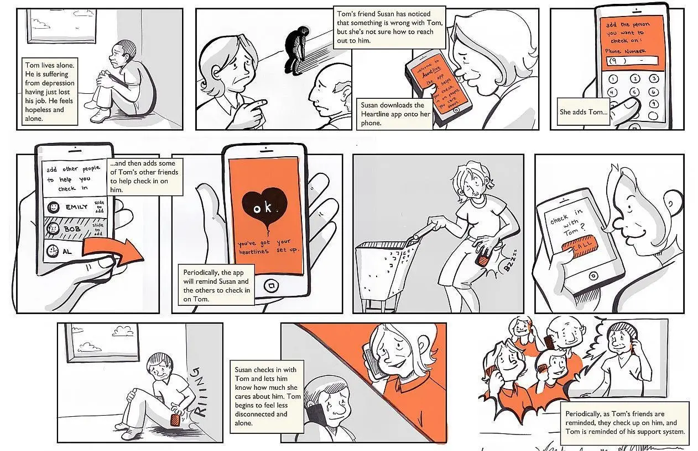

# Kolmas seminar
- [Eelmise seminari meenutus](#eelmise-seminari-meenutus)
- [Tagasiside kodutöödele](#tagasiside-kodutöödele)
- [Commitite kirjutamine](#commitite-kirjutamine)
- [Avatud ja suletud lähtekood](#avatud-ja-suletud-lähtekood)
- [Litsentsid](#litsentsid)

## Eelmise seminari meenutus

## Tagasiside kodutöödele
Üks olulisemaid osasid teie kodutöödes läbi kogu õpiaja hakkab olema *codereview*. See on asi, mida ma arvestan ka hindamisel. Mida põhjalikumalt on keegi kellegi teise koodi lugenud ja seejärel seda kommenteerinud, seda parem. Esialgu võib kodutööde all ka niisama lobiseda. Kui ei leia midagi sisulist.  
Siinjuures tõstan esile Pillet, Tanelit, Kasparit (Kiltmaad), Carli, kes leidis, kuidas ka hästi tehtud asja kommida, Silverit, ka Ervit. Helina oli kõvasti kommiteid teinud – kiidan.

## Commitite kirjutamine

**Hea commit aitab teistel arendajatel mõista tehtud muudatusi ning lihtsustab hilisemat koodi ülevaatamist ja vigade leidmist.**

[10 Essential Practices for Better Git Commits and Why They Matter](https://medium.com/@saeid/10-essential-practices-for-better-git-commits-and-why-they-matter-3cfc420bf53e)  
[Good Commit ✔ VS. Bad Commit ❌: Best Practices for Git](https://dev.to/sheraz4194/good-commit-vs-bad-commit-best-practices-for-git-1plc)

### Tähendusrikkad kommentaarid/sõnumid commititele
Tähendusrikas kommentaar selgitab muudatuste eesmärki.  
Väldi ebamääraseid kommentaare nagu "Parandatud vead" või "Tehtud muudatused". Selle asemel kasuta lühidat ja kirjeldavat kommentaari, mis illustreerib commit-i eesmärki ja tulemust.

**Tee:**  
"Add user profile image upload functionality"  
"Fix broken navigation links in header menu"

**Ära tee:**  
"Updated code"  
"Typo fixes"

Soovitused:  
- Alusta suure tähega
- Kasuta käskivat kõneviisi ("Add" mitte "Added", "Change" mitte "Changed") 
- Piira pealkirja umbes 50 tähemärgini
- Kui on vaja rohkem detaile, eralda pealkiri tühja reaga ja lisa põhjalikum kirjeldus, murdepunktiga umbes 72 tähemärgi juures

**Miks peaks kasutama käskivat kõneviisi?**

Commiti kommentaarides on soovituslik kasutada käskivat kõneviisi ("lisa", "paranda", "uuenda") mitte minevikuvormi ("lisasin", "parandasin", "uuendasin") mitmel põhjusel:

- Commit kirjeldab, mida see commit teeb koodiga, mitte mida sina tegid. See on nagu käsklus või samm-sammuline juhend.
- Käskiv vorm on tavaliselt lühem.

```bash
docs: add correction  // 3 sõna
docs: added correction  // 3 sõna, aga pikem
```
Rahvusvaheline tava: See järgib Git'i enda dokumentatsiooni ja commiti stiili. Inglise keeles kirjutatakse "add", "fix", "update" mitte "added", "fixed", "updated".
Loetavus changelogides: Kui vaatad commit ajalugu või changelog'i, siis käskiv vorm loeb paremini:

- add authentication
- fix login error 
- update documentation  
**vs**  
- added authentication
- fixed login error
- updated documentation

**Aga see on siiski konventsioon - kui sinu tiim või projekt eelistab minevikuvormi, siis võib ka seda kasutada. Peamine on järjepidevus projekti piires.**

### Maini pileti numbrit
Kui kasutad ülesannete/piletite haldamise süsteemi (nagu GitHub või Jira), on kasulik viidata commitis pileti numbrile. See loob selge seose commit-i ja seotud pileti või vea vahel.

**Tee:**  
"Implement password reset functionality, resolves #234"  
"Add dark mode theme support, closes #567"

**Ära tee:**  
"Fixed annoying bug"  
"Fixed user interface"

**Soovitused:**  
- Kasuta standardset terminoloogiat nagu "fixes", "closes" või "resolves" ülesande numbrile viitamisel. Paljud platvormid nagu GitHub tunnevad need ära ja seovad automaatselt commit-id mainitud ülesannetega ning võivad need isegi sulgeda, kui commit liidetakse.

### Regulaarsed commit-id
Regulaarne commit-imine on oluline. See tagab, et muudatused on järkjärgulised ja hallatavad, võimaldades lihtsamat ülevaatust, vigade otsimist ja vajadusel tagasipööramist.

**Tee:**  
- Tee commit, kui oled lõpetanud ühe loogilise muudatuse, isegi kui see on väike.

**Ära tee:**  
- Oota, et koguda palju mitteseotud muudatusi ühte suurde commit-i.

**Soovitused:**
- Mõtle igast commit-ist kui peatükist loos. Iga peatükk peaks olema arusaadav iseseisvalt.
- Väldi mitme mitteseotud muudatuse lisamist ühte commit-i. See teeb keeruliseks iga muudatuse eesmärgi jälgimise ja raskendab protsessi, kui on vaja tagasi pöörata.
- Kui leiad end kasutamas "ja" commit-i pealkirjas, mõtle, kas sinu commit sisaldab mitteseotud muudatusi.

### Kasuta atomaarseid commit-e
Atomaarne commit tähendab, et üks commit esindab ainult ühte konkreetset muudatust. See ei tähenda, et muudetud on ainult üks fail või isegi üks rida, vaid pigem ühte "loogilist" muudatust. Atomaarsed commit-id teevad lihtsamaks muudatuste mõistmise, vigade otsimise ja võimalike probleemide tuvastamise.

**Soovitused:**
- Enne commit-i tegemist vaata muudatused üle käsuga `git diff`
- Kui muudatused hõlmavad mitut valdkonda või funktsionaalsust, kasuta käsku `git add -p` muudatuste tükkhaaval lisamiseks. Käsu kasutamine käib nii:

1. Sisesta käsk `git add -p`
2. Git näitab sulle esimest muudatuste tükki ja küsib, mida sellega teha
3. Sul on järgmised valikud:
   - `y` - lisa see tükk (yes)
   - `n` - jäta see tükk lisamata (no) 
   - `s` - jaga tükk väiksemateks osadeks (split)
   - `q` - välju, ära lisa rohkem tükke (quit)
   - `?` - näita kõiki võimalikke valikuid (help)
4. Vasta igale tükile kas `y` või `n`, kuni kõik muudatused on üle vaadatud
5. Seejärel saad teha commit-i ainult valitud muudatustega

See on eriti kasulik, kui oled teinud mitu erinevat muudatust samas failis, aga soovid need eraldi commit-idesse panna.

## Konventsionaalsete commit-ide kirjutamise reeglid:
[Conventional Commits](https://www.conventionalcommits.org/en/v1.0.0/)  
[Conventional Commit Specification](https://pranaybathini.medium.com/conventional-commit-specification-ecd701b0bbb2)  
[Writing a Good Git Commit Message](https://www.gitkraken.com/learn/git/best-practices/git-commit-message)  

Üldine loogika on järgmine:  
Selmet kirjutada:
```Bash
git commit -m "fixed login error"
```
kirjuta arusaadavam kommentaar:
```Bash
git commit -m "fix(auth): improve login error handling"
```

### Peamised tüübid:
#### Fix
Fix-tüüpi commit-e kasutatakse koodibaasis esinevate vigade või probleemide lahendamiseks.

```Bash
$ git commit -m "fix: resolve issue with form submission not triggering validation"
$ git commit -m "fix(login): improve login error handling"
```

#### Feat
Seda kasutatakse projektile lisatud uute funktsioonide jaoks.

```Bash
$ git commit -m "feat: introduce real-time notifications for new messages"
$ git commit -m "feat(css): add mobile view layout"
$ git commit -m "feat(styles): add modal window animations"
```

#### Breaking Change
Breaking change ehk väga oluline muudatus tähistab commit-i, mis muudab API-t või funktsionaalsust viisil, mis ei ole tagasiühilduv. Selliseid muudatusi saab tähistada kas hüüumärgiga (!) või BREAKING CHANGE: märkega commit-i kirjelduses.

Näited hüüumärgiga:
```Bash
$ git commit -m "feat!: remove support for IE11"
$ git commit -m "feat: remove support for IE11"
$ git commit -m "BREAKING CHANGE: remove support for IE11"
$ git commit -m "feat(api): remove support for IE11"
```

**Üldjuhul nendest peakski piisama.**

### Muud

#### Chore
Chore-tüüpi commit-e kasutatakse regulaarsete hooldustööde jaoks, nagu sõltuvuste uuendamine, paketihaldurite konfiguratsioonid või muud ülesanded, mis ei muuda lähtekoodi ega mõjuta rakenduse käitumist.

```Bash 
$ git commit -m "chore: clean up unused dependencies from package.json"
```

#### Docs
Commit-id, mis hõlmavad ainult dokumentatsiooni muudatusi, nagu README failide uuendamine, kommentaaride lisamine või funktsioonide või klasside dokumentatsiooni kirjutamine.

```Bash
$ git commit -m "docs: add auth service instructions to README"
```

#### Build
Seda tüüpi kasutatakse muudatuste jaoks, mis mõjutavad ehitussüsteemi või väliseid sõltuvusi. Näiteks kui uuendad teeki või muudad ehituse konfiguratsioone, kuulub see sellesse kategooriasse.

```Bash
$ git commit -m "build: update webpack configuration"
$ git commit -m "build: update Hive Maven dependency to version 3"
```

#### CI
Commit-id, mis on seotud pideva integratsiooni konfiguratsioonide või skriptidega. See hõlmab muudatusi automatiseerimiseks ja testimiseks kasutatavates tööriistades ja protsessides.

```Bash
$ git commit -m "ci: add vault stage to gitlab ci pipeline to fetch api secrets"
```

#### Performance
Commit-id, mis parandavad koodibaasi jõudlust ilma selle välist käitumist muutmata. Optimeerimisega seotud muudatused kategoriseeritakse jõudluse parendustena.

```Bash
$ git commit -m "perf: optimize guest misconduct database search by reservation for faster retrieval"
```

#### Refactor
Refaktoreerimise commit-id hõlmavad koodi muudatusi, mis ei paranda viga ega lisa funktsionaalsust. Refaktoreerimine on suunatud koodi struktuuri, loetavuse või hooldatavuse parandamisele ilma selle välist käitumist muutmata.

```Bash
$ git commit -m "refactor: simplify validation logic in user registration"
$ git commit -m "refactor(validation): improve user registration validation logic"
```

#### Revert
Revert-tüüpi commit-e kasutatakse varasemate muudatuste tagasipööramiseks. On oluline mainida commit-i kommentaaris tagasipööratavate muudatuste commit-i ID või pealkiri.

```Bash
$ git commit -m "revert: revert changes made in commit abc123"
```

#### Style
Commit-id, mis on seotud koodi stiili ja vormindamisega. See võib hõlmata taandamise muudatusi, koodi ümbervormindamist või muutujate ümbernimetamist koodistandardite järgimiseks.

```Bash
$ git commit -m "style: format code according to linting rules"
$ git commit -m "style(css): add header hover effect"
$ git commit -m "style(navbar): update button colors and borders"
```


#### Test
Commit-id, mis lisavad või muudavad teste. See hõlmab ühikteste, integratsiooniteste või mis tahes muud tüüpi automatiseeritud testimist.

```Bash
$ git commit -m "test: add unit tests for authentication service"
```
Kuigi ilma tüübi eesliiteta, soovitatakse alustada lauset suure algustähega, siis  eesliite puhul kirjutatakse kõik väikse algustähega. 
Tüübi eesliide (feat:, fix:, jne) annab juba struktuuri.  
Väiketähed säilitavad visuaalse ühtsuse eesliitega.  
See on osa formaalsest spetsifikatsioonist.  

**Tavaliste Git-i commit-ide puhul:**  
Suure algustähega alustamine järgib standardset lauseehitust.  
Aitab eristada sõnumi algust.  
See on pikaajaline Git-i tava, mida näeb Git-i enda dokumentatsioonis ja paljudes suurtes projektides.  
Muudab sõnumi git log vaates paremini loetavaks.  

## Avatud ja suletud lähtekood

**Avatud lähtekood** tähendab, et tarkvara lähtekood on avalikult kättesaadav. See, et igaüks saab seda koodi näha, muuta ja levitada. See on vastand suletud lähtekoodile, kus lähtekood on ettevõtte omand ja seda ei jagata avalikult.

**Peamised põhimõtted:**

* **Vaba juurdepääs:** Igaüks saab koodi vaadata ja uurida.
* **Vaba levitamine:** Koodi saab vabalt kopeerida, levitada ja jagada teistega.
* **Vaba muudatus:** Koodi saab muuta ja kohandada vastavalt oma vajadustele.
* **Vaba kasutamine:** Koodi saab kasutada igal eesmärgil, ka kommertsiaalselt.

**Miks avatud lähtekood võib olla hea valik?**

* **Koostöö:** Suur hulk inimesi üle maailma saab koos töötada tarkvara parandamiseks ja uute funktsioonide lisamiseks.
* **Innovatsioon:** Avatud lähtekood soodustab innovatsiooni, kuna ideed levivad kiiresti ja neid saab erineval moel kombineerida.
* **Kvaliteet:** Rohkem inimesi ühe tarkvara kallal, võimaldab avastada rohkem vigu ja parandada kvaliteeti.
* **Turvalisus:** Avatud lähtekood on sageli turvalisem, kuna võimalikud haavatavused avastatakse ja parandatakse kiiremini.
* **Kulude kokkuhoid:** Paljudel juhtudel on avatud lähtekoodiga tarkvara tasuta või väga odav.

**Näited avatud lähtekoodiga tarkvarast:**

* **Operatsioonisüsteemid:** Linux, Android
* **Veebiserverid:** Apache, Nginx
* **Programmeerimiskeeled:** Python, Java
* **Andmebaasid:** MySQL, PostgreSQL
* **Veebiprojekteerimise teegid ja raamistikud:** React, Angular

### Millal ei ole avatud lähtekood parim valik?

* **Kui vajad täielikku kontrolli:** Suletud lähtekood võimaldab sul täielikult kontrollida tarkvara arendamist.
* **Kui vajad kiiret toetust:** Kuigi avatud lähtekoodiga projektide taga on sageli tugevad kogukonnad, võib professionaalse toe saamine olla keerulisem.
* **Kui töötad tundlike andmetega:** Mõnel juhul võivad olla turvalisuse nõuded, mis ei võimalda avatud lähtekoodi kasutamist.
* **Kui tahad oma toodet müüa või kui tahad, et keegi teine seda ei saaks müüa:** Avatud lähtekood võib piirata sinu võimalusi toodet kommertsialiseerida, kuna teised saavad seda vabalt kasutada ja levitada. Samuti ei saa sa takistada teistel sinu koodi põhjal sarnaseid tooteid luua ja müüa. Kui soovid täielikku kontrolli oma toote müügi üle, on suletud lähtekood parem valik.

### Kui soovite oma toodet täielikult kaitsta, võiksite kaaluda järgmisi võimalusi:

* **Kaitse autoriõigusega:** Te saate oma kohandatud koodi kaitsta autoriõigusega, mis annab teile eksklusiivsed õigused selle kasutamiseks ja levitamiseks.
* **Litsentsimise piirangud:** Võite lisada oma tootele litsentsi, mis piirab selle kasutamist teatud viisidel.

## Litsentsid

### Üldine autoriõguse loogika:
Kui teosel pole märgitud litsentsi, siis järelikult on ta litsentsitud kõige tugevamalt ja sa ei tohi teost jagada. Seega, kui sa tahad, et sinu materjal oleks kasutatav, pead lisama litsentsi.

### Litsentsid Githubis

Kõik GitHubis leiduvad populaarsed litsentsid on loodud selleks, et võimaldada tarkvara jagamist ja levitamist, kuid iga litsents seab sellele tegevusele erinevad tingimused.

#### Miks pigem ei leia Githubist täielikult keelavaid litsentse?

- GitHub on platvorm, mis on loodud avatud lähtekoodiga projektide jaoks. 
- Litsentsid on loodud selleks, et määratleda, kuidas tarkvara võib olla kasutatav ja levitatav. Nende eesmärk ei ole keelata jagamist, vaid reguleerida seda.

GitHub siiski toetab ka litsentse, mis piiravad tarkvara jagamist (nt "All Rights Reserved").  
Kui soovid oma tarkvara täielikult privaatseks jätta, saad kasutada privaatselt hallatavaid repositooriume, millel pole üldse jagamiskohustust.

#### Mida erinevad litsentsid reguleerivad?

- Muudatuste tegemine: Mõned litsentsid nõuavad, et kõik muudatused peavad olema samuti avalikult kättesaadavad (näiteks GPLv3).
- Kommertsialiseerimine: Mõned litsentsid reguleerivad, kuidas tarkvara võib olla kommertsiaalselt kasutatav. Näiteks GPLv3 lubab kommertsialiseerimist, kuid nõuab, et lähtekood oleks jagamisel kättesaadav.
- Autorite õigused: Kõik litsentsid kaitsevad tarkvara autori intellektuaalomandit.

#### Valik Githubi litsentse:

- Apache 2.0 - Lubab vabalt kasutada, muuta ja jagada tarkvara, kuid nõuab autoriõiguste märget. Kaitseb patendikasutust.

- GNU General Public License v3.0 - Tagab tarkvara vabaduse, nõuab et tuletatud teosed oleksid sama litsentsi all. Sisaldab patendikaitse ja DRM-i piiranguid.

- MIT License - Väga lihtne ja vaba litsents, mis lubab peaaegu kõike, nõudes vaid autoriõiguste säilitamist ja vastutusest loobumise märget.

- BSD 2-Clause "Simplified" License - Lihtne litsents, mis lubab vaba kasutust tingimusel, et säilitatakse autoriõiguste teade ja vastutusest loobumine.

- BSD 3-Clause "New" or "Revised" License - Sarnane 2-Clause versioonile, kuid lisab klausli, mis keelab kasutada autorite nimesid toodete reklaamimiseks.

- Boost Software License 1.0 - Lihtne ja vaba litsents, mis lubab kasutada lähtekoodi nii avatud kui suletud lähtekoodiga projektides.

- Creative Commons Zero v1.0 Universal (CC0) - Loobub kõigist autoriõigustest võimalikult suures ulatuses, viies teose avalikku omandisse. 

- Eclipse Public License 2.0 - Võimaldab kommertskasutust ja muutmist, kuid nõuab lähtekoodi avaldamist muudatuste korral.

- GNU Affero General Public License v3.0 - Sarnane GPLv3-le, kuid nõuab lähtekoodi avaldamist ka võrgupõhiste rakenduste puhul.

- GNU General Public License v2.0 - GPLv3 varasem versioon, mis tagab tarkvara vabaduse ja nõuab tuletatud teoste avaldamist sama litsentsi all.

- GNU Lesser General Public License v2.1 - Võimaldab linkida LGPL-tarkvaraga ka mittevaba tarkvara, säilitades teegi enda vabaduse.

- Mozilla Public License 2.0 - Võimaldab lähtekoodi kasutamist nii avatud kui suletud projektides, kuid nõuab MPL-koodi muudatuste avaldamist.

- The Unlicense - Loobub täielikult autoriõigustest ja viib teose avalikku omandisse, lubades piiranguteta kasutust.


#### [Kolm peamist litsentsi tüüpi GitHubis:](https://gist.github.com/nicolasdao/a7adda51f2f185e8d2700e1573d8a633#3-main-types-of-open-source-licenses)

**MIT License:**

Lihtne ja paindlik litsents, mis võimaldab kasutajatel vabalt kasutada, muuta ja levitada tarkvara, ilma et nad peaksid oma muudatusi avaldama.  
Tüüpiline "Tee minu asjadega, mida tahad, aga ära mind kohtusse kaeba."  
See on lubava vaba tarkvara litsents.    
Vali see, kui kardad, et keegi ei hakka sinu tarkvara kasutama.  
MIT litsents on üldjoontes sarnane BSD ja ISC litsentsidega.  

**Apache License 2.0:**

Sama mis MIT litsents, aga rohkemate sõnadega. Suurepärane juristidele :)  
Tasakaal patentõiguste ja vaba tarkvara vahel: võimaldab kasutajatel vabalt kasutada, muuta ja levitada tarkvara, kaitstes samal ajal tarkvara autori intellektuaalomandit.  
Populaarne suurtes projektides, nt nagu Apache HTTP Server.
Vali see MIT litsentsi asemel, kui kardad patenditrollimist.

**GNU General Public License v3.0 (GPLv3):**

Karmim litsents: GPLv3 on üks karmimatest vabavaralitsentsidest, mis nõuab, et kõik tuletised peavad olema samuti vabavaralised.  
Populaarne vabavaralistes projektides: See litsents on populaarne vabavaralistes projektides, nagu GNU/Linux ja LibreOffice.  
Vali see, kui kardad, et inimesed kasutavad sinu tööd ebaausalt (nt kui sind häirib, et keegi võiks sinu arvelt raha teenida). Kui nad kasutavad sinu tarkvara, peavad nad kasutama sama litsentsi nagu sina (st tõenäoliselt muutma selle avatud lähtekoodiga tarkvaraks).  
Lühidalt öeldes: kui keegi loob sinu tööst tuletatud teose ja levitab seda teatud tingimustel, peab ta avaldama lähtekoodi sama litsentsi alusel.  
GPLv3 on "copyleft" litsents, mis nõuab, et kõik tuletised jääksid sama litsentsi alla (vastandina copyright'ile).  
Näiteks üks põhjustest, miks Apple'i Mac OS ei põhine Linuxil, on see, et Linux kasutab GPL litsentsi, mis tähendaks, et ka OSX oleks pidanud olema avatud lähtekoodiga.  
Paljudele idufirmadele ei meeldi GPL litsents, kuna see võib väljumise ajal tõsiseid probleeme tekitada. Harva leidub investoreid, kes sooviksid osta midagi, mille nad on sunnitud avatud lähtekoodiga muutma.  

#### Valiku kriteeriumid:

**Valides litsentsi oma projektile, tuleb arvestada järgmiste kriteeriumidega:**

- Vabadus: Kui soovid, et teised saaksid vabalt kasutada, muuta ja levitada su tarkvara, siis vali vaba litsents, nagu MIT, Apache või GPL.
- Intellektuaalomand: Kui soovid kaitsta oma intellektuaalomandit, siis vali litsents, mis võimaldab sul säilitada oma õigused, näiteks Apache License 2.0.
- Kasutajate vajadused: Mõtle, kuidas soovid, et teised kasutaksid su tarkvara. Kas soovid, et nad saaksid muuta ja levitada su tarkvara vabalt, või soovid piirata nende võimalusi?

Kui muu ei aita litsentsi valida, siis kasuta abimeest:  
https://choosealicense.com


### Mõned meie õppetöös ette tulevad näited:

#### React.js litsentsipoliitika

**[React.js kasutab MIT litsentsi](https://github.com/facebook/react/blob/main/LICENSE)**, mis, nagu eespool kirjas, on avatud lähtekoodiga litsentside seas üks liberaalsemaid. See tähendab, et saate React.js-i vabalt kasutada, muuta, levitada ja isegi kommertsiaalseks otstarbeks kasutada ilma oluliste piiranguteta.


**Kas saate React.js-iga luua täielikult kaitstud toote?**

* Kuigi React.js kood ise on avatud lähtekoodiga, ei tähenda see, et teie rakenduse loogika või struktuur muutuks automaatselt avalikuks. Kui te kaitsete oma rakenduse lähtekoodi (nt autoriõiguse või litsentsiga), ei ole kellelgi õigust seda kasutada, ilma et te oleksite selleks loa andnud.  
* React.js-i kasutamine ei kohusta teid avalikustama oma rakenduse lähtekoodi.  

Aga rakenduse täielikult sulgemine võib raskendada selle edasist arendamist ja hooldamist. Avatud lähtekoodiga kogukond pakub sageli väärtuslikku tagasisidet ja abi.  


#### HTML, CSS ja JavaScript – litsentsimise nüansid

HTML, CSS ja puhas JavaScript on standardid, mis on loodud kõigi jaoks vabalt kasutamiseks.

**Pikem selgitus:**

* **Standardid, mitte tarkvara:** HTML, CSS ja JavaScript on veebilehtede loomiseks kasutatavad standardid. Need on nagu keele grammatika – määratlevad, kuidas elemente ühendada ja kuidas veebileht peaks toimima.
* **Vaba kasutamine:** Kuna need on standardid, ei ole nende kasutamiseks vaja mingit litsentsi. Võid vabalt luua veebilehti, kasutades neid tehnoloogiaid, ilma et peaksid kellelegi tasu maksma või tingimusi järgima.
* **Litsentsid tulevad mängu teekide ja tööriistadega:** Kui hakkad kasutama teeke nagu jQuery, React või Angular, siis on neil tavaliselt litsents. See litsents määrab, kuidas sa võid seda teeki kasutada, muuta ja levitada.

**Mida peaksid teadma:**

* **Autoriõigus:** Kuigi HTML, CSS ja JavaScript ise ei ole autoriõigusega kaitstud, võib sinu enda loodud veebilehe disain ja sisu olla autoriõigusega kaitstud.

### Mäng: "Litsentside dilemma"
Iga grupp saab ühe dilema. Arutelu aeg 15 minutit.

1. Idufirma dilemma
"Olete idufirma, kes arendab innovaatilist tehisintellekti rakendust. Teie kood põhineb osaliselt avatud lähtekoodiga projektidel. Investorid on huvitatud, aga muretsevad intellektuaalomandi pärast."
- Milliseid litsentse peaks kasutama?
- Kuidas kaitsta oma intellektuaalomandit?

2. Kogukonna projekt
"Arendate hariduslikku platvormi, mida soovite, et koolid saaksid vabalt kasutada ja kohandada. Samas tahate vältida, et keegi teie tööd kommertseesmärkidel ära ei kasutaks."
- Milline litsents sobiks?
- Millised on ohud ja võimalused?

3. Ettevõtte siseprojekt
"Teie ettevõte soovib luua sisemist tööriista, kasutades palju avatud lähtekoodiga komponente. Hiljem võib tekkida soov seda tööriista ka müüa."
Millised litsentsid on sobivad?
- Millised piirangud võivad tekkida?

4. Rahvusvaheline koostöö
"Teete koostööd rahvusvahelise meeskonnaga, kus igaüks lisab oma komponente. Projekt võib tulevikus muutuda kas äriliseks või jääda avalikuks."
- Kuidas litsentside valik mõjutab koostööd?
- Milliseid litsentse kombineerida?

Arutelu punktid:
- Mis on valitud litsentsi peamised eelised?
- Millised on potentsiaalsed riskid?
- Kuidas see mõjutab projekti tulevikuplaane?

Igal grupil 5 minutit aega esitluseks.

## Toode

### Milleks üldse tarkvara luua?

### Probleem – tarkvara kui lahendus

Toote kirjeldus – mida teie tarkvara teeb.  
**See peaks sisaldama:**
- Toote nimi
- Toote kirjeldus
- Toote eesmärgid
- Toote funktsioonid

### Tooteloomise "mäng"

  

Protseduur:
* Leppige kokku üldine probleem (vt allpool).
* Igaüks saab ühe paberilehe. Veenduge, et teil on kirjutusvahend.
* Kirjutage üles kolm toote ideed (üks lause iga idee kohta). Teil on 5 minutit aega.
* Viis minutit on möödunud. Andke oma leht päripäeva edasi järgmisele inimesele. Saate uue lehe kolme ideega. Lugege ideed läbi ja lisage veel kolm. Teil on 5 minutit aega.
* Korrake.
* Korrake.
Arutage saadud ideid ja valige üks välja.

**Valik probleeme**  
Otsesed probleemid:
* Kodutööde ja tähtaegade haldamine - kuidas hoida ülevaadet kõikidest ülesannetest ja tähtaegadest erinevates õppeainetes, eriti kui õpitakse töö kõrvalt.  
* Õppematerjalide jagamine ja sünkroniseerimine erinevate seadmete vahel - kuidas tagada, et vajalikud materjalid oleksid alati õigel ajal kättesaadavad, olenemata asukohast.  
* Efektiivne ajakasutus pendeldamisel kooli ja kodu vahel - kuidas kasutada sõiduaega produktiivselt õppimiseks või puhkamiseks.  
* Grupitööde koordineerimine - kuidas leida sobivaid aegu kohtumisteks ja hallata ühiseid ülesandeid, kui kõigil on erinevad graafikud.  

Üldisemad probleemid:
* Vanemaealiste inimeste ravimite võtmise järjepidevus - kuidas tagada, et õiged ravimid saaksid õigel ajal võetud ja hoida ülevaadet tarvitamisest.  
* Toiduraiskamise vähendamine kodumajapidamistes - kuidas jälgida toiduainete säilivusaegu ja planeerida tarbimist enne aegumist.  
* Väikeettevõtete energia- ja ressursikulu optimeerimine - kuidas tuvastada ja vähendada tarbetut ressursikulu igapäevatöös.  
* Ühistranspordi kasutajate liikumisinfo kogumine ja analüüs - kuidas koguda anonüümset infot inimeste liikumismustrite kohta, et optimeerida ühistranspordi graafikuid.  


## Kasutajakeskne disain
Kasutajakeskne disain (User-Centered Design, UCD) on disainiprotsess, kus lõppkasutajate vajadused, soovid ja piirangud on disainiprotsessi igas etapis kesksel kohal. See tähendab, et toode või teenus luuakse kasutajate tegelikke vajadusi silmas pidades, mitte ainult tehnilisi võimalusi või ärilisi eesmärke arvestades.

### Kasutajakeskse disaini põhiprintsiibid:

1. **Varajane keskendumine kasutajatele ja ülesannetele**
   - Mõista kasutajate vajadusi ja konteksti enne disainimist
   - Kaasata kasutajaid kogu protsessi vältel

2. **Empiiriline mõõtmine**
   - Jälgida kasutajate käitumist ja reaktsioone
   - Koguda tagasisidet prototüüpide ja toodete kohta

3. **Iteratiivne disain**
   - Disaini korduv täiustamine tagasiside põhjal
   - Probleemide varajane tuvastamine ja lahendamine


### Kasutajakeskse disaini protsess:

1. **Konteksti mõistmine**
   - Kasutajate tundmaõppimine
   - Kasutuskonteksti analüüs
   - Nõuete kogumine

2. **Disaini loomine**
   - Lahenduste väljatöötamine
   - Prototüüpide loomine
   - Disaini hindamine kasutajatega

3. **Hindamine ja täiustamine**
   - Kasutajatestid
   - Tagasiside kogumine
   - Disaini iteratiivne parandamine

Kasutajakeskne disain aitab luua tooteid, mis on:
- Lihtsamini kasutatavad
- Paremini vastavad kasutajate vajadustele
- Suurema kasutajate rahuloluga
- Väiksema õppimiskõveraga




## Persoonad

Persoonad on detailsed, fiktiivsed karakterid, mis esindavad teie toote või teenuse tüüpilisi kasutajaid. Need aitavad disaineritel ja arendajatel paremini mõista kasutajate vajadusi, eesmärke ja käitumismustreid.

Lühike selgitav näide persoona mõiste kohta:
> **Mari Mets, 35**  
> Projektijuht IT-firmas  
> Elab Tallinnas, abielus, 2 last  
> Vajab efektiivset projektijuhtimise tarkvara  
> Peamine väljakutse: tiimide koordineerimine erinevates ajavööndites

NB! Persoonat ei tohiks lihtsalt välja mõelda, persoona peaks baseeruma kasutajauuringutel. Väljamõeldud persoona kipub olema väljamõtleja isiklik eelarvamus, mitte tegelik kasutaja.

### Kuidas luua persoonasid?

Persoonade loomine on meeskonnatöö, mitte sellepärast, et see oleks keeruline, vaid et kaasata meeskonnaliikmeid ja tagada nende toetus persoonade kasutamisele. Persoonade loomise protsess peaks põhinema päris kasutajauuringutel, mitte väljamõeldud detailidel.

#### Persoonade loomise protsess:

1. **Alusta kasutajauuringutega**
   - Kogu andmeid päris kasutajate kohta
   - Tuvasta olulised karakteristikud ja käitumismustrid
   
2. **Grupeeri omadused**
   - Ühenda sarnased omadused klastriteks
   - Ühenda või eemalda liiga sarnased grupid
   - Tuvasta selged karakterid

3. **Lisa realistlikud detailid**
   - Täienda karakterit usutavate ja meeldejäävate detailidega
   - Veendu, et iga detail on asjakohane ja vajalik

#### Mida persoona peaks sisaldama:

1. **Põhiinfo:**
   - Nimi, vanus, sugu
   - Foto
   - Lühike kirjeldus tegevusalast

2. **Kogemus ja kontekst:**
   - Kogemustase antud valdkonnas
   - Kas kasutab toodet vabatahtlikult või töö tõttu
   - Kasutamise sagedus
   - Kasutatavad seadmed (arvuti, telefon jne)

3. **Eesmärgid ja mured:**
   - Olulised vajadused (kiirus, täpsus, põhjalikkus)
   - Peamised väljakutsed
   - Motivatsioon toote kasutamiseks

4. **Iseloomulikud tsitaadid:**
   - Laused, mis iseloomustavad persoona suhtumist

Need kirjeldused peavad aitama meeskonnal tunnetada, kas loodav toode vastab kasutaja, ehk persoona ootustele.

#### Olulised põhimõtted:

- Väldi ebavajalikke detaile, mis ei mõjuta disainiotsuseid
- Iga lisatud detail peaks teenima kindlat eesmärki
- Persoona peab olema meeldejääv ja usutav
- Põhine reaalsetel andmetel, mitte väljamõeldisel

**[Näide Nielsen Norman Groupi lehelt](https://www.nngroup.com/articles/persona/)**


#### Teistsugune vaade persoonadele – [Ärge kasutage fotosid](https://medium.com/we-are-systematic/short-post-stop-using-photos-in-your-personas-c2b11dc1383b)

**[Milliseid persoonasid mitte luua](https://medium.com/design-bridges/personas-e60c1c06ead1)**


[Allikas](https://medium.com/design-bridges/personas-e60c1c06ead1)

**Lihtsad sammud hea persoona loomiseks:**  
Samm 1. Eemalda visuaalsed efektid  
Samm 2. Kustuta ebaoluline või väljamõeldud info  
Samm 3. Eemalda fookus demograafilistelt andmetelt  
Samm 4. Jutusta lugu  
Samm 5. Lisa rohkem vajadusi, soove ja hirme  
Samm 6. Kirjelda asjakohast kogemust  
Samm 7. Määra prioriteedid ja rõhuasetus  


[Allikas](https://medium.com/design-bridges/personas-e60c1c06ead1)


## Kasutajalood (user stories)

Kasutajalood on lühikesed, lihtsad kirjeldused funktsionaalsusest, mida kasutaja soovib. Need on kirjutatud kasutaja vaatenurgast ja järgivad tavaliselt formaati:

"Kasutajana (kes?) soovin ma (mida teha?), et (mis eesmärgil?)."

Kasutajalood võib kirjutada:

1. Agiilse arenduse tööriistadesse nagu Jira, Trello või Azure DevOps
2. Projekti dokumentatsiooni (nt requirements.md fail)
3. Eraldi kasutajalugude dokumenti (nt user-stories.md)
4. Figma faili, kus on näha, kuidas toode peaks töötama

Näited kasutajalugudest:
- Kasutajana soovin ma sisse logida oma e-posti kontoga, et pääseda ligi oma isiklikele andmetele
- Administraatorina soovin ma näha kõiki aktiivseid kasutajaid, et jälgida süsteemi kasutust
- Kliendina soovin ma lisada tooteid ostukorvi, et neid hiljem osta

## Stsenaariumid

Stsenaariumid on detailsed kirjeldused, kuidas kasutajad süsteemiga suhtlevad konkreetsetes olukordades. Need aitavad mõista kasutajate teekonda läbi süsteemi ja tuvastada võimalikke probleeme.

Stsenaarium peaks sisaldama:
1. Kontekst - mis olukorras kasutaja on
2. Eesmärk - mida kasutaja üritab saavutada
3. Tegevused - sammud, mida kasutaja peab tegema
4. Tulemus - mida kasutaja loodab saavutada

Näide stsenaariumist:
> **Uue konto loomine**  
> Mari soovib luua uue konto rakenduses. Ta avab rakenduse avalehe, klikib "Loo konto" nupul, täidab vajalikud väljad oma andmetega ja vajutab "Registreeru". Süsteem saadab talle kinnitusmeili, mille ta avab ja kinnitab oma konto. Seejärel saab ta sisse logida ja alustada rakenduse kasutamist.

## Storyboard

Storyboard on visuaalne jutustus või stsenaariumi esitlus, mis näitab sammhaaval, kuidas kasutaja süsteemiga suhtleb. See on sarnane koomiksile, kus iga pilt esindab ühte sammu või tegevust kasutaja teekonnas.

Storyboard'i eelised:
- Aitab visualiseerida kasutajakogemust
- Teeb keerulised stsenaariumid lihtsamini mõistetavaks
- Võimaldab tuvastada probleeme enne arendamist
- Hea kommunikatsioonivahend meeskonna ja sidusrühmade vahel

Hea storyboard sisaldab:
1. Selge järjestus - sammud on loogilises järjekorras
2. Kontekst - kus ja millal tegevus toimub
3. Kasutaja emotsioonid ja mõtted
4. Probleemid ja lahendused
5. Selgitavad tekstid või dialoogid

Näide storyboard'ist võiks kujutada mobiilirakenduse kasutamist:
1. Kasutaja avastab probleemi (vajab transporti)
2. Avab rakenduse ja sisestab sihtkoha
3. Valib sobiva transpordiviisi
4. Kinnitab tellimuse
5. Ootab ja jälgib teenuse saabumist
6. Kasutab teenust
7. Maksab ja hindab kogemust

**[Näide storyboard'ist:](https://blog.adobe.com/en/publish/2017/09/26/a-comprehensive-overview-of-ux-design-deliverables)**



https://www.uxstudioteam.com/ux-blog/ux-storyboard

## Customer Journey Map


Ver2
https://miro.com/app/board/uXjVP20eerM=/?share_link_id=350385825919

Lugemist:
https://blog.prototypr.io/the-entire-ux-design-process-3fbbb36debd7
