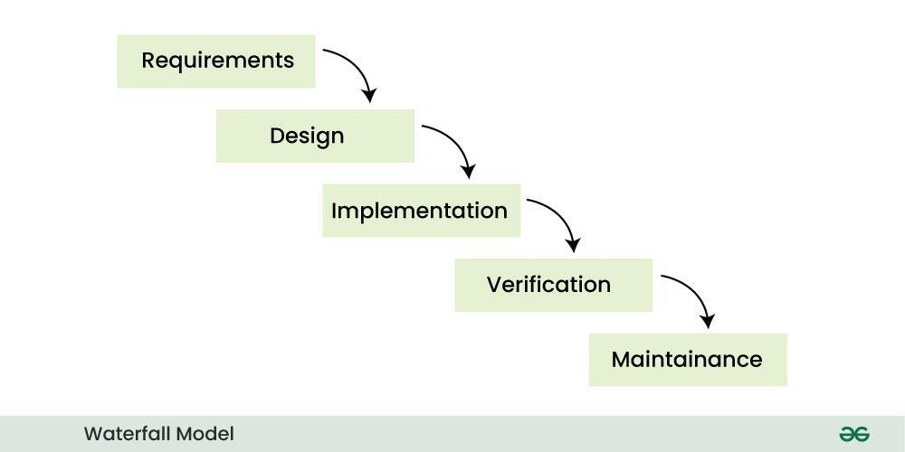
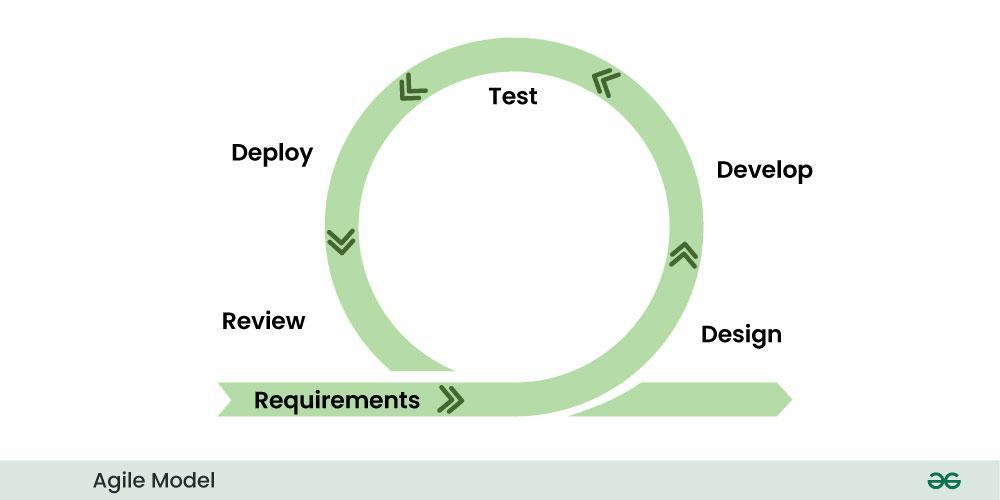
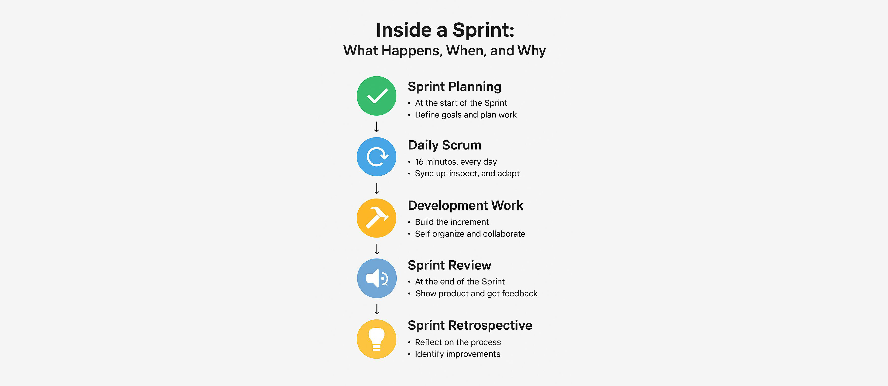
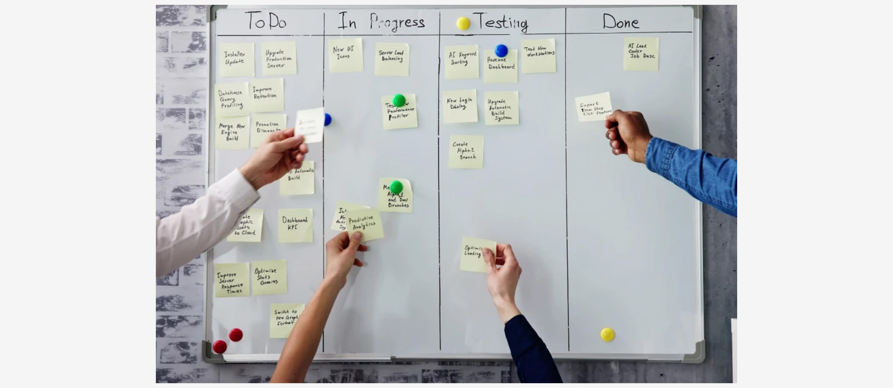

# Seminar 3: Sprint 1 - Planeerimine
## Projektijuhtimine ja meeskonnatöö

**Sissejuhatus tarkvaraarendusse**
Kestus: 3h (90 min teooria + 90 min praktikat)

---

## Täna:

- **Arendusmetoodikaid**: Waterfall, Agile, Scrum, Kanban
- **Rollid tarkvaraarenduses**: Project Owner, Project Manager, Developer, UX/UI Designer
- **Meeskonnatöö põhimõtteid**: kommunikatsioon, koostöö
- **GitHub Projects** advanced funktsioone
- **Sprint 1 planeerimist** ja käivitamist

---

# OSA 1: TEOORIA (90 min)

---

## 1.1 Arendusmetoodikate ülevaade (35 min)

---

### Waterfall mudel



---
### Waterfall mudel
**Eelised**: ✅ Selge struktuur, hea dokumentatsioon
**Puudused**: ❌ Vähe paindlikkust, hiline tagasiside

---

### Agiilne arendus 


---

### Agiilne arendus 
#### Põhiväärtused

1. **Inimesed ja koostöö** > protsessid ja tööriistad
2. **Töötav tarkvara** > põhjalik dokumentatsioon
3. **Koostöö kliendiga** > lepingu tingimused
4. **Reageerimine muudatustele** > plaani järgimine

---

### Scrum raamistik

**Rollid:**
- **Product Owner** - toote visioon, prioriteedid
- **Scrum Master** - protsessi juhtimine
- **Development Team** - toote arendamine

**Sprint tsükkel**: 1-4 nädalat (tavaliselt 2 nädalat)

---

### Scrum sündmused



---

### Scrum sündmused
- **Sprint Planning**: 2-4h
- **Daily Scrum**: 15 min
- **Sprint Review**: 1-2h
- **Sprint Retrospective**: 1h

---

### Kanban süsteem



**Põhiprintsiip**: Töövoogude visualiseerimine ja WIP piiramine

---

## 1.2 Rollid tarkvaraarenduses (20 min)

---

### Waterfall projektides

- **Project Manager ehk projektijuht** – juhib kogu projekti (ajakava, eelarve, ressursside planeerimine)
- **System Analyst / Business Analyst ehk süsteemi- ja ärianalüütik** – kogub ja dokumenteerib nõuded enne arendust
- **System Architect ehk süsteemiarhitekt** – kujundab tehnilise arhitektuuri

---

### Waterfall projektides

- **Developers ehk arendajad** – ehitavad süsteemi alles pärast nõuete ja disaini lukku panekut
- **Test Engineers (QA) ehk testijad** – testivad alles valmis tarkvara
- **Technical Writer ehk tehnilised kirjutajad** – dokumentatsioon ja juhendid
- **Operations/IT** – juurutamine pärast arendust

Iseloomulik: Rollid on lineaarselt järjestatud, töö liigub etappide kaupa edasi („relay race“).

---

### Tarkvaraarenduse rollid agiilses arenduses

**Juhirollid:**
- **Product Owner ehk tooteomanik** - toote visioon, prioriteedid, kasutajate vajadused
- **Project Manager ehk projektijuht** - projekti koordineerimine, ajakavad, ressursid
- **Scrum Master** - protsessi juhtimine, takistuste eemaldamine

---

### Tarkvaraarenduse rollid agiilses arenduses

**Arenduse rollid:**
- **Developer/Programmer ehk arendaja ja programmeerija** - koodimine, tehnilised lahendused
- **System Architect ehk süsteemi arhitekt** - süsteemi arhitektuur, tehnilised standardid
- **DevOps Engineer** - juurutamine, CI/CD, infrastruktuur. IT-spetsialist, kes töötab arenduse (Dev) ja süsteemihalduse/operatsioonide (Ops) vahepealses rollis.
- **QA Engineer** - Quality Assurance ahk kvaliteedi tagamine. Testimine, kvaliteedi tagamine

---

### Tarkvaraarenduse rollid agiilses arenduses

**Disaini rollid:**
- **UX Disainer** - kasutajakogemus, kasutajateekonnad
- **UI Disainer** - visuaalne disain, kasutajaliidesed
- **Frontend arendaja** - kasutajaliidese arendus

---

### Tarkvaraarenduse rollid agiilses arenduses

**Tugirollid:**
- **Tehniline kirjutaja** - dokumentatsioon, kasutajajuhendid
- **Ärianalüütik** - ärinõuded, protsesside analüüs
- **Tech Lead ehk tarkvaratiimi tehniline juht** - tehnilise tiimi juhtimine

---

### Meie kursuse rollid


**Product Owner / tooteomanik**: 
- Kasutajate vajadused ja äriloogika
- Prioriteedid ja backlog

**Project Manager / projektijuht**: 
- Projekti koordineerimine ja ajakavad  
- Protsessid ja meeskonna juhtimine

---

### Meie kursuse rollid

**Developer/arendaja**: 
- Tehnilised lahendused ja arhitektuur
- Arenduse planeerimine

**UX/UI Disainer**: 
- Kasutajakogemus ja visuaalne disain
- Prototüüpimine ja testimine

---

## 1.3 Meeskonnatöö (15 min)

---

### Efektiivse meeskonna omadused

- **Psühholoogiline ohutus**: võib teha vigu ja küsida
- **Usaldusväärsus**: kõik teevad kokkulepitud töö
- **Struktuur ja selgus**: rollid ja eesmärgid selged
- **Tähenduse tunne**: töö on oluline
- **Mõju**: näeb oma panuse tulemusi

---

### Kommunikatsiooni raamistikud

**Sünkroonne**:
- Stand-up meetingud (iga päev, 15 min)
- Planning sessions (sprindi alguses)
- Review ja retrospective (sprindi lõpus)

**Asünkroonne**:
- GitHub kommentaarid ja PR-id (pull requestid)
- Dokumentatsioon ja wiki
- Slack/Discord sõnumid

---

## 1.4 Backlog management (20 min)

---

### Epikute jagamine

```
THEME: Kooli toidu soojendamise ja jagamise keskkond
└── EPIC: Mikrolaineahjude broneerimissüsteem
    ├── USER STORY: Kasutaja näeb vabade ahjude olekut
    │   ├── TASK: IoT sensorite API
    │   └── TASK: Mobile-responsive kaart
    ├── USER STORY: Broneering kindlaks ajaks
    └── USER STORY: Broneeringu tühistamine
```

---

### Story points ja estimating

**Fibonacci skaal**: 1, 2, 3, 5, 8, 13, 21

- **1 punkt**: Triviaalne (30 min - 1h)
- **2 punkti**: Lihtne (2-4h)
- **3 punkti**: Keskmine (halb päev)
- **5 punkti**: Keeruline (2-3 päeva)
- **8+ punkti**: Peaks jagama väiksemateks

---

### Prioritiseerimise tehnikad

**MoSCoW meetod**:
- **Must have**: Kritilised funktsioonid
- **Should have**: Olulised, aga mitte kriitilised
- **Could have**: Nice-to-have funktsioonid
- **Won't have**: Praegu välistatud

---

# OSA 2: PRAKTILINE TÖÖTUBA (90 min)

---

## 2.1 Rollide jaotamine (15 min)

### Ülesanne: Vali oma roll

Iga tudeng valib ühe rolli järgmisteks seminariteks:

- **Product Owner**
- **Project Manager** 
- **Developer**
- **UX/UI Designer**

**Kirjuta üles**: Oma rolli peamised vastutused projektis

---

## 2.2 Projekti ajakava loomine (20 min)

### Projektiplaani templiit (project charter template)

```markdown
# PROJEKTI AJAKAVA

## Projekti ülevaade
- **Projekti nimi**: 
- **Probleemi kokkuvõte**: (1-2 lauset)
- **Lahenduse visioon**: (1-2 lauset)

## Eesmärgid ja edu kriteeriumid
- **Peamised eesmärgid**: (3-5 punkti)
- **Edu kriteeriumid**: (kuidas mõõdame edu?)
```

---

## 2.3 GitHub Projects seadistamine (25 min)

### Advanced funktsioone

**Custom fields:**
- Story Points (Number: 1, 2, 3, 5, 8, 13)
- Priority (Select: Critical, High, Medium, Low)
- Component (Select: Frontend, Backend, Design, Testing)
- Sprint (Select: Sprint 1, Sprint 2, Sprint 3)

---

### Views ja workflows

**1. Sprint Board:**
```
To Do | In Progress | Review | Done
Filter: Sprint = "Sprint 1"
Group by: Assignee
```

**2. Backlog Management:**
```
Table view:
Sort: Priority (desc), Story Points (asc)
```

---

## 2.4 Sprint 1 planeerimine (20 min)

### Sprint Goal määramine

**Näide**: "Meeskond on moodustatud, projekt on planeeritud ja tööriistad seadistatud"

### Capacity planning

- Iga tudeng: 5-8 story points nädalas
- Grupp kokku: ~15-25 story points Sprint 1 jaoks

---

### Tasks Sprint 1 jaoks

**Must-have ülesanded:**
- [ ] Project charter valmis
- [ ] Rollid määratud ja kirjeldatud
- [ ] GitHub Projects seadistatud
- [ ] Kommunikatsiooni protokoll kokku lepitud
- [ ] Risk assessment tehtud

---

## 2.5 Daily workflow seadistamine (10 min)

### Daily Standup protokoll

**3 küsimust (asünkroonne GitHub Discussions-is):**
1. Mida tegid eile?
2. Mida teed täna?
3. Mis sind takistab?

**Reeglid**: Lühidalt, konkreetselt, regulaarselt

---

# Kodutöö 3: Sprint 1 dokumentatsioon

---

## GitHub dokumentatsioon

Looge järgmised Markdown failid:

- `project-charter.md` - projekti kirjeldus ja eesmärgid
- `team-roles.md` - rollide kirjeldused ja vastutused  
- `project-timeline.md` - ajakava ja milestoneid
- `risk-analysis.md` - riskide analüüs ja leevendamise strateegiad
- `communication-plan.md` - meeskonna suhtluse protokollid
- `sprint-1-plan.md` - Sprint 1 eesmärgid ja ülesanded
- `sprint-1-review.md` - Sprint 1 tulemused ja analüüs

---

## Rolli-põhised ülesanded

**Product Owner**: `product-backlog.md`
**Project Manager**: `project-management-plan.md`
**Developer**: `technical-architecture.md`
**UX/UI Designer**: `design-strategy.md`

**Tähtaeg**: 1 nädal
**Esitamine**: GitHub workflow (Branch → PR → Review → Merge)

---

# Kokkuvõte

## Mida õppisime?

- ✅ Erinevaid arendusmetoodikaid
- ✅ Meeskonna rolle ja vastutusi
- ✅ GitHub Projects advanced kasutamist
- ✅ Sprint planeerimise põhimõtteid
- ✅ Meeskonnatöö alused

## Mis järgmiseks?

**Sprint 1** on käivitatud! Järgmine seminar: **Sprint 2 - Disainimine**

---

# Küsimused?

**Edu Sprint 1-ga! 🚀**