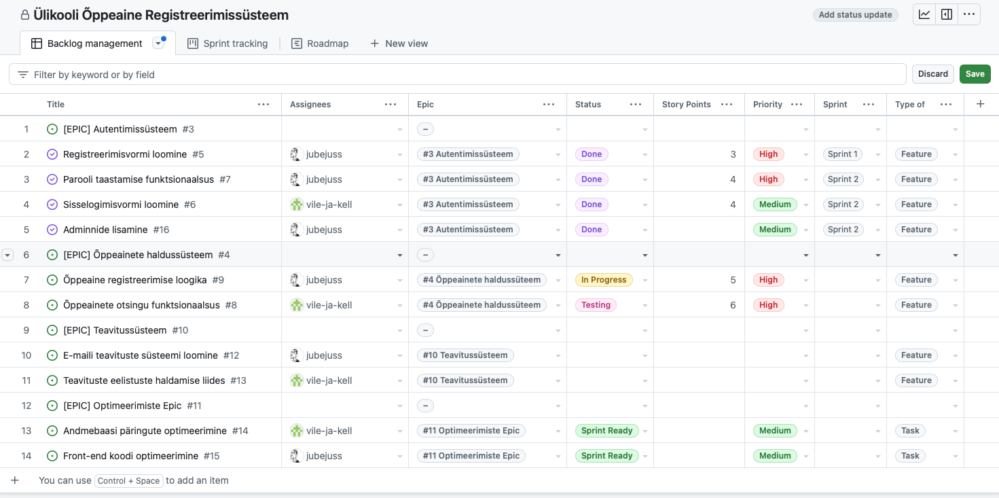
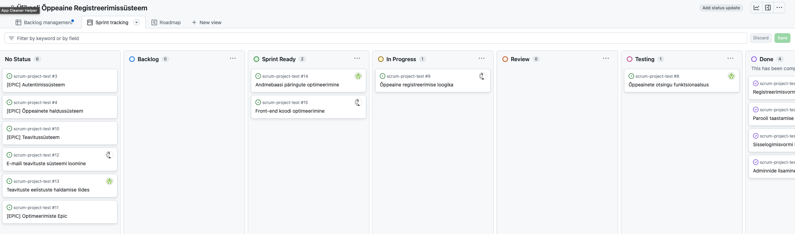
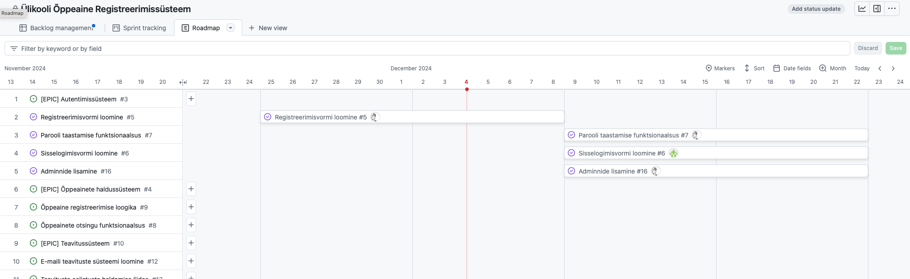
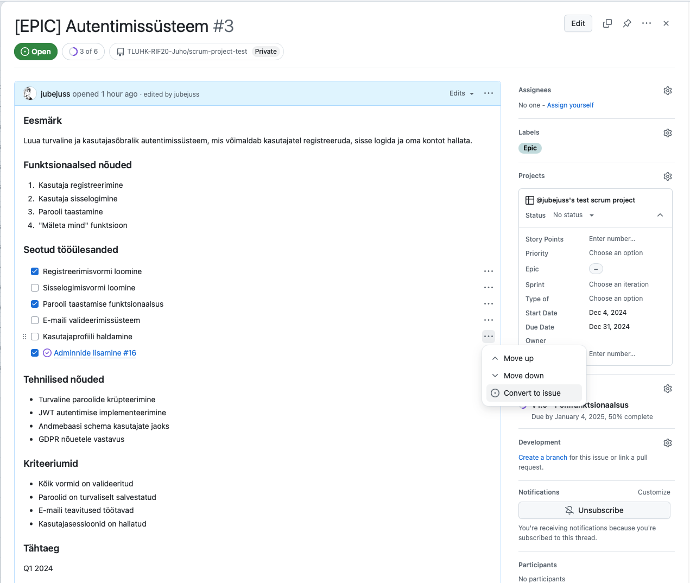

# Neljas seminar

Eelmise seminari tagaside:
Forkimine  
Fork > clone > checkout -b "uus haru" > muudatus > push > Contribute > Assign (sel juhul saan ma sõnumi, et muudatus on ootel)

## Osa 1: Paberprototüüpide loomine (1.5h)

### Teemad:
- Paberprototüüpide eesmärk ja kasulikkus
- Paberprototüüpide loomise põhimõtted
- Praktilised harjutused:
  - Eelnevalt loodud persoonade ja stsenaariumite põhjal prototüüpide visandamine
  - Kasutajaliidese elementide kavandamine
  - Navigatsiooni ja kasutajavoo visualiseerimine
- Prototüüpide testimine ja tagasiside

### Tegevused:
1. Sissejuhatus paberprototüüpimisse (15 min)
2. Prototüüpide visandamine gruppides (45 min)
3. Prototüüpide esitlemine ja tagasiside (30 min)

## Osa 2: Projekti haldamine Githubis (1.5h)

### Teemad:
- Scrum ja Kanban metoodikad
- Github Projects funktsionaalsus ja erinevad vaated
- Projekti töövoo ja tööülesannete haldamine

#### Scrum ja Kanban
##### Mis on Scrum?

Scrum on **agiilne** arenduse raamistik, mis keskendub tiimide tihedale koostööle ning järkjärgulisele projekti edenemisele. See raamistiku versioon arenes välja 1980. aastatel ja on praegu üks populaarsemaid agiilse arenduse meetodeid, mida kasutab umbes pisut üle poole agiilset lähenemist rakendavatest ettevõtetest[1][4]. Scrumi protsess koosneb kolmest peamisest rollist: **toote omanik**, **Scrum Master** ja **arendusmeeskond**. Toote omank vastutab toote nõuete määratlemise ja prioriseerimise eest, Scrum Master aitab protsessi juhtida ning arendusmeeskond teostab töö vastavalt nõudmistele[5].

Scrum töötab tsüklite ehk **sprindidena**, mis kestavad tavaliselt 2-4 nädalat. Iga sprindi alguses toimub planeerimise koosolek, kus määratakse ülesanded, mida meeskond peab lõpetama. Sprindi lõpus toimub ülevaatus, kus esitatakse valminud töö[3][4]. Scrum rõhutab ka pidevat tagasisidet ja tiimide iseorganiseerumist, mis aitab saavutada suuremat paindlikkust ja tootlikkust[1].

## Mis on Kanban?

Kanban on samuti **agiilne** meetod, kuid selle keskmes on visuaalne töövoogude juhtimine. Kanban metoodika sai alguse Toyota tootmissüsteemist ja on hiljem laienenud tarkvaraarendusele. Kanbani põhimõte põhineb visuaalsetel tahvlitel, kus tööülesanded esitatakse kaartidena ja liiguvad mööda tahvlit vastavalt oma staatusele (nt "ootel", "töös", "valmis")[1][4]. 

Kanban võimaldab paindlikku ülesannete järjekorra muutmist ning keskendub pidevale töövoo optimeerimisele ja läbipaistvusele. Iga veerg Kanban-tahvlil on piiratud teatud arvu kaartidega, et vältida tiimi ülekoormamist[1]. Kanbani eeliseks on selle lihtsus ja paindlikkus, kuna see ei nõua keerukaid reegleid ega kindlaid ajaraame nagu Scrum[2][4].

## Võrdlus

| Omadus        | Scrum                                           | Kanban                                         |
|---------------|-------------------------------------------------|------------------------------------------------|
| Struktuur     | tsükliline (sprindid)                          | jätkuv voog                                    |
| Rollid        | toote omanik, Scrum Master, arendusmeeskond         | pole kindlaid rolle; tiimid kohandavad ise   |
| Planeerimine  | sprindi planeerimine                           | paindlik ülesannete järjekord                |
| Visuaalsus    | kasutatakse sprindi tahvleid                    | visuaalne Kanban-tahvel                       |
| Eesmärk       | kiire arendus ja tagasiside                    | tööde sujuv voog ja läbipaistvus              |

Scrum sobib paremini projektidesse, kus on selged eesmärgid ja vajadus kiire arenduse järele, samas kui Kanban sobib olukordadesse, kus tööülesanded muutuvad pidevalt ning ei ole vajalikud kindlad ajaraamid[1][2].

## Allikad:
[1] Millist agiilse arenduse raamistikku valida ehk Scrumist Scrumbanini https://blog.twn.ee/et/scrumist-scrumbanini
[2] 2.4.2. Kanban vs Scrum - poolt ja vastu https://www.tlu.ee/~sirvir/Re-designing_and_Co-creating_Innovative_Cultural-Heritage_Services_Through_Libraries_Estonian_version/242_kanban_vs_scrum__poolt_ja_vastu.html
[3] [PDF] Scrum raamistik ja selle rakendamine Playtech Estonia OÜ osakonna näitel https://dspace.ut.ee/server/api/core/bitstreams/6f0e1e8e-bbe0-4131-b802-3b74dc0573d4/content
[4] Agiilne arendus ehk Kanban, Scrum ja teised – kaasaegne lähenemisviis ... https://koren.ee/blogi/agiilne-arendus-ehk-kanban-scrum-ja-teised-kaasaegne-laehenemisviis-tarkvaraarenduses
[5] Agiilne arendus - Vikipeedia https://et.wikipedia.org/wiki/Agiilne_arendus
[6] [PDF] AGIILSE LÄHENEMISE RAKENDUSVÕIMALUSTE ... https://digikogu.taltech.ee/et/Download/29545de0-840c-48c6-90d7-da7ca1786b22

## Srum projekti kulg
### Backlog

Backlog on prioriseeritud nimekiri kõigist töödest, funktsioonidest, parendustest ja vigadest, mis on vajalikud toote arendamiseks. Scrum'i kontekstis jaguneb backlog kaheks: **toote backlog** (Product Backlog) ja **sprindi backlog** (Sprint Backlog). Toote backlog sisaldab kõiki nõudeid ja ülesandeid, mida toode vajab, samas kui sprindi backlog on valik toote backlog'ist, mis on määratud teostatavaks konkreetse sprindi jooksul. Backlog'i haldamine on kriitilise tähtsusega, et tagada arenduse sujuvus ja prioriteetide vastavus ärivajadustele[1][2].

### Sprint Tracking

Sprint tracking viitab protsessile, mille käigus jälgitakse ja mõõdetakse sprindi edenemist. See hõlmab tööde oleku jälgimist, et tagada, et meeskond liigub õigesti eesmärkide suunas. Sprint tracking'i raames kasutatakse sageli visuaalseid tööriistu nagu **burndown chart**, mis näitab, kui palju tööd on jäänud lõpetada sprindi jooksul. See aitab meeskonnal tuvastada takistusi ja kohandada oma lähenemist vastavalt vajadusele[1][3].

### Epic

Epicud on suuremad tööüksused või kasutajalood, mis jagunevad väiksemateks ja hallatavamateks osadeks (nt **user stories**). Need esindavad laiemat funktsionaalsust või ärivajadust ning aitavad meeskonnal planeerida ja korraldada oma tööd. Epicute kasutamine võimaldab arendusmeeskondadel näha suuremat pilti ning paremini mõista, kuidas erinevad funktsioonid omavahel seotud on. Epicute jagamine väiksemateks osadeks aitab ka backlog'i haldamisel ning prioritiseerimisel[2][3].

## Allikad:  
[1] [PDF] AGIILSETE ARENDUSMETOODIKATE ... https://digikogu.taltech.ee/et/Download/44719e8b-4e75-4090-9289-beeaff7db137
[2] [PDF] Scrum raamistik ja selle rakendamine Playtech Estonia OÜ osakonna näitel https://dspace.ut.ee/server/api/core/bitstreams/6f0e1e8e-bbe0-4131-b802-3b74dc0573d4/content
[3] Millist agiilse arenduse raamistikku valida ehk Scrumist Scrumbanini https://blog.twn.ee/et/scrumist-scrumbanini

#### Näidis: Ülikooli Õppeaine Registreerimissüsteem
**Backlog**

**Sprint tracking**

**Roadmap**

Vaata projekti siin: https://github.com/orgs/TLUHK-RIF20-Juho/projects/7
Issued: https://github.com/TLUHK-RIF20-Juho/scrum-project-test/issues

### Epicute loomine Githubis.
Github ei ole päris täielik ja automaatne projektihaldamissüsteem, seega on siin vaja pisut rohkem käsitsi tööd teha.

Epic tuleb luua Github Issuena ja talle tuleks luua eraldi label "Epic". Epiku nime ette lisa [EPIC], et oleks lihtne aru saada, et tegemist on epikuga.  

Epicu sees tuleb vastav ülesanne lahti kirjutada ja jagada alamissutekes, või piletiteks või kes kuskil kuidas nimetab. Kui vormindada korrektselt, kasutades märkeruudustikuga list, on võimalik Epicu sees olevad ülesanded muuta issueteks. KAsuta seda lahendust kindlasti. Sellisel juhul on Epicu sees olevad ülesanded ja issued seotud ja kui issue on lahendatud, märgitakse see ka tekstis selliselt.

Meeskonna rollid:  
Mari - UI/UX disainer (vastutab kasutajaliidese eest)  
Jaan - Front-end arendaja (teeb veebilehe eesmise osa)  
Peeter - Back-end arendaja (teeb serveripoolse loogika)
Liis - Dokumenteerija ja testija (kirjutab juhendid ja testib)

## Lisalugemist:  
https://scrumguides.org/docs/scrumguide/v2020/2020-Scrum-Guide-US.pdf

