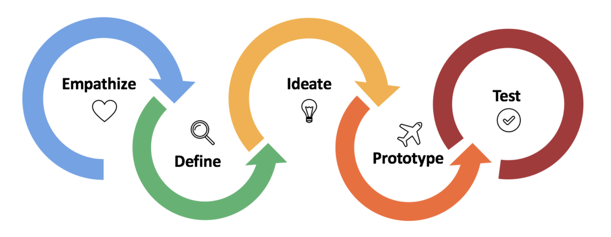
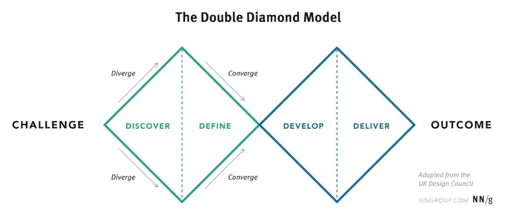
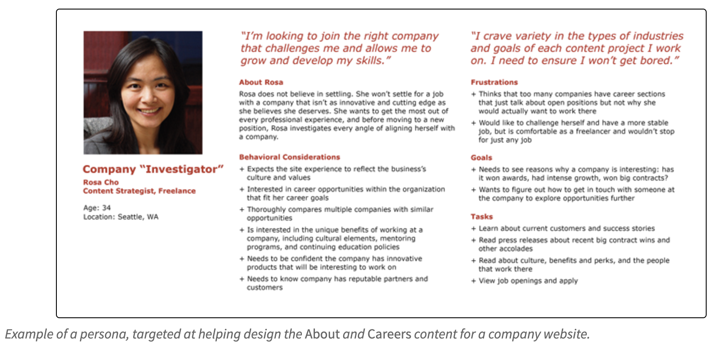
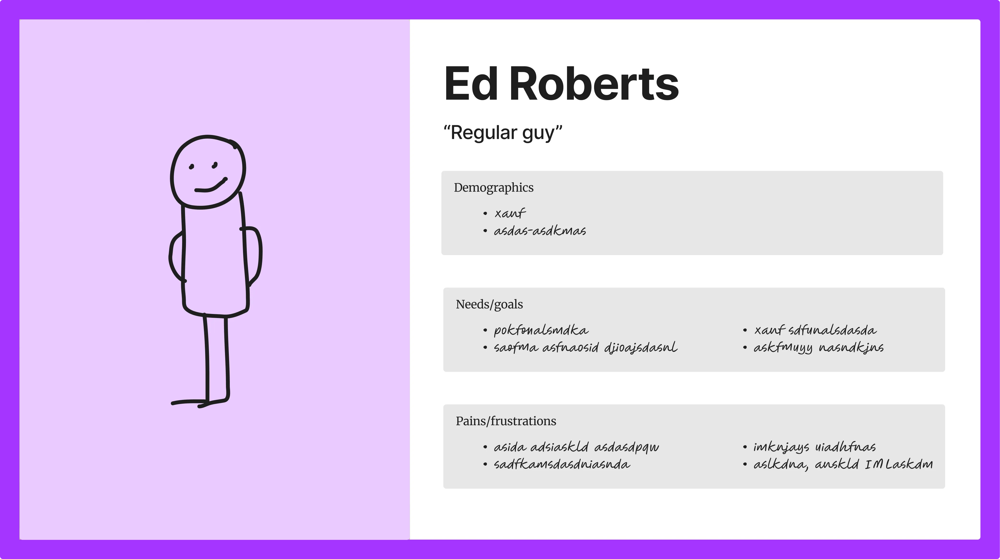
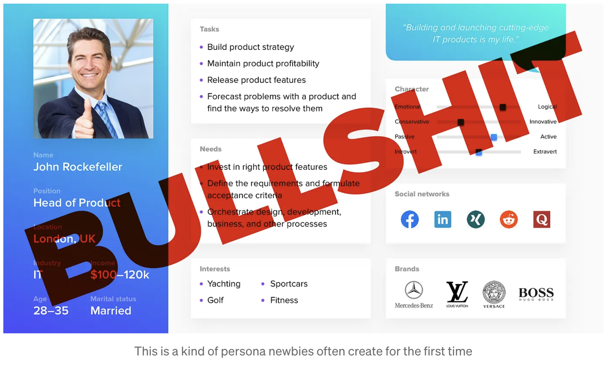
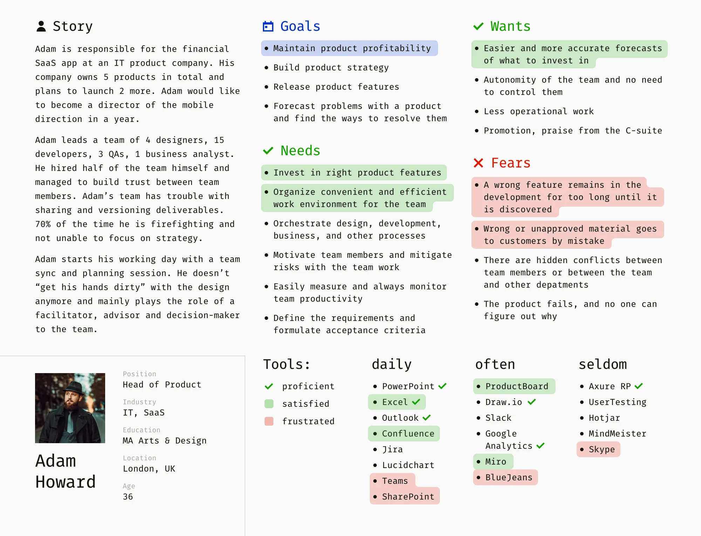
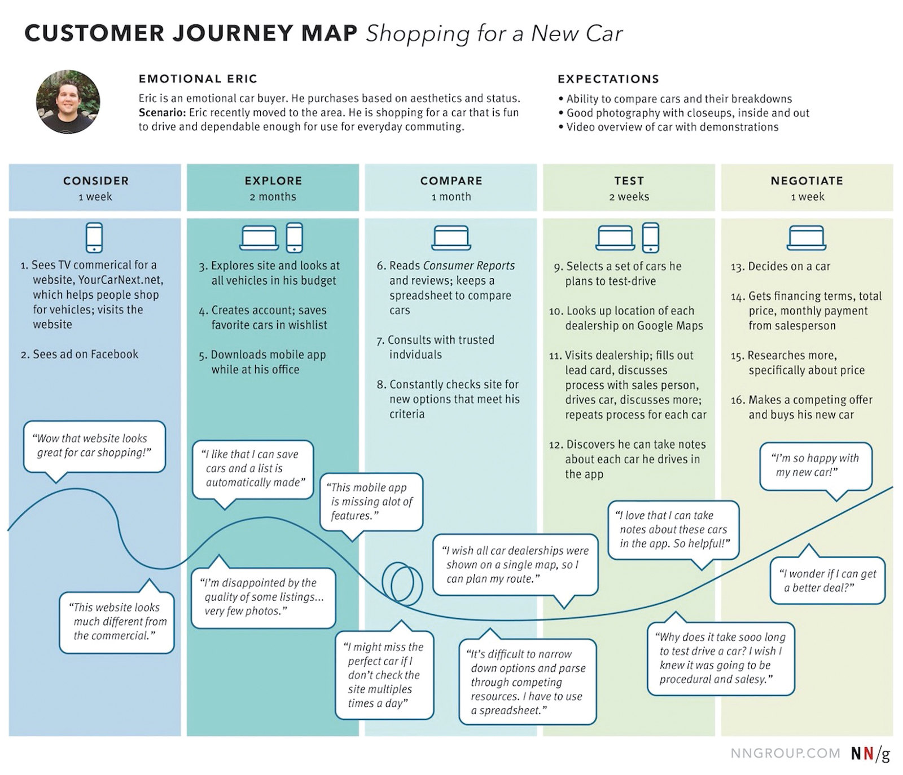
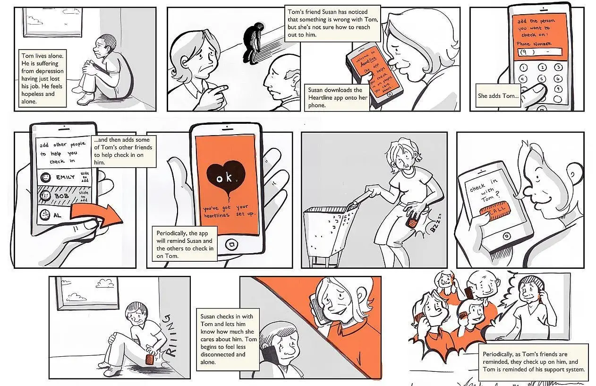

# Seminar 4: sprint 2 - disainimine
[Seminari salvestus, I-osa](https://youtu.be/2A1mUSwpdqQ)  
[Seminari salvestus, II-osa](https://youtu.be/--mdY1zROYo)

---

## Täna õpime

1. **Sprint Review ja Retrospective** - kuidas sprinti lõpetada
2. **Design Thinking** - inimesekeskne lähenemine
3. **Persoonade loomine** - kasutajate mõistmine
4. **User Story-d** - vajaduste kirjeldamine
5. **Prototüüpimine** - ideede rakendamine ja testimine

---

## Seminari struktuur

- **30 min** - Sprint 1 Review & Retrospective
- **60 min** - teooria (Design Thinking, Persoonad, User Stories)
- **90 min** - praktika (Persoonad, Prototüübid)

---

# Sprint 1 Review
## "Mida me tegime?"

---

## Sprint Review eesmärk

- **Demonstreerida** Sprint 1 tulemusi
- **Saada tagasiside** stakeholder'itelt ehk neilt, kes on asjaga seotud
- **Kinnitada** Sprint 2 suund
- **Luua läbipaistvus** meeskonna töös

---

## Demo struktur (15 min)

1. **Sprindi eesmärgi meeldetuletus** (2 min)
2. **Saavutatud tulemused** (8 min) 
3. **Sprindi mõõdikud** (3 min)
4. **Stakeholderite tagasiside** (2 min)

---

## "Kooli Köök" Sprint 1 demo

**Sprindi eesmärk:** "Projekt on käivitamiseks valmis"

**Saavutused:**
- Projektiplaani dokument
- Meeskonna rollide jaotus
- Tehniline arhitektuur
- GitHub Projects seadistus

---

## Sprint 1 mõõdikud

- **Planeeritud**: 14 Story Points
- **Täidetud**: 15 Story Points (107%)
- **Velocity**(meeskonna töökiirus sprindis): 15 SP (baseline järgmisteks)
- **Blockers**(takistused, mis aeglustasid tööd) : 2 väikest

---

# Sprint 1 Retrospective
## "Kuidas me töötasime?"

---

## Retrospective eesmärk

- **Analüüsida** meeskonna koostööd
- **Leida parandamise** võimalusi
- **Planeerida** järgmise sprindi muudatused
- **Tugevdada** tiimi

---

## Start-Stop-Continue meetod

**CONTINUE** - Mis läks hästi?
**STOP** - Mida tuleks lõpetada?
**START** - Mida alustada?

---

## "Kooli Köök" Retrospective näide

**CONTINUE**
- Daily standupid GitHub-is töötasid
- Rollide jaotus oli selge
- Peer review tõi kvaliteeti

**STOP**
- Liiga pikad hindamise arutelud
- Liiga palju väikesi PR-e

**START**
- Planning poker cards
- Definition of Done checklistid

---

## Action Items Sprint 2-ks

1. **Marko** - Planning poker tööriist
2. **Kristel** - DoD template-id
3. **Kõik** - Max 3 PR-i nädalas
4. **Liisa** - Stakeholder feedback plaan

---

# Disainmõtlemine
## Inimesekeskne innovatsioon

---

## Mis on disainmõtlemine?

"Inimkeskne disain on interaktiivsete süsteemide arendamine, mille eesmärk on muuta süsteemid kasutatavaks ja kasulikuks, keskendudes kasutajatele, nende vajadustele ja nõuetele ning rakendades inimfaktori, ergonoomika ja kasutatavuse teadmisi ja tehnikaid. See suurendab tõhusust ja efektiivsust, parandab inimeste heaolu, kasutajate rahulolu, ligipääsetavust ja jätkusuutlikkust ning aitab vältida võimalikke negatiivseid mõjusid inimeste tervisele, ohutusele ja sooritusele."  
— ISO 9241-210:2019(E)

---

**Definitsioon lühidalt:** Inimkeskne lähenemine innovatsioonile

**Integreerib:**
- Inimeste vajadused
- Tehnoloogia võimalused 
- Äri nõudmised

---

## Disainmõtlemise 5 etappi


---

## Disainmõtlemise 5 etappi

1. **Empaatia** (Empathize) - kasutajate mõistmine
2. **Defineerimine** (Define) - probleemi formuleerimine
3. **Ideestamine** - lahenduste genereerimine
4. **Prototüüpimine** - kiired testversioonid
5. **Testimine** - kasutajatega valideerimine

---

## Dopelt teemanti mudel



**1. teemant:** Õige probleemi leidmine
**2. teemant:** Õige lahenduse leidmine

---

## Inimkeskse disaini põhimõtted

- **Inimesed esikohal** - tehnoloogia teenib inimesi, rakendused on inimeste jaoks, mitte vastupidi
- **Konteksti mõistmine** - kus, millal, kuidas kasutavad
- **Iteratiivne protsess** - jätkuv tagasiside
- **Multidistsiplinaarne koostöö** - erinevad vaatenurgad
- **Empaatia** - kasutajate emotsioonide mõistmine

---

# Persoonade loomine
## Kasutajate mõistmine

---

## Mis on persoona?

**Definitsioon:** fiktiivne karakter, mis esindab reaalset kasutajagruppi

**Persoona eesmärk:**
- keskenduda konkreetsele kasutajale
- lihtsamad otsused ("Kas Mari kasutaks seda?")
- ühine arusaam kasutajatest
- väldi iseenda projitseerimist

---

## Persoona elemendid

**Põhiinfo:**
- nimi ja pilt (meeldejätmine)
- vanus, elukutse, haridus
- tehnika kogemus

**Kontekst:**
- kasutamise keskkond
- seadmed ja tehnoloogiad
- ajaline koormus

---

## Persoona elemendid

**Eesmärgid:**
- miks tahab toodet kasutada
- peamised eesmärgid
- motivatsioon

**Frustatsioonid:**
- mis praegu segab
- peamised väljakutsed
- vältimist vajavad vead

---

## Näide: Mari Mets

```
MARI METS, 20, rakendusinformaatika tudeng

"Ma soovin rohkem aega huvialadele, 
mitte kodutööde tähtaegade jälgimisele."

KONTEKST: Ülikoolielus, tihe tunniplaan
EESMÄRGID: Kiire ülevaade, automaatsed meeldetuletused  
FRUSTATSIOONID: Info hajutatud, unustab tähtaegu
KÄITUMINE: Kontrollib telefoni iga 30 min
```

---

#### Olulised põhimõtted:

- Väldi ebavajalikke detaile, mis ei mõjuta disainiotsuseid
- Iga lisatud detail peaks teenima kindlat eesmärki
- Persoona peab olema meeldejääv ja usutav
- Põhine reaalsetel andmetel, mitte väljamõeldisel

**[Näide Nielsen Norman Groupi lehelt](https://www.nngroup.com/articles/persona/)**



---

#### Teistsugune vaade persoonadele – [Ärge kasutage fotosid](https://medium.com/we-are-systematic/short-post-stop-using-photos-in-your-personas-c2b11dc1383b)  


#### Veel teistsugusem:
**[Milliseid persoonasid mitte luua](https://medium.com/design-bridges/personas-e60c1c06ead1)**



[Allikas](https://medium.com/design-bridges/personas-e60c1c06ead1)

**Lihtsad sammud hea persoona loomiseks:**  
Samm 1. Eemalda visuaalsed efektid  
Samm 2. Kustuta ebaoluline või väljamõeldud info  
Samm 3. Eemalda fookus demograafilistelt andmetelt  
Samm 4. Jutusta lugu  
Samm 5. Lisa rohkem vajadusi, soove ja hirme  
Samm 6. Kirjelda asjakohast kogemust  
Samm 7. Määra prioriteedid ja rõhuasetus  


[Allikas](https://medium.com/design-bridges/personas-e60c1c06ead1)


---

# User Storyd (Põgus turvustus eelmises seminaris)
## Vajaduste kirjeldamine

---

## User Story formaat

```
"[kasutaja tüübina] soovin ma [eesmärk/funktsioon], 
et [kasutaja väärtus/põhjus]."
```

**Näide:**
"Tudengina soovin ma näha kõiki oma kodutöid ühes kalendris, et ma ei unustaks ühtegi tähtaega."

---

## INVEST kriteeriumid

Hea user story peab olema:

- **I**ndependent - sõltumatu teistest
- **N**egotiable - läbirääkitav  
- **V**aluable - väärtuslik
- **E**stimable - hinnatav
- **S**mall - piisavalt väike
- **T**estable - testitav

---

## Aksepteerimiskriteeriumid

**Definitsioon:** Tingimused, mis peavad olema täidetud

**Näide:**
```
USER STORY: tudengina soovin näha tähtaegu kalendris

Aksepeerimiskriteeriumid:
- Näeb kõiki kodutöid kronoloogiliselt
- Iga ülesande juures tähtaeg ja õppeaine  
- Saab filtreerida õppeainete kaupa
- Näitab ainult aktiivseid ülesandeid
```

---

###Kasutajalood võib kirjutada:  

Agiilse arenduse tööriistadesse nagu Jira, Trello või Azure DevOps
Projekti dokumentatsiooni (nt requirements.md fail)
Eraldi kasutajalugude dokumenti (nt user-stories.md)
Figma faili, kus on näha, kuidas toode peaks töötama

---

Kasutajalugudest saab komplekteerida EPIC-ud ning need saab lisada projekti ning tuletada nendest ülesanded.  

---

# Kasutajateekond
## Journey Mapping

---

## Customer Journey Map

**Definitsioon:** Visuaalne esitlus kasutaja kogemusest

**Elemendid:**
- **Puutepunktid** - kus kasutaja tootega kohtub
- **Tegevused** - mida kasutaja teeb
- **Mõtted** - mis kasutaja mõtleb
- **Emotsioonid** - kuidas kasutaja tunneb
- **Võimalused** - kus saab parendada

---

## Kasutajateekonna näide

```
ETAPP 1: Probleem tekib
- Tegevus: Meenutab tähtaega
- Mõtted: "Kas mul on aega?"
- Emotsioon: 😰 Stress
- Võimalus: Varajane meeldetuletus

ETAPP 2: Otsib infot  
- Tegevus: Kontrollib Moodle-t
- Mõtted: "Kus see info oli?"
- Emotsioon: 😤 Frustratsioon
- Võimalus: Keskne info koht
```

---

## Kasutajateekonna näide


---

## Stsenaariumid

Stsenaariumid on detailsed kirjeldused, kuidas kasutajad süsteemiga suhtlevad konkreetsetes olukordades. Need aitavad mõista kasutajate teekonda läbi süsteemi ja tuvastada võimalikke probleeme.

---

Stsenaarium peaks sisaldama:
1. Kontekst - mis olukorras kasutaja on
2. Eesmärk - mida kasutaja üritab saavutada
3. Tegevused - sammud, mida kasutaja peab tegema
4. Tulemus - mida kasutaja loodab saavutada

---

Näide stsenaariumist:
> **Uue konto loomine**  
> Mari soovib luua uue konto rakenduses. Ta avab rakenduse avalehe, klikib "Loo konto" nupul, täidab vajalikud väljad oma andmetega ja vajutab "Registreeru". Süsteem saadab talle kinnitusmeili, mille ta avab ja kinnitab oma konto. Seejärel saab ta sisse logida ja alustada rakenduse kasutamist.

---

## Storyboard

Storyboard on visuaalne jutustus või stsenaariumi esitlus, mis näitab sammhaaval, kuidas kasutaja süsteemiga suhtleb. See on sarnane koomiksile, kus iga pilt esindab ühte sammu või tegevust kasutaja teekonnas.

---

Storyboard'i eelised:
- Aitab visualiseerida kasutajakogemust
- Teeb keerulised stsenaariumid lihtsamini mõistetavaks
- Võimaldab tuvastada probleeme enne arendamist
- Hea kommunikatsioonivahend meeskonna ja sidusrühmade vahel

---

Hea storyboard sisaldab:
1. Selge järjestus - sammud on loogilises järjekorras
2. Kontekst - kus ja millal tegevus toimub
3. Kasutaja emotsioonid ja mõtted
4. Probleemid ja lahendused
5. Selgitavad tekstid või dialoogid

---

Näide storyboard'ist võiks kujutada mobiilirakenduse kasutamist:
1. Kasutaja avastab probleemi (vajab transporti)
2. Avab rakenduse ja sisestab sihtkoha
3. Valib sobiva transpordiviisi
4. Kinnitab tellimuse
5. Ootab ja jälgib teenuse saabumist
6. Kasutab teenust
7. Maksab ja hindab kogemust

---
**[Näide storyboard'ist:](https://blog.adobe.com/en/publish/2017/09/26/a-comprehensive-overview-of-ux-design-deliverables)**



https://www.uxstudioteam.com/ux-blog/ux-storyboard


---

Jutusein https://miro.com/app/board/uXjVP20eerM=/

---

# Funktsionaalsed vs mittefunktsionaalsed nõuded (käsitletud ka eelnevates seminarides)

---

## Funktsionaalsed nõuded 

**Definitsioon:** Mida süsteem TEEB

**Näited:**
- Kasutaja saab sisse logida
- Süsteem saadab meeldetuletuse
- Admin saab lisada kasutajaid
- Saab filtreerida ülesandeid

---

## Mitte-funktsionaalsed nõuded

**Definitsioon:** KUIDAS süsteem käitub

**Jõudlus:** Leht laadib 3 sekundi jooksul
**Kasutatavus:** Uus kasutaja õpib 5 minutiga
**Turvalisus:** Parool vähemalt 8 märki
**Skaleeruvus:** Toetab 10x kasutajate kasvu

---

# Praktika
## Sprint 2 planeerimine

---

## Sprint 2 eesmärk

Kasutajaliidese prototüüp on loodud ja testitud, arendus saab alustada tööga.  

Mis meil selleks vaja on?

---

## Sprint 2 Capacity (näide)

**Velocity kasv 15 → 18 SP:**
- **Liisa (PO)**: 4 SP - uurimistöö ja tagasiside
- **Marko (PM)**: 3 SP - koordineerimine  
- **Jaan (Dev)**: 5 SP - tehnilised analüüsid
- **Kristel (UX)**: 6 SP - disaini ekspert

---

## Sprint 2 GitHub Issues (näide)

**Design Epic Issues (12 SP):**
- **Issue #8**: Loo 3 detailset persoonat (3 SP)
- **Issue #9**: Disaini broneerimise UI (5 SP)  
- **Issue #10**: Toidu jagamise interface (3 SP)
- **Issue #11**: Design System dokumentatsioon (1 SP)

**Research Epic Issues (6 SP):**
- **Issue #12**: Kasutajatestimise plaan (2 SP)
- **Issue #13**: Konkurentsianalüüs (2 SP)
- **Issue #14**: Tehnilise teostatavuse analüüs (2 SP)

---

# Persoonade töötuba
## "Kooli Köök" kasutajad

---

## Sprint 1 uurimistulemused

- **78%** kulutab mikrolaineahju otsimisele 10+ minutit
- **65%** unustab toitu külmaks
- **45%** jagaks ülejäänud toitu
- **23%** huvitatud ühisostudest

---

## Peamine kasutaja: Mari Mets

```
MARI METS, 20, rakendusinformaatika tudeng

"Ma tahan kiiresti soojendada oma lõunat ja 
jätkata õppimist, mitte seista järjekordades."

KONTEKST: 2. kursus, tihe tunniplaan, mobiilikasutaja
EESMÄRGID: Leia vaba ahi <30 sek, broneeri ette
FRUSTATSIOONID: Pikad järjekorrad, info puudub
KÄITUMINE: Telefon iga 30 min, intuitiivne kasutus
```

---

# User Story brainstorm
## Sprint 2 prioriteedid

---

## Must Have (8 SP)

**1. Reaalajas ahjude olek (3 SP)**
```
Tudengina soovin näha kõigi mikrolaineahjude 
praegust olekut, et ma ei peaks ringi käima ja otsima.

✅ 12 ahju ühel vaatel
✅ Olek uuendatakse 30 sek jooksul  
✅ Selge värvikood: roheline/kollane/punane
✅ Töötab telefonis ja arvutis
```

---

## Must Have (8 SP) jätk

**2. Broneerimise funktsioon (5 SP)**
```
Tudengina soovin broneerida vaba mikrolaineahju 
kuni 15 minutiks, et ma ei peaks kartma järjekorda.

 Broneering max 15 min
 Auto-tühistus kui ei kasuta 5 min  
 Saab broneerida 2h ette
 Push teavitus enne algust
 Saab tühistada enne kasutamist
```

---

# Paberprototüüpimine
## Lo-fi wireframe'id


## Vaata näidet ja loe juurde siit:  
https://uxplanet.org/the-magic-of-paper-prototyping-51693eac6bc3

---

## Prototüüpimise põhimõtted

- **Kiirus > Täpsus** - ei pea ilus olema
- **Fookus funktsioonidele** - vorm tuleb hiljem
- **Iteratiivne** - kiiresti, testi, paranda
- **Kaasahaarav** - kõik saavad kaasa rääkida

---

## Joonistamise reeglid

- Lihtne pliiats ja paber
- Suured kastid komponentidele
- Väiksed tekstid
- Märgi clickable elemendid
- Näita navigatsiooni

---

## Ekraanide jaotus rollide kaupa (võimalik näide)

- **UX Designer**: Peamised user flow'd
- **Product Owner**: Dashboard ja overview
- **Developer**: Seadistused ja admin vaated  
- **QA Lead**: Error state'd ja edge case'd

---

# Kodutöö 4
## Sprint 2 GitHub Issues täitmine

---

## GitHub Workflow

**Kodutöö = Sprint 2 Issues täitmine**

1. **Loo sprindi plaan** – mida te teete, kes mille eest vastutab jne
2. **Loo vajalikud failid**
3. **Loo wireframed**  
4. **Loo GitHub Issues projekti** 
5. **Määra Labels, Assignee, Components**  
6. **Töö In Progress** → **Review** → **Done**
7. **Sprint review ja Retrospective** võtke seekordne sprint kokku. Lisage igaüks enda poolt kommentaar, mida õppisid, mis oleks võinud olla teisit, mis on endiselt segane või muud kommenteerimits vajavad jutud. 

---

## Issued täitmiseks

**Issue #X**: Loo 2-3 detailset persoonat
**Issue #X**: Loo persoonade baasil kasutajateekonnad või stsenaarium või storyboard, mis vastavad ülesannetele, mida kasutaja peaks/saaks rakenduses sooritada
**Issue #X**: Loo rakenduse kuvad (wireframed), mida saaksid järgmisel korral kasutajate peal testida. Kuvade arv vali, et saaksid anda testimiseks vähemalt kaks ülesannet

---

## Repositooriumi struktuur

```
sprint2/
├── sprint_plan.md
├── personas.md  
├── scenario-journey-storyboard.md  
├── images/wireframes dokumenteerimise huvides
├── daily-standups.md (juhul kui teete)  
├── sprint-2-review.md
├── sprint-2-retrospective.md
└── README.md
```

---

## Tähtaeg

**Järgmise seminarinädala algus**

Järgmine seminar: **Sprint 3 - Arendamine**

---

# Küsimused?

**Täna õppisime:**
✅ Sprint Review ja Retrospective  
✅ Design Thinking metoodika
✅ Persoonade loomist
✅ User Story kirjutamist
✅ Paberprototüüpimist

**Järgmiseks:** Sprint 2 dokumentatsiooni loomine