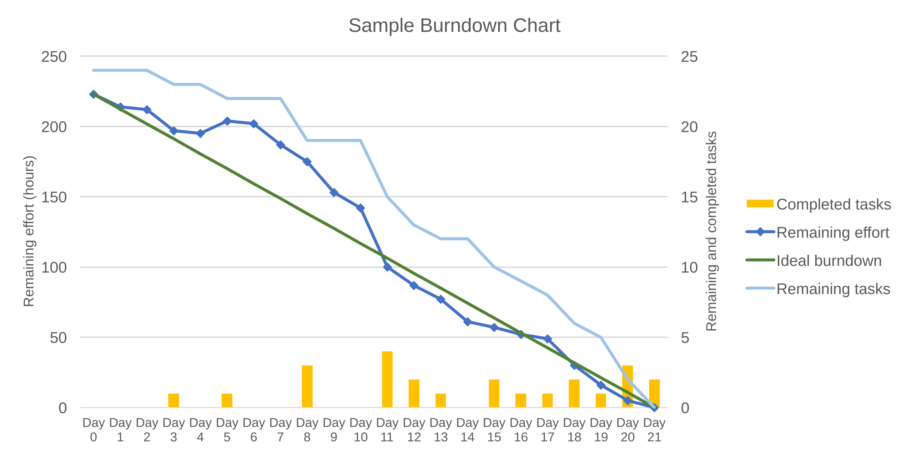

# Seminar 5: Sprint 3 - arendamine (simuleerimine)

---

## Täna õpime

1. **Sprint 2 Review ja Retrospective** - disaini tulemuste ülevaade
2. **Epic Breakdown** - suurte ülesannete jagamine
3. **Story Points ja Estimating** - keerukuse hindamine
4. **Sprint Metrics** - velocity, burndown charts
5. **Sprint Simulation** - 2 nädala arendus 40 minutiga

---

## Seminari struktuur

- **30 min** - Sprint 2 Review & Retrospective
- **90 min** - Teooria (Epic breakdown, metrics, communication)
- **90 min** - Praktika (Sprint simulation, ülesannete jagamine)

**Kokku: 3 tundi**

---

## Oluline!

**Me EI koodi!**

Täna simuleerime arendusprotsessi:
- Kuidas arendajad ülesandeid jagavad
- Kuidas meeskonnad koostööd teevad
- Kuidas progressi jälgitakse
- Mis toimub "päris" Sprint 3 ajal

---

# Sprint 2 Review
## "Mida me disainisime?"

---

## Sprint 2 Review eesmärk

- **Demonstreerida** Sprint 2 disaini tulemusi
- **Näidata** wireframe'e ja personaid
- **Kinnitada** et olemevalmis "arendamiseks"
- **Saada tagasiside** teistelt meeskondadelt

---

## Demo struktuur (15 min)

1. **Sprint 2 eesmärk** (2 min)
2. **Disaini tulemused** (10 min)
   - Personas
   - Wireframes
   - User journeys
3. **Sprint 2 mõõdikud** (3 min)

---

## Teie demo

**Iga meeskond (2 min):**
- Näita 2-3 persoonat
- Näita wireframe'e (pildid)
- Selgita user journey
- Ütle, mitu SP täitsite

**Teised meeskonnad küsivad:**
- "Kuidas see tehniliselt töötab?"
- "Kas see on kasutajale arusaadav?"

---

## Wireframedega testimine
Et veenduda wireframede sobivuses, tuleb testida. Iga tiim testib oma wireframedega vähemalt kaht sestenaariumit ja dokumenteerib leiud.  
Päris elus tuleks selle põhjal ka parandused täiustused sisse viia.

## Sprint 2 mõõdikud

Näide:

- **Planeeritud**: 16 Story Points
- **Täidetud**: 18 Story Points (112%)
- **Velocity**: 18 SP
- **Wireframe'id**: 8 ekraani
- **Personas**: 3 detailset

---

# Sprint 2 Retrospective
## "Kuidas me disainisime?"

---

## Retrospective eesmärk

- **Analüüsida** Sprint 2 disaini protsessi
- **Leida** parandamise võimalusi
- **Valmistuda** Sprint 3-ks (arendus)
- **Tugevdada** meeskonda

---

## Start-Stop-Continue meetod

**CONTINUE** - Mis läks hästi disainis?

**STOP** - Mida lõpetada?

**START** - Mida proovida Sprint 3-s?

---

## Näide: "FindFood" Retrospective

**CONTINUE**
- Wireframe'id olid selged
- Personas aitasid fokuseerida
- User journey oli kasulik

**STOP**
- Liiga palju detaile prototüüpides
- Unustasime error state'id

**START**
- Task breakdown varem
- Rohkem kasutajate testimist

---

## Action items Sprint 3-ks

Iga meeskond valib selgeid praktilisi samme ("action items"), mida võtta järgmiseks sprint'iks, et parandada oma tööprotsessi ja rakendada retrospektiivis leitud õppetunde. Need tegevuspunktid aitavad fookust hoida ning toetavad meeskonna arengut Sprint 3 jooksul – näiteks tehniliste otsuste dokumenteerimine või paremini omavaheline suhtlus.

Iga meeskond valib 2 action item'it:

Näited:
- "Kirjutame technical decisions dokumenti"
- "Kasutame GitHub Projects'i aktiivsemalt"
- "Teeme daily standup'e järjepidevamalt"

Asub tahvlil nähtavas kohas, nt to do, In Progress, Done, Action items. Või tavaline tööülesanne, mida järgib kas kogu tiim või mõni juht. Järgmises retros vaadatakse, kas si toimis, kas täideti, kas paranes.

---

# Epic Breakdown
## Suurtest ülesannetest väikesteks

**Lisalugemist:**
[Let's do better Epic Breakdowns](https://medium.com/infobipdev/lets-do-better-epic-breakdowns-it-s-an-investment-that-will-pay-off-3e15819ae10b)

---

## Hierarhia: Projekt → Epic → User Story → Task

```
PROJEKT: FindFood
  └── EPIC: Restoranide otsing
      └── USER STORY: Kasutaja näeb lähimaid restorane
          └── TASK 1: Loo kaardi komponent (UI)
          └── TASK 2: Hangi kasutaja asukoht (Backend)
          └── TASK 3: Lae restoranide andmed (Backend)
          └── TASK 4: Kuva restoranid kaardil (UI)
          └── TASK 5: Testi kaardi laadimist (Testing)
```

---

## Miks me jagame väiksemaks?

**Suured ülesanded on:**
- Raske hinnata
- Raske jagada
- Raske jälgida
- Raske testida

**Väikesed task'id on:**
- Selged
- 1-3 päeva töö
- Konkreetsed
- Testitavad

---

## Task'ide 5 tüüpi

1. **UI/Frontend**: Ekraanid, nupud, disain
2. **Backend/Logic**: Andmete töötlemine, äriloogika
3. **Database**: Andmete salvestamine
4. **Testing**: Kas kõik töötab?
5. **Documentation**: Kuidas kasutada?

---

## Näide: "FindFood" Epic Breakdown

**EPIC**: Kasutaja registreerimine

**USER STORY 1**: Kasutaja saab e-posti teel registreerida
- TASK: Loo registreerimise ekraan (UI) - 3 SP
- TASK: Valideeri e-posti formaat (Backend) - 2 SP
- TASK: Salvesta kasutaja andmebaasi (Database) - 3 SP
- TASK: Saada kinnitusmail (Backend) - 2 SP
- TASK: Testi registreerimist (Testing) - 2 SP

**USER STORY 2**: Kasutaja saab parooli taastada
- TASK: ... (sarnane breakdown)

---

## Task'i hea kriteerium

**Hea task:**
- 1 inimene saab 1-3 päevaga valmis
- On selge Definition of Done
- Ei sõltu liiga paljudest teistest task'idest
- On max 5 Story Points

**Halb task:**
- "Tee rakendus valmis" (liiga suur)
- "Paranda kõik" (ebaselge)
- "Uuri midagi" (ei ole lõppu)

---

# Story Points ja Estimating
## Keerukuse hindamine

---

## Story Points meeldetuletus

**Story Point = Keerukus, MITTE aeg**

```
1 SP: Lihtne - teame täpselt kuidas
2 SP: Selge - väike töö
3 SP: Keskmine - mõtlemist vajavad
5 SP: Keeruline - uurimist vajab
8 SP: Väga keeruline - peaks jagama!
13 SP: Liiga suur - JAGA KINDLASTI!
```

**Fibonacci skeem**: 1, 2, 3, 5, 8, 13

---

## Miks Fibonacci?

Suuremad numbrid = suurem ebakindlus

```
1-3 SP vahel: väike erinevus (lihtsad task'id)
5-8 SP vahel: suur erinevus (keerulised task'id)
```

Kui ei suuda valida 5 vs 8 - task on liiga suur, jaga väiksemaks!

---

## Planning Poker

**Kuidas hinnata:**

1. Product Owner kirjeldab task'i
2. Iga liige valib saladuses oma hinnangu (1-13)
3. Kõik näitavad korraga
4. Kõige kõrgem ja madalaim selgitavad oma põhjendust
5. Arutelu ja uus hinnang
6. Konsensus

---

## Planning Poker näide

**TASK**: "Loo sisselogimise ekraan"

```
Mari (UX): 2 SP - "Mul on wireframe olemas"
Jaan (Dev): 5 SP - "Peab valideerima sisendeid"
Liisa (PO): 3 SP - "Keskmine keerukus"
Marko (PM): 5 SP - "Nõustun Jaaniga"

Arutelu → Konsensus: 3 SP
Põhjus: UI on lihtne, aga validation teeb keerulisemaks
```

---

## Tavalised hindamisvead

**Liiga optimistlik:**
- "See on lihtne!" (aga tegelikult ei ole)
- Unustame testimise, dokumentatsiooni

**Liiga pessimistlik:**
- "See on võimatu!" (aga tegelikult keskmine)
- Kartame tundmatut

**Scope creep:**
- Task muutub töö käigus suuremaks
- "Aga me peaksime ka seda tegema..."

---

# Arenduse mõõdikud
## Kuidas jälgida progressi?

---

## Mis on velocity (sprindivõimekus)

**Lisalugemist:**
[Sprint Velocity Guide](https://www.parabol.co/blog/sprint-velocity/)

**Sprint Velocity** = meeskonna poolt ühe sprindi jooksul lõpetatud töö suurus

**Mõõdetakse:**
- Story points'ides (kõige tavalisem)
- Lugude arvuga (user stories)
- Tehtud tundidega

**Oluline:** See on meeskonna mõõdik, mitte üksiku arendaja oma!

---

## Velocity näide

**Näide:**
- Sprindi alguses plaanis 3 lugu
- Kokku 9 story points'i
- Kõik lood lõpetatud → velocity = 9

**Kui mõni lugu jääb pooleli:**
- Selle story point'e arvesse EI võeta
- Ainult "Done" lood loevad!

**"Kooli Köök" näide:**
```
Sprint 1: 15 SP lõpetatud
Sprint 2: 18 SP lõpetatud
Sprint 3 plaan: 15-18 SP (realistlik)
```

---

## Velocity kasutusvõimalused

**1. Tulevaste sprintide planeerimine**
- Kasuta viimaste 3 sprindi keskmist
- Nt: 15, 18, 16 SP → järgmine sprint ~16 SP

**2. Probleemide avastamine**
- Velocity langeb järsult → takistused? Liiga suured lood?
- Velocity kõigub palju → ebastabiilne planeerimine

**3. Retrospektiivi sisend**
- Võrdle sprinte: kas saavutasime plaani?
- Miks mitte? Mida parandada?

---

## Velocity hoiatused

**ÄRGE kasutage velocity't:**
- Meeskondade võrdlemiseks
- Survevahendina ("tõstke velocity't!")
- Individuaalse tootlikkuse mõõtmiseks

**Miks?**
- Story points on meeskonnaspetsiifilised
- Võib tekkida "kilovatuse" kultuur
- Kahjustab kvaliteeti ja meeskonna heaolu

**Velocity on sisekaudne abivahend, mitte kontrollivahend!**

---

## Mis on burndown chart

**Lisalugemist:**
[Burndown Chart Tutorial](https://www.atlassian.com/agile/tutorials/burndown-charts)

**Burndown Chart** (kulumise diagramm) = graafik, mis näitab kui palju tööd on veel jäänud sprindi jooksul

**Telgede selgitus:**
- **X-telg:** Aeg sprindi jooksul (päevad)
- **Y-telg:** Töömaht, mis on veel teha (story points)

**Kaks joont:**
- **Ideaaljoon:** "Õige" kulgemise rada → viib sprindi lõpuks nullini
- **Tegelik joon:** Reaalne progress üle aja

---

## Burndown chart näide



*Allikas: [Wikipedia - Burndown Chart](https://en.wikipedia.org/wiki/Burndown_chart)*

**Graafikul näeme:**
- **Completed tasks (oranž):** Tehtud ülesanded
- **Remaining effort (tumesinine):** Alles jäänud pingutus
- **Ideal burndown (roheline):** Ideaalne kulgemise joon
- **Remaining tasks (helesinine):** Alles jäänud ülesanded
- **X-telg:** Sprint päevad
- **Y-telg:** Ülesannete arv või story points

**Kui tegelik joon on oluliselt kõrgemal:**
- Töö jääb maha
- Kiirus madalam kui plaanitud
- Võimalik, et sprint goal ei saavutata

---

## Burndown chart eelised

**1. Visuaalne progress**
- Meeskond näeb kohe: kas edeneme?
- Kas töö kuhjub viimasele päevadele?

**2. Varajane probleemide avastamine**
- Lugude suurus liiga suur?
- On takistusi (blockereid)?
- Kas vajame abi?

**3. Korrigeerimise võimalus**
- Sprindi keskel saab veel reageerida
- Nt: väiksemad lood, abi küsimine, scope vähendamine

---

## Kuidas burndown chart'iga toimetada

**Kasutamine:**
- Uuenda igapäevaselt (või vähemalt üle sprindi)
- Daily standup'is vaata graafikut
- Kui joon jääb maha → küsi "Miks?"

**Analüüs:**
- Kas on blokeerijaid?
- Kas töö on alahinnatud?
- Kas meeskond vajab tuge?

**Hoiatus:**
- Joon ei lange → Blocker! Takistus!
- Joon tõuseb → Uued task'id lisatud (scope creep!)

---

## Parimad praktikad velocity ja burndown'iga

**Alustamine:**
- Hakka mõõtma velocity't alles pärast 2-3 sprinti
- Tulemused stabiliseeruvad järk-järgult

**Planeerimisel:**
- Kasuta viimaste 3 sprindi keskmist (mitte jäika limiiti!)
- Jaga suured lood väiksemateks
- Pooleli lood EI loe velocity'sse

**Jälgimisel:**
- Uuenda burndown'i regulaarselt
- Retrospektiivides analüüsi kõikumisi
- Tutvu põhjustega: backlog refinement? Sõltuvused?

**OLULINE:** Need on sisekaudsed abivahendid, mitte survevahed!

---

## Blockers - Takistused

**Blocker** = Takistus, mis peatab töö

**Tüübid:**
```
Dependency Blocker:
"Ma ei saa jätkata, kuni X teeb Y valmis"

Knowledge Blocker:
"Ma ei tea, kuidas seda teha"

Resource Blocker:
"Meil pole ligipääsu sellele tööriistale"

External Blocker:
"Ootame kliendi tagasisidet"
```

---

## Blockerite juhtimine

**Kui märkad blocker'it:**
1. Kirjuta GitHub Issues'sse
2. Maini inimest, kes saab aidata
3. Otsi alternatiivsed task'id
4. Küsi abi daily standup'is

**Project Manager jälgib:**
- Kui kaua blocker kestab?
- Kes saab aidata?
- Kas see mõjutab Sprint goal'i?

---

# Daily Standups
## Igapäevane koordineerimine

**Lisalugemist:**
[Daily Standups Guide](https://www.atlassian.com/agile/scrum/standups)

---

## Daily Standup formaat

**3 küsimust:**

```
1. Mida ma EILE tegin?
2. Mida ma TÄNA teen?
3. Mis mind TAKISTAB?
```

**Reeglid:**
- Max 15 minutit kogu meeskonnale
- Mitte probleemide lahendamine
- Ainult info jagamine
- Kui probleem suur → eraldi arutelu

---

## Asünkroonne Standup GitHub-is

**Template:**
```markdown
## Daily Standup [17.11.2025]
**Nimi:** Mari
**Roll:** UX Designer

### Eile tegin:
- Lõpetasin wireframe'i testimise
- Sain 3 tudengilt tagasisidet

### Täna teen:
- Parandused wireframe'is
- Uuendan GitHub Projects board'i

### Mind takistab:
- Ei tea, kas peaksin komponente
  veel detailsemaks tegema
```

---

## Standup head tavad

**DO:**
- Ole aus takistuste kohta
- Tag-i inimesi, kellelt vajad vastust (@nimi)
- Paku abi teistele
- Uuenda GitHub Projects board'i

**DON'T:**
- "Ma ei tea, mida teha" (küsi kohe abi!)
- "Kõik on hästi" (kui tegelikult ei ole)
- "Ma lihtsalt ei jõudnud" (selgita põhjust)

---

# Continuous Integration (CI)
## Automaatne kvaliteedikontroll

---

## Mis on CI/CD?

**CI = Continuous Integration** = Pidev kokkupanemine
**CD = Continuous Deployment** = Pidev avaldamine

**Analoogia: Lego ehitamine**
- Iga kord kui keegi lisab tüki, kontrollime kas sobib kokku
- Kui ei sobi, märkame KOHE (mitte 2 nädala pärast!)

---

## Ilma CI-ta

```
5 inimest ehitavad erinevaid osi 2 nädalat

Sprint lõpus:
"Paneme kokku!"

Tulemus:
- Osad ei sobi kokku
- Konfliktid koodis
- 3 päeva parandamist
```

---

## CI-ga

```
Iga päev:
1. Keegi lisab muudatuse
2. Automaatne test: "Kas kõik töötab?"
3. Kui ei tööta → parandame KOHE

Sprint lõpus:
"Juba kokku pandud!"

Tulemus:
- Kõik töötab
- Vähem strssi
- Kiirem release
```

---

## GitHub Actions näide

**Automaatsed ülesanded:**

```yaml
Iga kord kui keegi teeb commit'i:
1. Kontrolli: Kas kõik failid on olemas?
2. Kontrolli: Kas README on kirjutatud?
3. Kontrolli: Kas test läbib?
4. Kui kõik OK → merge lubatud
5. Kui ERROR → märgista punasega
```

**Te ei pea veel kasutama, aga hea teada!**

---

# Praktika
## Sprint 3 Planning

---

## Sprint 3 eesmärk

**Sprint Goal:**

"Põhifunktsioonid on tehniliselt kirjeldatud,
ülesanded jagatud ja simuleeritud arendusprotsess
läbi viidud dokumentatsiooni kaudu."

**Oluline:** Me ei koodi, me SIMULEERIME arendust!

---

## Sprint 3 plaan

**Sprint 3 on arenduse simuleerimine:**
- Mängite läbi 2-nädalase arendusprotsessi
- Dokumenteerite, kuidas projekt edeneb
- Fookus: koostöö, planeerimine, kommunikatsioon

**Teie meeskond:**
- Jätkate oma projektiga (Sprint 1 ja 2 jätk)
- Keskendute ühele peamisele funktsioonile
- Jagate tööd rollide vahel

---

## Sprint 3 kohustuslikud ülesanded

**1. Ülesannete jaotus** (`task-breakdown.md`)
- Vali 1 peamine funktsioon teie projektist (nt broneerimine)
- Jaga see 5-10 konkreetseks ülesandeks (disain, kood, test, dokud)
- Määra igale ülesandele vastutaja ja staatus

**2. Tehnilised otsused** (`technical-decisions.md`)
- Kirjelda 3 tehnilist otsust (nt Mobile-first, SQL vs NoSQL)
- Selgita MIKS see otsus tehti (põhjendused, alternatiivid)

**3. Daily Standup Simulation** (`daily-standups.md`)
- Kirjuta 10 päeva standup kirjeid (kujuta ette 2 nädalat)
- Iga päev: Eile tegin / Täna teen / Mind takistab

**4. Sprint Progress Tracking** (`sprint-progress.md`)
- Tabel: päevade kaupa mitu ülesannet tehtud/pooleli/alustamata
- Blockerite log: mis takistas ja kuidas lahendati

**5. Pseudokood** (rollipõhine)
- **Developer:** 3-4 algoritmi lihtsas eesti keeles (vaata näiteid!)
- **UX:** UI loogika pseudokoodiga (valideerimised, vead)

---

# Ülesannete jagamine töötuba
## Teie projektiga

---

## Samm 1: Vali peamine funktsioon (5 min)

**Teie meeskond valib:**

1 peamine funktsioon teie projektist

**Näited:**
- "Kooli Köök": Mikrolaineahju broneerimine
- Teie projekt: ?

**Küsimus:** Milline on teie projekti kõige tähtsam funktsioon Sprint 3-ks?

---

## Samm 2: Kirjelda funktsiooni (5 min)

**Template:**

```
FUNKTSIOON: [Nimi]

KIRJELDUS:
Kasutaja saab [mida teha], et [miks/eesmärk]

NÄIDE:
Mari soovib broneerida vaba mikrolaineahju,
et ta ei peaks kartma järjekordi lõunapausil.
```

---

## Samm 3: Jaga ülesanneteks (15 min)

**Mõelge läbi:**

```
1. DISAIN: Mis ekraane / wireframe'e vaja?
2. PROGRAMMEERIMINE: Mis loogika / pseudokood vaja?
3. TESTIMINE: Kuidas testida, et töötab?
4. DOKUMENTATSIOON: Mis kirjeldada?
```

**Eesmärk:** 5-10 ülesannet

---

## "Kooli Köök" broneerimise näide

```
FUNKTSIOON: Mikrolaineahju broneerimine

ÜLESANDED:
1. Disaini broneerimise ekraan (Disain) - @mari
2. Kirjuta pseudokood broneerimise loogikale (Prog.) - @jaan
3. Kirjuta pseudokood aja kontrollimisele (Prog.) - @jaan
4. Disaini teavituste UI (Disain) - @mari
5. Kirjelda testimise stsenaariume (Test) - @liis
6. Dokumenteeri kuidas broneerimine töötab (Docs) - @liis
7. Kirjuta kasutajajuhend (Docs) - @liis
```

---

# Sprint Simulation
## 2 nädala arendus 40 minutiga

---

## Simulatsiooni reeglid

**10 vooru = 10 tööpäeva = 2 nädalat**

**Iga voor (3 min):**
1. Kirjuta daily standup (30 sek)
2. "Tee task valmis" = kirjuta mida tegid (1 min)
3. Uuenda GitHub Projects (30 sek)
4. Viska täringut - võib tulla event! (30 sek)
5. Uuenda burndown chart (30 sek)

**Valmista ette:**
- Burndown chart (paber/tahvel)
- GitHub Projects board
- Timer

---

## Event kaardid (juhuslikud)

**Võimalikud sündmused:**

- "Blocker: Vajad info teiselt liikelt" (+1 voor ooteaeg)
- "Boost: Ülesanne läks kiiremini!" (lisa üks ülesanne "Tehtud" nimekirja)
- "Bug found: Lisa testimise ülesanne" (+1 ülesanne nimekirja)
- "Stakeholder muudatus: Muuda wireframe'i" (+1 voor tööd)
- "Teammate on vacation: Võta üle ülesanne" (rohkem tööd)

**Õpetaja valib juhuslikult!**

---

## Simulatsioon algab!

**Voor 1-10:**

Õpetaja hõikab: "Päev 1! START!"

**3 minutit toimub:**
- Daily standup kirjutamine
- Task'ide "tegemine"
- Board'i uuendamine
- Burndown chart uuendamine

**Päev 5:** "Poolaeg! Kontrollige burndown'i!"

**Päev 10:** "Sprint LÄBI! Vaadake tulemusi!"

---

## Progress Analüüs

**Pärast simulatsiooni:**

1. Kas kõik ülesanded said tehtud?
2. Millal oli kõige produktiivsem päev?
3. Kas olid blockerid?
4. Võrdle plaaniga

**Tulemuste hindamine:**
- Planeeritud: X ülesannet
- Täidetud: ? ülesannet
- Lõpetamata: ? ülesannet

---

## Õppetunnid

**Küsimused igale meeskonnale:**

- Mis oli üllatav?
- Mida tegite hästi?
- Mida teeksite teisiti päris Sprint'is?
- Kas mõistate nüüd arendusprotsessi?

---

# Kodutöö 5
## Sprint 3 Dokumentatsioon

---

## Kodutöö ülevaade

**Dokumenteeri Sprint 3 simulatsioon ja lisa detailid**

**7 kohustuslikku faili:**
1. `sprint-3-plan.md` - Sprint goal, ülesanded, meeskond
2. `task-breakdown.md` - Funktsioon → Ülesanded
3. `daily-standups.md` - 10 päeva kirjeid (simuleeritud)
4. `sprint-progress.md` - Ülesannete progress päevade kaupa
5. `technical-decisions.md` - 3 tehnilist otsust
6. `sprint-3-review.md` - Mis "valmis sai"
7. `sprint-3-retrospective.md` - Start-Stop-Continue

---

## Rolli-põhised lisad

**Product Owner:**
- `backlog-refinement.md` - Kuidas backlog'i täpsustati
- Aktsepteerimiskriteeriumid pseudokoodile

**Project Manager:**
- `blockers-log.md` - Blockerite jälgimine ja lahendused

**Developer:**
- `algorithms/` kaust - **3-4 pseudokoodi algoritmi**
- `technical-architecture.md` - Tehnilise arhitektuuri kirjeldus
- **Vaata näiteid:** `pseudocode-examples.md`

**UX/UI Designer:**
- `ui-logic.md` - Kasutajaliidese loogika (pseudokoodiga)
- `usability-testing-plan.md` - Kuidas wireframe'e testiti

---

## Repositooriumi struktuur

```
sprint3/
├── sprint-3-plan.md
├── task-breakdown.md (asendab epic-breakdown)
├── daily-standups.md
├── sprint-progress.md
├── technical-decisions.md
├── sprint-3-review.md
├── sprint-3-retrospective.md
├── backlog-refinement.md (PO)
├── blockers-log.md (PM)
├── algorithms/ (Dev - pseudokood)
│   ├── algorithm-1.md
│   ├── algorithm-2.md
│   └── algorithm-3.md
├── technical-architecture.md (Dev)
├── ui-logic.md (UX - pseudokood)
├── usability-testing-plan.md (UX)
└── README.md
```

---

## Hindamiskriteeriumid

**4 kategooriat (igaüks 25%):**

1. **Completeness** - Kas kõik failid olemas?
2. **Detail level** - Kas piisavalt detailne?
3. **Realism** - Kas võiks olla päris sprint?
4. **Team coordination** - Kas meeskond töötas koos?

---

## GitHub Workflow

```
1. Loo branch: feature/sprint-3
2. Loo failid sprint3/ kausta
3. Commit + Push
4. Loo Pull Request
5. Peer review (teised meeskonnaliikmed)
6. Merge main'i
7. Lisa "submission" label
```

**Tähtaeg:** 1 nädal

---

## Järgmine seminar

**Seminar 6: Lõplikud esitlused**

- Sprint 3 Review
- Kogu projekti retrospektiiv (3 sprinti)
- Portfolio esitlused (5-7 min)
- Projekti hindamine

**Valmista ette:**
- Demo (kõik 3 sprinti)
- Õppetunnid
- Portfolio

---

# Küsimused?

**Täna õppisime:**
- Epic Breakdown hierarhiat (Projekt → Epic → Story → Task)
- Story Point'e ja Planning Poker'it (teoreetiliselt)
- Velocity ja Burndown Chart'e (teoreetiliselt)
- Daily Standup'e ja meeskonna kommunikatsiooni
- Sprint'i simuleerimist praktiliselt
- Pseudokoodi kirjutamist algajatele

**Lisaks:** Litsentsiteema on saadaval eraldi failis `licenses-extra.md`

**Järgmiseks:**
Sprint 3 dokumentatsiooni loomine ja arenduse simuleerimine

---

# Edu Sprint 3-ga!
